# Tech Interview 대비 지식 정리집

:baby_chick: 기술 인터뷰 지식 정리집

> 틀렸거나 애매모호한 내용은 언제든 이슈 남겨주세요 :)

<br>

## 자료구조

<details>
  <summary>자료구조란?</summary>
  <ul>
    <li><a href="./%EC%9E%90%EB%A3%8C%EA%B5%AC%EC%A1%B0/%EC%9E%90%EB%A3%8C%EA%B5%AC%EC%A1%B0%EB%9E%80.md">자료구조란?</a></li>
  </ul>
</details>

<details>
  <summary>ArrayList vs LinkedList</summary>
  <ul>
    <li><a href="./%EC%9E%90%EB%A3%8C%EA%B5%AC%EC%A1%B0/List/ArrayList.md">ArrayList</a></li>
    <li><a href="./%EC%9E%90%EB%A3%8C%EA%B5%AC%EC%A1%B0/List/LinkedList.md">LinkedList</a></li>
    <li><a href="./%EC%9E%90%EB%A3%8C%EA%B5%AC%EC%A1%B0/List/DoubleLinkedList.md">DoubleLinkedList</a></li>
    <li><a href="./%EC%9E%90%EB%A3%8C%EA%B5%AC%EC%A1%B0/List/ArrayList%20vs%20LinkedList.md">ArrayList vs LinkedList</a></li>
  </ul>
</details>

<details>
  <summary>Stack</summary>
  <ul>
    <li><a href="./%EC%9E%90%EB%A3%8C%EA%B5%AC%EC%A1%B0/Stack/Stack.md">Stack</a></li>
    <li><a href="#">Stack으로 Queue 구현하기 - 미완성</a></li>
  </ul>
</details>

<details>
  <summary>Queue</summary>
  <ul>
    <li><a href="./%EC%9E%90%EB%A3%8C%EA%B5%AC%EC%A1%B0/Queue/Queue.md">Queue</a></li>
    <li><a href="./%EC%9E%90%EB%A3%8C%EA%B5%AC%EC%A1%B0/Queue/Deque.md">Deque</a></li>
  </ul>
</details>

<br>

## 알고리즘

<details>
  <summary>정렬 알고리즘</summary>
  <ul>
    <li><a href="https://www.youtube.com/watch?v=ww6URL1l1ho&t=19s">링크</a></li>
  </ul>
</details>

<br>

## JAVA

<br>

### 공통

#### Q. 자바란 무엇인가?
<details>
  <summary>답변</summary>

  ---

  * 자바는 제임스 고슬링과 다른 연구원들이 개발한 **객체 지향적 프로그래밍 언어**이다.
    * 엄밀히 말하면 멀티 패러다임 프로그래밍언어 (절차형, 함수형 모두 지원)
  * 특징
    * JVM (WORA) 가상머신 -> 운영체제와 독립적
    * GC라는 프로세스를 통해 자동으로 메모리 관리는 수행한다.
    * 멀티 스레드를 지원한다.

  ---
</details>

#### Q. 자바를 사용한 이유는?
<details>
  <summary>답변</summary>
  
  ---

  * 가장 대표적인 객체지향언어. (확장, 유지보수면에서 유리하다)
  * 메모리를 직접 관리하지 않아도 되는 Managed 언어. (시간 단축, 편의성)
  * 플랫폼과 독립적인 언어.
  * 언어 차원에서 스레드를 지원해준다.
  * 높은 점유율과 오랜 역사. 문서화.

  ---
</details>

#### Q. Primitive Type vs Wrapper class
<details>
  <summary>답변</summary>

  ---

  * Wrapper Class를 사용하는 이유
    * Nullable
    * `toString()`를 통해 String 타입으로 바로 변환 가능
    * Generic 타입으로 사용하기 위함
    * 멀티스레딩에서 동기화를 지원하려면 객체가 필요 (?)
  * Boxing vs Unboxing (Auto)
    * Primitive -> Warpper : Boxing
    * Wrapper -> Primitive : Unboxing
    * JVM은 상황에 따라 Boxing을 하기도, Unboxing을 하기도 한다.
    * [편리한 AutoBoxing의 단점](./JAVA/AutoBoxing/AutoBoxing의%20단점.md)
      * **Wrapper Class를 연산하면 오토박싱/언박싱이 일어나기에 비효율적이다.**

  ---
</details>

#### Q. Generic은 왜 Wrapper Class만 사용하는가?
<details>
  <summary>답변</summary>

  ---

  * 우선 Generic을 사용하는 가장 큰 이유가 타입 체크를 위함이다. 즉, 컴파일 타임시에만 타입 체크 및 제약을 적용하고, 자동 형변환을 해준다. 그리고 컴파일 된 .class 파일에는 실제로 제네릭 정보가 전혀 없다. (소거됨)
  * 다르게 말하면 런타임엔 Generic으로 주어진 타입으로 형변환 된 Object만이 존재할 수 있다. 그러기 때문에 Primitive 타입은 Object가 될 수 없기에 불가능한 것.
  * 쉽게 말하면 **Generic 특성상 Object로 Convertable한 타입만 가능하다.**
  * [참고 1](https://www.quora.com/Why-is-it-impossible-to-use-primitive-types-as-a-type-parameter-in-Java), [참고 2](https://stackoverflow.com/questions/2721546/why-dont-java-generics-support-primitive-types)

  ---
</details>

#### Q. 생성자 vs 정적 팩토리 메서드
<details>
  <summary>답변</summary>

  ---

  * 생성자와 정적 팩토리 메서드의 차이는 정적 팩토리 메서드의 장단점으로 알 수 있다.
  * 정적 팩토리 메서드의 장점
    * 이름을 가질 수 있다.
    * **반드시 새로운 객체를 만들 필요가 없다. 불변 객체를 캐싱하거나, Validation을 처리할 수 있다.**
    * 반환 타입의 하위 타입 객체를 반환할 수 있는 능력이 있다.
    * 입력 매개변수에 따라 매번 다른 클래스의 객체를 반환할 수 있다.
    * static 팩토리 메서드를 작성하는 시점에는 반환할 객체의 클래스가 존재하지 않아도 된다.
  * 정적 팩토리 메서드의 단점
    * 상속하려면 public, protected 생성자가 필요하니, 정적 팩토리 메서드만 제공하면 하위 클래스를 만들 수 없다.
    * static 팩토리 메서드는 프로그래머가 찾기 어렵다.

  ---
</details>

#### Q. String 객체는 객체인데 왜 new로 선언하지 않는가?
<details>
  <summary>답변</summary>

  ---

  * `String`은 대표적 **불변 객체**로, `String 상수 풀 영역`에서 객체를 관리한다.
  * 즉, 상수처럼 **이미 선언된 String 객체가 있으면 이 영역에서 가져다 사용하고, 없다면 여기에 새롭게 객체를 생성하여 사용한다.**

  ---
</details>

#### Q. ""와 new String("")의 차이점은?
<details>
  <summary>답변</summary>
  
  ---

  * `""`은 Heap 내의 별도 공간인 `String 상수 풀 영역`에 문자열을 생성하고, 같은 문자열은 한번만 생성된다.
    * `String 상수 풀 영역`에 생성되는 String 객체는 불변이다.
  * `new String()`는 일반 클래스와 마찬가지로 Heap에 문자열 객체로 생성된다.

  ---
</details>

#### Q. 불변 객체를 써야하는 이유
<details>
  <summary>답변</summary>

  ---

  * 불변 객체란?
    * 불변 객체란 **생성 후 그 상태를 변경할 수 없는 객체**를 말한다. 반대 개념으로 가변(mutable)객체가 있다.
    * 불변 객체란 **외부에서 불변 객체의 값을 수정할 수 없는 객체**를 의미한다.
    * 대표적인 불변 객체: `String`, `Boolean`, `Integer`
    * 대표적인 가변 객체: `StringBuilder`
  * 불변 객체를 왜 사용하는가?
    * **멀티 스레드 환경에서 안전하다. 동기화를 고려하지 않아도 된다.**
    * **부수효과가 발생할 확률이 적다.**
      * 객체는 기본적으로 참조 값을 통해 접근하기 때문에, 방어적 복사를 통해 불변으로 만들어 두는 것이 좋다.
      * 예를 들어, 여러 스레드나 메서드에서 Money를 사용하게 된다면 언제 어디서 부수 효과가 발생해 내부 값이 변경 될지 모르기 때문에 안전하지 않다.
    * **캐시나 Map또는 Set의 요소를 활용하기에 적합하다.**
  * 컬렉션을 불변으로 만들려면 요소도 불변으로 만들어줘야된다.
    * `List`를 불변으로 해도, 그 요소가 불변이 아니면 언제든 가변이 될 수 있기 때문이다. 
  * **단점으로는 메모리 낭비를 유발할 수 있다는 것이다.**
    * 단, 이것은 GC 커스텀을 통해 개선할 수 있을 듯 하다.

  ---
</details>

#### Q. 불변 만드는 방법
<details>
  <summary>답변</summary>

  ---

  * 원시 타입에서의 불변
    * 원시 타입은 값을 그대로 외부로 내보내도 불변임을 보장한다.
    * 하지만, 객체의 `Setter`를 통해서는 객체 내부에서의 원시 타입은 불변을 막을 수 없다.
    * **`Setter`를 생성하지 않고, final을 붙여줘 생성자만을 통해서 설정되도록하면 불변을 보장할 수 있다.** 혹은 특정 메시지를 통해서만 원시 타입이 변경되도록 하면 된다.
  * 참조 타입에서의 불변
    * 객체는 기본적으로 참조 값을 통해 접근하기에, 불변성을 보장하기 더 힘들다.
    * **final + 방어적 복사 (생성자, Getter, 기타 반환 메서드)를 통해 참조 타입을 불변으로 만들 수 있다.**
    * **컬렉션을 불변으로 만들기 위해서는, 해당 컬렉션의 요소도 불변으로 만들어줘야한다.**
    * 더 자세한 내용은 [여기](https://github.com/binghe819/TIL/blob/master/JAVA/%EA%B8%B0%ED%83%80/%EB%B6%88%EB%B3%80%20%EA%B0%9D%EC%B2%B4.md)

  ---
</details>

#### Q. 자바에서 null을 안전하게 다루는 방법은?
<details>
  <summary>답변</summary>

  ---

  * null의 정의
    * null은 값이 할당되지 않은 변수
    * 모든 참조 유형이 될 수 있는 특수 리터럴
    * "객체 없음", "알 수 없음", "사용할 수 없음"등 응용 프로그램(환경)마다 정의를 다르게 할 수 있다.
  * null의 문제점
    * null은 쉽게 NPE를 발생시킬 수 있다.
    * null을 반환할 수 있는 메서드는 클라이언트로 하여금 혼란을 초래할 수 있다.
      * 클라이언트 입장에서 null이 반환되는 메서드인지 아닌지 항상 확인해줘야한다.
  * null을 안전하게 다루는 방법
    * Assertion (단정문) 사용
    * **Objects** 사용 (`isNull`, `nonNull`, `requireNonNull`, ...)
    * `Optional`
  * 추천하는 null 방지 도구
    * `Optional`
    * JSR 305
    * JSR 308 (`@NonNull`, `@Nullable`)

  ---
</details>

#### Q. Optional 사용시 주의할 점
<details>
  <summary>답변</summary>

  ---

  * 쉽게 요약하면, `Optional`은 최대 1개 원소를 가지는 특별한 Stream이라고 생각하고 사용하면 된다.
  * `isPresent()`를 사용하지 않는다. -> `orElse`, `orElseGet` 등을 사용하자.
    * `isPresent()`를 호출하여 null인지 확인하고 다른 로직을 가져가는 경우. 이 경우 굳이 `Optional`로 감쌀 필요가 없다.
    * 차라리 그냥 null인지 확인하는 로직을 넣는 것이 더 좋다. 대신 `orElse`, `orElseGet`등등을 사용하자.
  * `orElse(new ...)` 대신 `orElseGet(() -> new ...))`를 사용하자.
    * `orElse(new ...)`는 무조건 실행된다. 만약 새로운 객체를 생성하거나 새로운 연산을 수행하는 경우에는 `orElseGet(() -> new ...))`를 사용하자. 이는 Optional에 값이 없을 때만 실행된다.
  * Optional은 필드로 사용하면 안된다. 반환 값으로만 사용하자
  * Optional은 비싸다. 비어있는 컬렉션을 반환할 때는 Optional을 감싸지 말고, 빈 컬렉션을 반환하자.
  * 더 자세한 내용은 [여기](http://homoefficio.github.io/2019/10/03/Java-Optional-%EB%B0%94%EB%A5%B4%EA%B2%8C-%EC%93%B0%EA%B8%B0/)를 참고

  ---
</details>

#### Q. java의 main 메서드가 static인 이유
<details>
  <summary>답변</summary>
  
  ---

  * **생명주기**
    * JVM상 static이 가장 먼저 메모리에 올라간다. 제일 마지막에 수거된다.
    * **main메서드의 경우 어떤 객체 생성보다도 가장 먼저 실행되어야하기 때문에 static으로 선언되어야 한다.**
  * 어디서든 접근이 가능해야함
    * static으로 해야 어디서든 접근이 가능하기 때문.

  ---
</details>

#### Q. java의 non-static와 static의 차이
<details>
  <summary>답변</summary>

  ---

  * **non-static은 특정 객체의 대한 상태(동적 변수 혹은 인스턴스 변수)를 의미하고, static은 여러 객체가 공유하는 상태(정적 변수 혹은 클래스 변수)를 의미한다.**
  * non-static은 객체가 생성되고 할당되며, 해당 객체의 상태를 나타내며, static은 객체가 생성되지 않아도 할당되며, 모든 객체에서 사용 가능하다.
  * non-static 메서드에서는 static 변수와 메서드에 모두 접근 가능하지만, static 메서드에서는 non-static 변수와 메서드에 접근하지 못한다. (아직 생성되지 않았기에)
  * **생명주기가 다르다.** non-static은 인스턴스와 생명주기를 같이 하며, static은 프로그램과 생명주기를 같이한다.
  * 쉽게 얘기하면, **non-static은 인스턴스(객체)에 속하고, static은 클래스 자체에 속한다.**

  ---
</details>

#### Q. java의 데이터 타입
<details>
  <summary>답변</summary>

  ---

  * 기본형 데이터 타입
    * 숫자형
      * 정수 - byte (1byte), short(2byte), int(4byte), long(8byte)
      * 실수 - float(4byte), double(8byte)
      * java는 기본적으로 unsigned를 제공하지 않는다. wrapper class를 이용하면 되지만 추천하지 않는다.
      * 데이터 타입별 표현 가능 범위는 [여기](https://velog.io/@bsjp400/JAVA-%EB%8D%B0%EC%9D%B4%ED%84%B0%ED%83%80%EC%9E%85-Datatype)
    * 논리형 - boolean (1byte)
    * 문자형 - char (2byte) 모든 유니코드
    * 문자열 - String
  * 참조형 데이터 타입
    * 배열 타입
    * 열거 타입
    * 클래스, 인터페이스

  ---
</details>

#### Q. Enum을 사용하는 이유는? - 수정 예정
<details>
  <summary>답변</summary>

  ---

  * Enum이 나오게 된 이유는 [여기](https://github.com/binghe819/TIL/blob/master/JAVA/%EA%B8%B0%ED%83%80/%EC%97%B4%EA%B1%B0%ED%98%95(enum).md)참고
  * Enum 장점
    * 코드가 단순해지며 가독성이 좋다.
    * 인스턴스 생성과 상속을 방지한다.
    * 상수를 의미할 뿐만 아니라, 객체처럼 사용할 수 있다. - 추가 속성, 메시지를 통한 자율성 보장등
  * Enum은 싱글톤 (하나만 생성하여 여러 객체가 나눠서 사용함)이며, new를 통해 생성할 수 없다.

  ---
</details>

#### Q. Generic을 사용하는 이유
<details>
  <summary>답변</summary>
  
  ---

  * 컴파일 타임때 런타임때 실행되는 **타입의 안정성**을 제공하기 위해.
  * 자바는 데이터 바인딩에 **공변성**의 특징을 가지기 때문에, 버그 가능성이 있습니다. 따라서, 컴파일 타임에 런타임에 사용되는 타입을 검증을 하기 위함이다.
    * **`<Object>`: Object만을 받아 들인다.**
    * **`<? extends Object>`: Object를 상속받은 객체를 받아 들인다.**

  ---
</details>

#### Q. 오버로딩과 오버라이딩의 차이
<details>
  <summary>답변</summary>
  
  ---

  * 오버로딩: 재구성
    * 한 클래스 내에 같은 이름의 메서드를 여러 개 정의하는 것.
    * 단, 기존 메서드와 매개변수의 개수 또는 타입이 달라야한다.
    * 새로운 메서드를 정의하는 것.
  * 오버라이딩: 재정의
    * 인터페이스 혹은 상위 클래스의 메서드를 재정의.
    * 기존의 메서드를 재정의하는 것.

  ---
</details>

#### Q. try-with-resource
<details>
  <summary>답변</summary>
  
  ---

  * JAVA 7부터 지원하는 기능
  * `Closeable`을 구현하고 있는 객체만이 사용 대상이 될 수 있다. **리소스에 대한 자동 반납 기능을 지원한다.**

  ---
</details>

#### Q. Stream이란? 장점과 특징은?
<details>
  <summary>답변</summary>
  
  ---

  * Stream이란?
    * **Stream은 선언형 방식으로 컬렉션 데이터를 조작하는 API.**
      * 선언형 방식: 내부 반복 (WHAT) -> Stream을 이용한 내부 반복
      * 명령형 방식: 외부 반복 (HOW) -> 기존의 반복문을 통한 외부 반복
    * **스트림은 '데이터의 흐름'이다.** **배열 또는 컬렉션에 함수 여러 개를 조합해서 원하는 결과를 필터링하고 가공된 결과를 얻을 수 있다.**
      * DB의 쿼리(SELECT)와 같이 **정형화된 처리 패턴**을 적용시킨 것.
      * 배열 혹은 컬렉션의 데이터를 쿼리(Stream와 동일하다고 봐도 무방)하는 것.
  * Stream의 특징
    * 스트림은 **외부 반복을 통해 작업하는 컬렉션과는 달리 내부 반복 (internal interation)을 통해 작업**을 수행한다
      * 외부 반복 예시 : for문, 내부 반복 예시 : stream()....
    * 스트림은 재사용이 가능한 컬렉션과는 달리 **단 한 번만 사용할 수 있다**. (불변)
    * 스트림은 **원본 데이터를 변경하지 않는다**.
    * 스트림의 연산은 필터-맵(filter-map) 기반의 API를 사용하여 **지연 (lazy) 연산**을 통해 성능을 최적화한다.
    * 스트림은 parallelStream() 메서드를 통한 손쉬운 병렬 처리를 지원한다.
  * 구조
    * 생성
    * 중간 연산
    * 최종 연산

  ---
</details>

#### Q. Stream에서 map과 flatmap의 차이는?
<details>
  <summary>답변</summary>
  
  ---

  * map은 단일 스트림 안의 요소를 원하는 특정 형태로 변환시켜주는 중간 연산 메서드.
  * flatmap은 스트림의 형태(요소)가 배열이나 리스트일 때 각 리스트의 모든 원소를 특정 형태로 변환하고 단일 원소 스트림으로 반환시켜주는 중간 연산 메서드.

  ---
</details>

#### Q. 함수형 프로그래밍 개념과 특징
<details>
  <summary>답변</summary>

  ---

  * 함수형 프로그래밍
    * 함수를 값으로 바라보고 명령형이 아닌 선언형으로 프로그래밍 하는 프로그래밍 방식을 말한다.
  * 명령형과 선언형
    * 명령형 프로그래밍
      * What보다는 How을 나타냄.
      * ex. 클래스에서 메서드를 정의하고, 필요할 때 그 메서드를 호출하는 명령하여 동작.
    * 선언형 프로그래밍
      * How보다는 What을 설명.
      * ex. 데이터가 입력으로 주어지고, 데이터가 처리되는 과정(흐름)을 정의하는 것으로 동작.
  * 함수형 프로그래밍의 조건
    * 순수 함수
      * 부수효과가 없으며, 같은 입력이 주어지면 항상 같은 결과를 반환한다.
      * 멀티 스레드로부터 안전하다.
    * 고차 함수
      * 일급 함수의 특징을 만족해야한다.
      * 함수의 인자로 함수를 전달할 수 있다.
      * 함수의 리턴값으로 함수를 사용할 수 있다
    * 익명 함수
      * 이름이 없는 함수. 자바에서의 익명 클래스 혹은 람다식.
    * 합성 함수
      * 새로운 함수를 생성하거나 어떤 계산을 수행하기 위해 둘 이상의 함수를 결합하는 것이다.
      * 메서드 체이닝
  * 함수형 프로그래밍의 특징
    * 불변성
      * 상태를 변경하지 않는 것.
      * 상태를 변경하게 되면, 부수 효과가 생기게 되어 순수함수의 조건을 만족하지 못한다.
    * 참조 투명성 (순수 함수)
      * 프로그램 동작의 변경없이 관련 값을 대체할 수 있다면 표현식을 참조 상 투명하다고 한다.
      * 즉, 참조상 투명한 함수는 같은 입력이 주어지면 항상 같은 결과를 반환한다.
    * 일급 함수
      * 함수를 함수의 매개변수, 반환 값, 자료구조로 사용할 수 있다.
    * 게으른 평가
      * 함수형 언어에서는 값이 필요한 시점에 평가된다.
  * 함수형 프로그래밍의 장점
    * 동시성에서 발생할 수 있는 부수 효과를 없앨 수 있다.
    * 멀티 스레딩 환경에서 스레드 세이프를 보장하면서 안정적으로 병렬처리를 할 수 있다.
    * 높은 수준의 추상화를 지원한다. 개발자는 How보다는 What에 집중할 수 있다. (핵심 가치에 집중 가능)
    * 함수 단위의 코드 재사용이 수월하다.
    * 불변이기에 코드를 예측하기 쉽다.

  ---
</details>

#### Q. Lambda식이란?
<details>
  <summary>답변</summary>
  
  ---

  * Lambda식이란
    * **람다식은 메서드(함수)를 하나의 '식(expression)'으로 표현한 것**이다
    * **메서드로 전달할 수 있는 익명 클래스 메서드를 단순화 한 것.**
    * 함수형 인터페이스를 이용하여 람다식을 구현한다.
  * **Lambda는 함수형 프로그래밍의 특징을 모두 가지고 있다고 보면 된다.**
    * 일급 객체의 역할을 수행할 수 있으며, 메서드의 매개변수로 전달될 수도 있다. 또한, 변수에 담거나, 메서드의 결과값으로 반환될 수도 있다.
  * 장점
    * 불필요한 코드를 줄여주고, 가독성을 높여준다.
    * 익명 클래스와는 다르게 클래스를 생성하지 않는다.

  ---
</details>

#### Q. 익명 클래스 vs 람다식
<details>
  <summary>답변</summary>
  
  ---

  * 둘의 차이점은 바이트 코드를 보면 쉽게 파악할 수 있다.
  * **익명 내부 클래스는 새로운 클래스를 생성하지만, 람다는 새로운 메서드를 생성하여 포함한다.**
    * 익명 내부 클래스
      * **static 중첩 클래스**를 생성한다.
    * 람다식
      * 람다식은 static이든, 객체를 사용을 위한 non-static이든 클래스를 따로 생성하지 않고, **메서드를 생성**한다. 
  * this
    * 익명 내부 클래스의 this: 새로 생성된 클래스
      * 새로운 클래스를 만들기 때문에, **익명 내부 클래스에서의 this는 익명 클래스 자신**을 가리킨다.
    * 람다식의 this: 람다식이 선언된 (포함하고 있는) 클래스
      * **람다식은 새로운 메서드**로 볼 수 있으며, 메서드에서 **this는 메서드를 가진 클래스**를 의미한다.
      * 즉, **람다식에서 this는 람다를 포함하는 클래스의 인스턴스**이다.
  * 메서드의 개수
    * 익명 내부 클래스는 여러 개의 메서드를 가질 수 있다.
    * 람다식은 `@FunctionalInterface`를 사용하므로, 하나 이상의 메서드를 가지면 컴파일 에러가 발생한다.
  * 람다도 일종의 클로저다.
    * 클로저: 함수 범위 밖의 자유변수를 참조할 수 있는 함수
    * 람다가 람다식 범위 밖의 변수에 접근하고자 한다면, 해당 변수는 `final`이어야 한다.

  ---
</details>

#### Q. 함수와 메서드의 차이
<details>
  <summary>답변</summary>
  
  ---

  * 근본적으로 동일. 함수는 일반적 용어, 메서드는 객체지향개념 용어
  * 함수는 클래스에 독립적
    * 함수(람다식)는 이 모든 과정없이 오직 함수(람다식) 자체만으로도 이 메서드의 역할을 수행할 수 있다.
  * 메서드는 클래스에 종속적
    * 모든 메서드는 클래스에 포함되어야하므로 클래스도 새로 만들어야 한다.

  ---
</details>

#### Q. Java 8에 추가된 기능
<details>
  <summary>답변</summary>
  
  ---

  * 추가된 기능
    * 가장 크게 추가된 부분은 Java에서 함수형 프로그래밍을 지원하기 시작. (람다, 스트림)
    * LocalDate, LocalDateTime 클래스가 새로 생김.
      * 이전의 Date와 Calendar는 가변이었다. 즉, set을 통해 값을 변경할 수 있으며, 부수효과가 발생하기 쉽다. 또한, 객체의 역할이 분담되어 있어, 년/월/일을 표현하고 계산하기 위해 둘 모두를 생성하는 비용이 든다.
      * LocalDate와 LocalDateTime은 이러한 문제를 해결했다.
    * 인터페이스에 default 메서드 정의 가능해짐.
    * Optional

  ---
</details>

#### Q. ==과 equals()의 차이점은?
<details>
  <summary>답변</summary>
  
  ---

  * `==` : 동일성
    * `==`은 primitive면 값 비교, reference이면 주소 비교를 통해 boolean 값을 리턴한다.
  * `equals()` : 동등성
    * `equals()`는 Object 클래스에 정의된 메서드이며, 객체의 값을 비교하여 boolean 값을 리턴한다.
    * `equals()`와 `hashCode()`를 재정의함으로써 동등성을 구현한다.
  * `hashCode()`를 재정의하지 않는다면?
    * `HashMap`과 `HashTable`에서 key에 대한 중복 여부를 `equals()`와 `hashCode()`로 하기 떄문에, 둘 다 재정의해줘야한다.
    * `hashCode()`를 재정의할 땐, 해당 객체의 상태를 통해 해시값을 계산해야한다.
  * [더 자세한 내용](https://github.com/binghe819/TIL/blob/master/JAVA/Effective%20Java/item11.md)

  ---
</details>

#### Q. Checked Exception vs Unchecked Exception
<details>
  <summary>답변</summary>
  
  ---

  * 다른 점
    * **컴파일 때 예외처리 여부**
  * Checked Exception 
    * 프로그래머가 별도의 **예외처리를 하지 않으면** 컴파일 단계에서 오류를 발생시키는 예외.
    * 비관적인 예외처리 기법이라 불린다.
    * ex. SQLException, IOException
  * Unchecked Exception
    * 프로그래머가 별도의 **예외처리를 하지 않아도** 컴파일 단계에서 오류를 발생시키지 않는 예외.
    * 낙관적인 예외처리 기법이라 불린다.
    * ex. NPE, RuntimeException

  ---
</details>

#### Q. Checked Exception을 지양하는 이유는?
<details>
  <summary>답변</summary>
  
  ---

  * 자칫 잘못하면 **한 메서드를 사용하는 모든 메서드가 무책임하게 `throws`로 예외를 던지는 문제**가 발생한다.
  * OCP를 위반하게 될 수도 있다. -> 캡슐화가 안된다.
    * 특정 클래스에 의존하는 다른 클래스들로 예외 시그니처가 전달되고, 그로인해 발생하는 결합도가 유지보수성에 악영향을 끼친다.
    * 즉, **모든 상위 메서드들이 최하위 메서드의 예외 시그니처를 알아야 하므로 캡슐화가 깨진다.**
  * 예외를 `throw`한 메서드와 **depth가 3만 멀어져도 이 예외의 발생 근원지를 추측하기가 어려워진다.**
    * 어디서 진짜 예외가 발생했는지 찾기가 힘들다는 것.
  * 물론 반대 의견도 있다. 바로 `엘레강트 오브젝트`..
    * 각 클래스, 메서드의 시그니처가 아주 명확해야 한다는 의견이다.
    * 즉, **예외 가능성이 있는 메서드가 Unchecked Exception을 사용하는 것은 클라이언트를 속인다는 것!**
    * 하지만, 개인적으로 Unchecked를 사용하고, 문서화를 하는 것이 좋아보인다.
  * Checked Exception 지양한 예시
    * SQLException -> DataAccessException

  ---
</details>

#### Q. 업캐스팅과 다운캐스팅
<details>
  <summary>답변</summary>

  --- 

  * `캐스팅 == 형변환`
  * 업캐스팅
    * **하위 클래스의 객체가 상위 클래스 타입으로 형변환 되는 것.**
    * **상위 클래스 타입의 참조변수로 하위 클래스의 인스턴스를 참조하면 묵시적으로 업캐스팅이 발생한다.**
    * 물론 이때, 하위 클래스의 멤버에는 접근 불가하다.
  * 다운캐스팅
    * **자신의 고유한 특성을 잃은 하위 클래스의 객체를 다시 복구시켜주는 것을 의미한다.**
    * 즉, 업캐스팅된 것을 다시 원상태로 돌리는 것.
    * **주의 할점은 업캐스팅이 선행되어야 하며, 명시적으로 타입을 지정해줘야한다.**

  ---
</details>

#### Q. 정적 바인딩 vs 동적 바인딩이란
<details>
  <summary>답변</summary>

  ---

  * 바인딩
    * 프로그램 구성 요소의 성격을 결정해주는 것.
    * ex. 변수의 데이터 타입이 무엇인지 정해지는 것.
  * 정적 바인딩
    * 컴파일타임에 성격이 결정된다.
      * 변수의 경우 정적 할당(ex. c, c++,java). 컴파일 타임에 타입이 결정됨.
      * 메서드의 경우, 호출되는 메서드가 컴파일 타임에 결정된다.
  * 동적 바인딩
    * 다형성을 사용하여 메서드를 호출할 때, 발생하는 현상.
    * 런타임에 성격이 결정된다.
      * 변수의 경우 동적 할당(ex. python, kotlin). 런타임에 타입이 결정됨.
      * 메서드의 경우, 호출되는 메서드가 런타임에 결정된다.

  ---
</details>

#### Q. Collection vs Collections
<details>
  <summary>답변</summary>

  ---

  * Collection
    * **컬렉션 프레임워크의 루트 인터페이스.**
    * `List`, `Set`, `Queue`등은 모두 `Collection` 인터페이스를 상속한다. 
    * 하지만, **`map` 인터페이스는 단순히 값을 배열로 저장하는 `List`, `Set`과 다르게 키:값으로 저장하기 때문에, `Collection` 인터페이스를 상속받지 않는다.** 그저 컬렉션 프레임워크에 같이 정의만 되어있다.
  * Collections
    * **컬렉션을 대상으로 하는 정렬, 검색, 최소, 최대값검색 등을 지원하는 유틸성 객체이다.**

  ---
</details>

#### Q. String vs StringBuffer vs StringBuilder
<details>
  <summary>답변</summary>

  ---  

  * String은 불변, 나머지 둘은 가변
    * String은 불변이므로 지정된 문자열을 변경할 수 없다.
    * 나머지 둘은 변경이 가능하다.
  * StringBuffer와 StringBuilder의 장점
    * 문자열을 변경할 수 있기에 많은 문자열 연산시에 더 효율적이다.
  * StringBuffer와 StringBuilder의 차이점
    * StringBuffer는 equals 메서드를 오버라이딩하지 않는다.
    * StringBuilder는 StringBuffer에서 스레드 동기화 기능만 뺀 클래스이다. 멀티 스레드가 아니라면 StringBuilder가 더 효율적이다.

  ---
</details>

#### Q. HashMap vs HashTable vs ConcurrentHashmap
<details>
  <summary>답변</summary>

  ---

  * 공통점
    * 모두 Map 인터페이스를 구현한 구현체이며, `key:value` 구조를 가진 자료구조다.
  * thread-safe
    * HashMap은 주요 메서드에 synchronized 키워드가 없어 thread-safe하지 않다.
    * HashTable은 주요 메서드에 synchronized 키워드가 있어 thread-safe하다. 당연히 HashMap보다 느리다.
    * ConcurrentHashMap은 주요 메서드에 synchronized 키워드가 없지만, thread-safe하다. 서로 다른 스레드가 같은 해시 버킷에 접근할 때만 해당 블록이 잠기게 되므로, HashTable보다 효율적이다.
      * HashTable은 하나의 버킷을 접근해도 모든 버킷을 잠금 상태로 만들지만, ConcurrentHashMap은 해당 해시 버킷만을 잠금한다.
  * null 허용
    * HashMap은 key, value에 null을 허용한다.
    * HashTable과 ConcurrentHashMap은 key, value에 null을 허용하지 않는다.

  ---
</details>

#### Q. HashMap vs TreeMap vs LinkedHashMap
<details>
  <summary>답변</summary>

  ---

  * 조회
    * HashMap은 Hashing을 사용하여 데이터를 저장하기 때문에 조회시 O(1)이다.
    * TreeMap은 내부적으로 Red-Black 트리를 사용해 데이터를 저장하기 때문에 조회시 O(logN)이다.
  * 데이터 순서
    * HashMap은 데이터의 순서가 보장되지 않는다.
    * TreeMap과 LinkedHashMap은 데이터의 순서를 보장한다.

  ---
</details>

#### Q. java.util.Stack이 잘못된 이유
<details>
  <summary>답변</summary>

  ---

  * Stack의 문제점
    1. Vector를 상속받는다. Vector는 LIFO가 아닌 중간에 데이터 삽입, 삭제 연산도 가능하기 때문에 Stack의 본질에서 벗어난다.
    2. Stack은 synchronized 키워드로 thread-safe를 보장한다. 이는 성능적으로 오버헤드가 크다. 실사용 서버에선 좋은 선택이 아니다.
  * Stack 대신 무엇을 써야하는가?
    * Java API 문서에서는 더 완벽한 LIFO 자료구조로 Deque의 구현체인 ArrayDeque를 사용하라고 추천한다.
    * thread-safe해야한다면, ConcurrentLinkedDeque을 사용하면 된다. 이는 lock-free한 자료구조를 사용하여 thread-safe를 보장하여 성능상 더 유리하다고 한다.

  ---
</details>

#### Q. Inner Class와 Nested Class
<details>
  <summary>답변</summary>

  ---

  * 자바에선 class 안에 class를 선언할 수 있다.
    * 이를 통해 논리적으로 군집화를 할 수 있으며, 불필요한 외부 노출을 줄여 캡슐화를 할 수 있다. 또한, 가독성을 높이며 유지 보수하기 좋은 코드를 작성할 수 있다.
  * 종류
    * Static Nested Class
    * Inner Class
      * Local Inner Class
      * Anonymous Class
  * Static Nested Class vs Inner Class
    * 둘의 차이점은 static으로의 선언 여부이다. Inner Class는 static을 붙이지 않는 경우다.
    * 멤버 접근
      * Static Nested Class는 Outer Class의 static 멤버를 제외한 어떠한 멤버도 접근할 수 없다.
      * Inner Class는 Outer Class의 모든 멤버에 접근 가능하다.
    * 객체 생성
      * Static Nested Class는 Outer Class와 관계없이 독립적으로 객체를 생성 가능.
      * Inner Class는 Outer Class의 객체를 생성한 뒤 해당 객체를 이용해서 객체를 생성할 수 있다.
        * Inner Class의 경우 보통 Outer Class에 대한 참조를 갖고 있다. 이로인해 GC가 수거하지 못해, 메모리 누수 가능성이 있다.
  * Nested Class를 구현하는데 Outer Class에 대한 멤버를 참조하지 않는다면, 무조건 Static Nested Class로 선언해주는 것이 좋다.

  ---
</details>

#### Q. 접근 제어자
<details>
  <summary>답변</summary>
  
  ---

  * 접근 제어자란?
    * 클래스나 멤버 선언 시 **부가적인 의미를 부여하는 키워드**.
    * **객체지향의 정보 은닉**(캡슐화)을 위해 사용된다.
  * 종류
    * public: 외부에 전체 공개되며, 어디에서나 접근할 수 있다.
    * protected: 같은 패키지 혹은 다른 패키지에서 해당 클래스를 상속한 클래스에서 접근 가능하다.
    * default: 클래스 멤버는 같은 클래스의 멤버와 같은 패키지에 속하는 멤버에서만 접근 가능하다.
    * private: 같은 클래스 내에서만 접근 가능하며, 외부에서 접근이 불가능하다.

  ---
</details>

#### Q. System.out.println()대신 로깅을 사용하는이유
<details>
  <summary>답변</summary>

  ---

  * System.out.println의 단점
    * 로그가 시스템 콘솔에만 출력된다.
    * 로그 레벨을 설정할 수 없다.
    * 내부적으로 멀티스레드 환경에서 thread-safe를 보장하기 위해 synchronized를 이용하므로 성능이 좋지 않다.
  * 로깅 라이브러리의 장점
    * 많은 부가 정보 (스레드 정보, 클래스 이름)를 쉽게 볼 수 있다.
    * 로그 레벨을 설정할 수 있다.
    * 로그를 시스템 콘솔 외에도 파일이나 특정 서버로 보낼 수 있다. (저장 가능)
    * 비동기적으로 동작하도록 만들 수 있다. (성능상 좋음)

  ---
</details>

#### Q. 직렬화 / 역직렬화의 차이
<details>
  <summary>답변</summary>

  ---

  * 직렬화 : 데이터를 연속적인 데이터로 변형하는 것
    * 객체 -> 스트림 (전송 혹은 저장하기 위함)
  * 역직렬화 : 직렬화된 데이터를 변환하여 객체의 형태로 표현하는 것
    * 스트림 -> 객체 (전송 혹은 저장된 것을 다시 객체로 사용하기 위함)

  ---
</details>

#### Q. 깊은 복사와 얕은 복사
<details>
  <summary>답변</summary>

   ---

  * 얕은 복사 : 객체의 저장된 멤버들을 그대로 복사한다.
    * 객체안에 저장된 멤버중 참조하고 있는 객체는 복제되지 않는다.
    * 참조변수만 복제되고, 힙에 저장되어 있는 객체는 그대로 남아 있는다.
    * 원본을 변경하면 복사본도 영향을 받는다. ( 힙에 저장된 객체는 그대로이기 때문에 )
  * 깊은 복사 : 객체의 저장된 멤버들의 참조하고 있는 객체까지 복제한다.
    * 객차안에 저장된 멤버중 참조하고 있는 객체까지 복제한다.
    * 참조변수도 복제하고, 힙에 저장되어 있는 객체까지 복제한다. ( new를 통해 인스턴스화 )
    * 원본의 변경이 복사본의 영향을 끼치지 못한다. ( 힙에 저장된 객체가 서로 다르기 때문 )

  ---
</details>

<br>

### JVM, GC

#### Q. JVM이란?
<details>
  <summary>답변</summary>

  ---

  * JVM이란
    * 자바 가상 머신.
    * 자바 바이트코드를 실행할 수 있게 해주는 주체다.
  * JVM의 특징
    * WORA (Write Once, Run Anywhere)
      * JVM은 플랫폼에 독립적이며, 모든 자바 가상 머신은 자바 가상 머신 규격에 정의된 대로 자바 바이트 코드를 실행한다. (스펙)
      * 모든 자바 프로그램은 CPU나 운영 체제의 종류와 무관하게 동일하게 동작하는 것을 보장한다.
      * 윈도우, 맥, 리눅스.. 등등 운영체제에 종속적이지 않다.
    * GC
      * 클래스 인스턴스는 사용자 코드에 의해 명시적으로 생성되고 GC에 의해 자동적으로 소멸된다.

  ---
</details>

#### Q. 자바 프로그램의 동작 과정
<details>
  <summary>답변</summary>

  ---

  1. JAVA 소스 코드 파일 (.java)를 JAVA 컴파일러 (javac)로 바이트 코드(.class)로 **변환한다**.
  2. JVM 내에 있는 Class Loader가 runtime data area로 바이트 코드 파일을 **적재한다**.
     * Loading -> Linking -> Initializing
  3. JVM 내에 있는 execution engine(Interpreter, JIT Compiler, GC)이 runtime data area에 적재된 바이트 코드를 기계어로 변경해 명령어 단위로 **실행한다**.
  
  > 더 자세한 내용은 [여기](https://github.com/binghe819/TIL/blob/master/JAVA/JVM/jvm_structure.md)

  ---
</details>

#### Q. JVM 메모리 구조
<details>
  <summary>답변</summary>

  ---

  * 자바의 실행 과정
    * JVM 내에 있는 Class Loader가 runtime data area로 바이트 코드 파일을 적재한다.
  * Runtime Data Area 구조
    * Method 영역 (static 영역)
      * 클래스 수준의 정보 (클래스 이름, 부모 클래스 이름, 메서드, 변수)를 저장한다. static으로 선언된 데이터들도 저장된다.
      * 프로그램이 끝날 때까지 유지되는 자원을 저장한다.
      * 모든 스레드에서 공유할 수 있는 자원
    * Heap 영역
      * new를 통해 생성된 객체와 배열이 저장된다.
      * GC의 대상이 되는 영역.
      * 모든 스레드에서 공유할 수 있는 자원.
    * Stack 영역
      * 메서드를 호출할 때마다 해당 메서드를 실행하기 위한 스택 프레임이 생성되는 영역. (콜스택)
      * 스택 프레임 내의 지역변수, 파라미터, 리턴 값, 참조 변수등을 저장한다.
      * 스레드마다 독립적으로 존재하는 영역이며, 스레드 간 공유가 불가능하다.
  * 더 자세한 내용은 [여기](https://github.com/binghe819/TIL/blob/master/JAVA/JVM/jvm_structure.md)

  ---
</details>

#### Q. GC란? - 예정
<details>
  <summary>토글</summary>
  
  --- 
  
  * 
  
  --- 
</details>

#### Q. GC 동작 방식 - 예정
<details>
  <summary>토글</summary>
  
  --- 
  
  * 
  
  --- 
</details>

#### Q. call by value와 call by reference
<details>
  <summary>답변</summary>

  ---

  * call by value
    * 함수 호출시 전달되는 변수의 값을 복사하여 함수의 인자로 전달하는 방식.
    * 복사된 인자는 함수 안에서 지역적으로 사용된다.
    * 따라서 함수 안에서 인자의 값이 변경되어도, 호출때 매개변수로 사용된 외부의 값은 변경되지 않는다.
    * Java의 경우 데이터 타입에 따라 함수 호출 방식이 달라진다.
      * primitive type (원시타입): call by value로 동작 (int, short, long, float, double, char, boolean)
      * reference type (참조타입): call by reference처럼 동작. (배열, 객체 인스턴스)
  * call by reference
    * 함수 호출시 인자로 전달되는 변수의 참조값을 전달하는 방식 (ex. c언어에서 포인터를 매개변수로 넘기는 것)
    * 따라서 함수 안에서 인자의 값이 변경되면, 호출때 매개변수로 사용된 외부의 값도 함께 변경된다.
  * Java는 call by value다.
    * 객체의 주소 값을 직접 넘기지 않고, 객체 주소를 바라보는 또 다른 변수를 복사해 만들어서 넘긴다.
      * 인스턴스에 접근하는 참조 값을 저장하는 변수를 넘기는 것.
    * Java uses only call by value while passing reference variables as well. It creates a copy of references and passes them as valuable to the methods.

  ---
</details>

#### Q. 리플렉션이란?
<details>
  <summary>답변</summary>

  ---

  * 리플렉션이란?
    * 컴파일되고 실행되면서 Class Loader에 의해 Method 영역에 로딩되있는 클래스의 **메타데이터**를 이용해 런타임 시점에 해당 클래스의 인스턴스를 생성하거나 멤버에 **접근할 수 있도록 해주는 자바 API**이다.
    * 이 모든 것을 런타임에 할 수 있다.
    * It allows an executing Java program to examine or "introspect" upon itself, and manipulate internal properties of the program. For example, it's possible for a Java class to obtain the names of all its members and display them.
  * 대표적 사용 예시
    * **Component Scan** (클래스의 애노테이션을 스캔하기 위해 클래스 메타 데이터를 이용하기 위함)
    * 다이나믹 프록시 (Method 이름)

  ---
</details>

#### Q. 리플렉션 사용시 주의할 점
<details>
  <summary>답변</summary>

  ---

  1. 지나친 사용은 성능 이슈를 야기할 수 있다. 반드시 필요한 경우에만 사용할 것을 추천한다.
     * Component Scan처럼 프로그램 실행시 한 번만 하면 되는 경우에만 사용하는 것이 좋다.
  2. 컴파일 타임에 확인되지 않고 런타임 시에만 발생하는 문제를 만들 가능성이 있다.
  3. 접근 지시자를 의도적으로 무시할 수 있기 때문에 자칫하면 보안적 이유가 발생할 수 있다.

  ---
</details>

#### Q. 동기화(synchronized) vs 비동기화(asynchronized)
<details>
  <summary>답변</summary>

  ---

  * 동기화
    * 어느 메서드가 실행하는 동안 다른 메서드를 실행이 불가능하게 블록하는 것.
      * 작업을 요청한 후 해당 작업의 결과가 나올 때까지 기다린 후 처리하는 것.
    * **메서드를 실행시킴과 동시에 반환 값이 기대되는 경우.**
  * 비동기화
    * 어느 메서드를 실행하는 도웅에도 다시 메서드를 실행이 가능하다.
      * 작업을 요청한 후 해당 작업의 결과가 나올 때까지 기다리지 않고 다음 작업을 처리하는 것.
    * 메서드를 실행시키면 바로 blocking되지 않고 이벤트 큐 혹은 백그라운드 스레드에 해당 task를 위임하고, 바로 다음 코드를 실행하는 것.
    * ex. ajax, 스레드, 로깅 비동기 처리

  ---
</details>

<br>

## OOP

<br>

### 객체지향

#### Q. 객체지향이란?
<details>
  <summary>답변</summary>
  
  ---

  * 객체지향이란
    * 실세계에 존재하는 사물을 추상화시켜 상태와 행위를 가진 객체로 만들고, 그 객체들이 서로 상호작용하며 동작하도록 프로그래밍하는 프로그래밍 기법.
    * 프로그래밍 세계에서 "객체"들이 주가 되어, 각각의 "객체"가 메시지를 주고 받으며, 비즈니스 처리를 하는 것.
  * **객체지향의 본질**
    * **시스템을 상호작용하는 자율적인 "객체"들의 공동체로 바라보고 객체를 이용해 시스템을 분할하는 방법**
    * 자율적인 객체
      * 상태와 행위를 함께 지니며 스스로 자기 자신을 책임지는 객체.
    * 세 가지만 기억하자
      * **클래스는 도구일 뿐이다. 중요한 것은 객체의 역할, 책임, 협력이다.**

  ---
</details>

#### Q. SOLID 원칙이란?
<details>
  <summary>답변</summary>

  ---

  * 객체 지향 프로그래밍 및 설계의 다섯 가지 기본 원칙.
  > 보통 저수준의 SOLID를 많이 고민하지만, 고수준에도 동일하게 적용 가능하다. 이를 답변에서 얘기하자.
  * [SRP (Single Responsibility Principle)](https://github.com/binghe819/TIL/blob/master/OOP&%EC%84%A4%EA%B3%84/SOLID/SRP.md)
    * **어떤 클래스를 변경해야 하는 이유는 오직 하나뿐이어야 한다.**
    * 하나의 모듈은 하나의, 오직 하나의 액터에 대해서만 책임져야 한다.
      * 액터: 해당 모듈에 변경을 요청하는 한 명 이상의 사람들을 가리킴. (한명 혹은 집단)
    * 위반하는 예시
      * `Employee`라는 객체를 회계팀, 인사팀, DB 관리자 모두가 사용한다면, 해당 객체의 액터는 3개다.
      * 이때, 회계팀과 인사팀이 정의한 메서드가 동일한 private 메서드를 사용한다고 가정해보자, 해당 private 메서드의 변경으로 인해 두 액터에 영향을 끼치게 된다. 이는 SRP를 위반하는 것.
      * 이는 여러 액터가 단일 클래스에 의존하며, 의존하는 코드를 너무 가까이 배치했기 때문이다. 분리시켜야 한다.
    * 쉬운 예시
      * 남자보단 남자친구, 남편, 운동선수등등 구체적인 것이 SRP에 적합하다.
  * [OCP (Open Closed Priciple)](https://github.com/binghe819/TIL/blob/master/OOP&%EC%84%A4%EA%B3%84/SOLID/OCP.md)
    * **소프트웨어는 확장에 대해서는 열려 있어야 하지만 변경에 대해서는 닫혀 있어야 한다.**
      * **기존의 코드를 변경하지 않고 (Closed), 기능을 수정하거나 추가할 수 있도록 (Open)해야 한다.**
      * 인터페이스의 코드는 변경하지 않고, 인터페이스에 정의된 기능을 구현하는 구현체는 추가할 수 있도록 하는 원칙
    * OCP의 핵심은 런타임 의존성과 컴파일타임 의존성이다. - 다형성
      * 핵심은 컴파일타임 의존성을 고정시키고, 런타임 의존성을 변경하는 것. (동적 바인딩)
    * 예시
      * JDBC
  * [LSP (Liskov Substitution Priciple)](https://github.com/binghe819/TIL/blob/master/OOP&%EC%84%A4%EA%B3%84/SOLID/LSP.md)
    * **상위 타입의 객체를 하위 타입의 객체로 치환해도 상위 타입을 사용하는 프로그램은 정상적으로 동작해야 한다는 원칙**
      * B가 A의 자식 타입이면, 부모 타입인 A객체는 자식 타입인 B로 치환해도, 기존 동작엔 문제가 없어야 한다는 원칙.
      * A - B의 부모 자식에 대한 정의가 논리적으로 제대로 된 상속이어야 기존 프로그램이 자식인 B로 치환해도 문제 없이 작동해야 한다는 의미
    * 부모에서 구현한 원칙을 자식도 따라야한다는 원칙.
      * 자식에서 부모의 구현을 변경하여, 기존의 로직에 영향을 주면 안된다.
    * 예시
      * 자동차 인터페이스가 있고 엑셀이라는 기능이 선언되어있다고 할때, 자동차 인터페이스의 구현체는 엑셀 기능을 앞으로 가는 기능으로 만들어야지 뒤로 가는 기능으로 만들면 안됩니다
  * [ISP (Interface Segregation Principle)](https://github.com/binghe819/TIL/blob/master/OOP&%EC%84%A4%EA%B3%84/SOLID/ISP.md)
    * 클라이언트는 자신이 사용하지 않는 메서드에 의존 관계를 맺으면 안된다.
      * 인터페이스는 그 역할에 충실한 최소한의 기능만 공개하라는 것.
    * 하나의 일반적인 인터페이스보다는, 여러 개의 구체적인 인터페이스가 낫다.
      * 불필요한 짐을 실은 무언가에 의존하면 예상치도 못한 문제가 발생할 수 있다.
    * 쉽게 말해, **인터페이스가 하나의 책임을 수행해야한다는 의미.**
  * [DIP (Dependency Inversion Principle)](https://github.com/binghe819/TIL/blob/master/OOP&%EC%84%A4%EA%B3%84/SOLID/DIP.md)
    * **추상화된 것은 구체적인 것에 의존하면 안된다는 원칙. 구체적인 것이 추상화된 것에 의존해야한다.**
    * **고차원 모듈은 저차원 모듈에 의존하면 안된다.** 이 두 모듈 모두 다른 추상화 된 것에 의존해야 한다는 원칙.
    * 의존성 역전이란
      * 기존엔 고수준 모듈이 직접 사용하고자 하는 객체를 생성하면 의존성이 역전된다고 볼 수 없다.
      * 반면에, 고수준 모듈이 추상적인 것에 의존하고, 외부에서 주입받음으로써 사용하기 때문에 의존성이 역전된다. 즉, 고수준 모듈이 자기가 사용하는 객체를 외부에서 주입해주는 것에 의존하기 때문에 의존성 역전이라한다.
    * 예시
      * **카드 결제라는 고차원 모듈이 있다면, 카드 결제 컨트롤러에선 신한 카드 결제에 의존하지 말고, 카드 결제라는 추상적인 것에 의존해야 한다.**
      * 그리고 신한 카드 결제 혹은 다른 카드 결제들은 모두 카드 결제라는 모듈을 구현하는 저차원 모듈이다. (세부사항이다.)

  ---
</details>

#### Q. 응집도와 결합도
<details>
  <summary>답변</summary>
  
  ---

  * 응집도
    * **모듈에 포함된 내부 요소들이 연관돼 있는 정도를 나타냄.**
    * **응집도 높음** (좋음): 모듈 내의 요소들이 하나의 목적을 위해 긴밀하게 혀볅한다면 해당 모듈은 높은 응집도를 가진다고 할 수 있다.
    * 응집도 낮음: 모듈 내의 요소들이 서로 다른 목적을 추구한다면, 응집도가 낮다고 한다.
  * 결합도
    * **다른 모듈과의 의존성 정도를 나타낸다.**
    * 결합도 높음: 다른 모듈에 대해 너무 자세한 부분까지 알고 있으면 결합도가 높다고한다.
    * **결합도 낮음** (좋음): 다른 모듈에 대해 꼭 알아야 하는 부분만 알고 있다면 결합도가 낮다고 한다.
    * **결합도의 정도는 한 요소가 자신이 의존하고 있는 다른 요소에 대해 알고 있는 정보의 양으로 결정된다. 결합도가 낮을려면 협력하는 대상에 대해 더 적게 알아야 한다.**
  * 이 둘은 캡슐화와도 관계가 있다.
    * 캡슐화의 정도가 객체의 응집도와 결합도를 결정하기 때문.
    * 캡술화를 잘 지키면 응집도는 높이고, 모듈 사이의 결합도는 낮출 수 있다.

  ---
</details>

#### Q. OOP의 4가지 특징
<details>
  <summary>답변</summary>
  
  ---

  * 캡상추다.
    * 캡슐화
      * 객체의 속성과 행위를 하나로 묶고, 실제 구현 내용 일부를 외부에 감추어 은닉하는 것.
      * 변경될 가능성이 높은 부분을 구현이라고 부르고, 상대적으로 안정적인 부분을 인터페이스라고 부른다.
      * **캡슐화는 외부에서 알 필요가 없는 부분을 감춤으로써 단순화하는 추상화의 한 종류다.**
      * **캡슐화가 중요한 이유는 불안정한 부분과 안정적인 부분을 분리해서 변경의 영향을 통제할 수 있기 때문이다.**
      * 정보 은닉
    * 상속
      * **클래스들 간의 속성과 동작을 물려주는 것.**
      * 이를 통해 클래스들 관계를 계층적으로 형성할 수 있다.
    * 추상화
      * 더 일반적인 개념을 의미. (공통된 것들을 하나로 묶어 일반화하는 사고 과정)
      * 추상화를 통해 세부적인 내용이 아니라 일반적으로 표현하는 것.
      * ex. 신한 카드(구체)를 신용 카드로 추상화 시킴.
    * 다형성
      * 동일한 메시지를 수신 했을 때, 객체의 타입에 따라 다르게 응답할 수 있는 것. (컴파일 타임이 아닌 런타임에 형태가 결정된다.)
      * 인터페이스, 추상 클래스를 이용해 구현

  ---
</details>

#### Q. 추상클래스와 인터페이스의 차이
<details>
  <summary>답변</summary>
  
  ---

  * 목적이 다르다.
    * 추상 클래스: **상태와 행위들을 모아 놓은 템플릿**
      * 추상 클래스는 공통된 기능은 그대로 물려받거나 혹은 별도로 구현하고, 새로운 속성과 행위를 **확장하는 것이 목적**.
    * 인터페이스: **클라이언트에게 제공하는 명세(스펙).**
      * 인터페이스는 클라이언트에게 구현체의 메서드를 어떻게 사용할지에 대한 **명세를 제공하는 것이 목적**.
  * **상태와 행위**
    * 추상 클래스는 non-static한 상태를 가질 수 있으며, 행위도 갖는다.
    * 인터페이스는 non-static한 상태를 가질 수 없으며, 행위도 갖지 못한다. 행위에 대한 명세만 가질 수 있다. (default로 상수는 가질 수 있다.)
  * **접근 제어자**
    * 추상 클래스는 접근 제어자를 선택할 수 있다. (상속하려면 protected 이상)
    * 인터페이스는 모두 public으로 노출해야 한다.
  * **내부 구현**
    * 추상 클래스는 내부 구현까지 물려준다(공유한다).(결합도가 높아진다.)
    * 인터페이스는 내부 구현이 없으므로, 공유하지 않는다.
  * 추상 클래스의 단점
    * **상위 하위 클래스 간의 결합도가 너무 높다.** (종속적이다)
      * 추상 클래스는 하위 클래스가 상위 클래스의 상태와 행위를 공유하기 때문에 하위 클래스가 상위 클래스에 의존하는 관계가 된다.
    * 정말 필요한 IS-A 관계나 확장하려는 목적을 제외하곤 인터페이스를 사용하는 것이 좋은 설계.

  ---
</details>

#### Q. 인터페이스 디폴트 메서드란?
<details>
  <summary>답변</summary>
  
  --- 
  
  * 디폴트 메서드란?
    * 자바 8부터 나온 개념으로 인터페이스에도 추상 메서드가 아닌 구현이 포함된 메서드를 추가할 수 있게 해주는 기능이다.
    * 구현한 클래스에서 오버라이딩을 할 수도 있다.
  * 왜 사용하는가? - 레거시 코드 호환성
    * 새로운 릴리즈가 나올 때, 인터페이스에 새로운 기능이 추가되면, 기존에 해당 인터페이스를 구현하던 클래스는 호환성이 맞지 않는 문제가 발생한다.
    * 인터페이스에 변경이 발생할 때마다 구현 클래스에서의 추가 작업을 방지하기 위해 사용한다.
  
  --- 
</details>

#### Q. 상속보다 조합이 좋은 이유는?
<details>
  <summary>답변</summary>
  
  ---

  * 상속
    * 두 관점에서 좋지 않다.
      1. **캡슐화를 깨뜨린다.**
         * 상위 클래스가 어떻게 구현되느냐에 따라 하위 클래스의 동작에 이상이 생길 수 있다.
           * **상위 클래스의 메서드가 변경되면, 해당 메서드에 의존하는 하위 클래스의 메서드에 모두 영향을 끼친다.**
         * 상위 클래스 내부 구현을 하위 클래스에 상속하므로 내용이 노출.
           * **하위 클래스에서 오버라이딩을 잘못하면 LSP를 깨뜨릴 수 있다.**
      2. 설계를 유연하지 못하게 한다.
         * **상위 하위 클래스 간의 관계가 컴파일 시점에 결정된다.**
         * 따라서 **실행 시점에 객체의 종류를 변경하는 것이 불가능하다.**
         * 부모에 너무 종속적이게 된다.
  * 조합
    * 인터페이스에 정의된 메시지를 통해서만 코드를 재사용하는 방법
    * 상속의 두 가지 단점을 모두 해결한다.
      * 인터페이스에 정의된 메시지를 통해서만 사용하기에 내부 구현을 캡슐화할 수 있다.
      * `setter`나 생성자를 통해 인스턴스 교체가 쉽기 때문에, 설계가 유연하다. 컴파일 타임이 아닌 런타임에 의존성 주입을 통하기 때문에 더 유연하다.
  * 의존성 관점에서 생각한다면
    * **상속은 구체적인 것에 의존한다 (컴파일 타임) -> 코드의 수정이 발생한다.**
    * **조합은 추상적인 것에 의존한다 (런타임) -> 의존성만 바꿔주면 되므로, 코드의 수정이 필요없다.**

  ---
</details>

#### Q. 상속은 언제 사용하는 것이 좋은가?
<details>
  <summary>답변</summary>
  
  --- 
  
  1. 하위 클래스가 상위 클래스의 '진짜' 하위 타입인 상황.
     * 클래스 B가 클래스 A와 `is-a` 관계일 때만 클래스 A를 상속해야 한다.
  2. 상위 클래스와 하위 클래스의 책임을 분리할 때.
     * 상위는 상위의 일을 하고, 하위는 하위의 일을 하도록 상속하라는 의미.
     * 상위는 하위가 무엇을 해야하는지 `abstract`로 남겨두고 하위를 구현할 때.
     * **추상 클래스는 하위 클래스가 상위 클래스의 대한 코드를 재정의하지 않고, 그저 확장할 때만 사용하는 것이 좋다.**
     * ex. 템플릿 메서드 패턴.
  
  --- 
</details>

#### Q. 원시값 포장 vs VO
<details>
  <summary>답변</summary>
  
  ---

  <p align="center">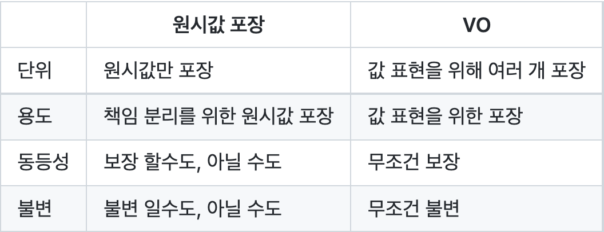 </p>

  * [여기](https://github.com/binghe819/TIL/blob/master/OOP&%EC%84%A4%EA%B3%84/%EA%B8%B0%ED%83%80/%EC%9B%90%EC%8B%9C%EA%B0%92%20%ED%8F%AC%EC%9E%A5%EA%B3%BC%20VO.md#3-%EC%9B%90%EC%8B%9C%EA%B0%92-%ED%8F%AC%EC%9E%A5%EA%B3%BC-vo%EC%9D%98-%EC%B0%A8%EC%9D%B4)를 참고

  ---
</details>

#### Q. 클래스 vs 객체
<details>
  <summary>답변</summary>
  
  --- 
  
  * 
  
  --- 
</details>

<br>

### 디자인 패턴

#### Q. 싱글톤 패턴
<details>
  <summary>답변</summary>
  
  --- 
  
  * 싱글톤 패턴이란?
    * 인스턴스를 오직 하나만 생성하여 애플리케이션상에서 1개만 존재함을 보장하는 디자인 패턴.
  * 왜 사용하는가?
    * 상태를 가지고 있지 않는 Util성 객체 혹은 하나만 생성하여 캐싱해서 사용하고자 하는 경우 메모리를 아낄 수 있다.
    * 로또를 구현한다면 가정한다면, 로또 번호는 1 ~ 45로 고정이므로, 이러한 번호는 싱글톤으로 미리 만들어두고 캐싱해서 사용하면 좋다.
  * 싱글톤 단점
    * 싱글톤 패턴을 사용하는 곳과 싱글톤 클래스 사이에 강한 의존성이 생긴다.
      * 수정 및 테스트하기 힘들다.
    * 객체지향적으로 사용 불가.
      * private 생성자를 갖고 있기 때문에 상속할 수 없다.
      * 싱글톤의 사용은 전역 상태를 만들 수 있기 때문에 바람직하지 못한다.
  * 주의할 점 - 다중 스레드
    * 다중 스레드에서 한꺼번에 처리하는 스레드들이 동시에 싱글톤 객체를 수정하는 것은 매우 위험하다.
    * 읽기 전용 (final)일 때만 사용해야 한다.
  
  --- 
</details>

#### Q. 프록시 패턴
<details>
  <summary>답변</summary>
  
  --- 
  
  * 프록시
    * **클라이언트와 사용 대상 사이에 대리 역할을 맡은 객체**를 두는 방법의 총칭
    * ex. 프록시 패턴과 데코레이터 패턴
  * 프록시 패턴
    * 프록시를 사용하는 방법중 타깃에 대한 접근 방법을 제어하려는 목적을 가진 패턴.
    * 프록시 패턴은 타깃의 기능 자체에는 관여하지 않으면서 접근하는 방법을 제공한다.
  * 프록시 패턴 사용 이유
    * 실제 객체에 대한 접근을 제어하기 위해 사용된다.
    * `Collection.unmodifiableCollection()` (컬렉션 접근 권한 제어용 프록시역할)
  
  --- 
</details>

#### Q. 프록시 패턴 vs 데코레이터 패턴
<details>
  <summary>답변</summary>
  
  --- 

  * 프록시: 클라이언트와 사용 대상 사이에 대리 역할을 맡은 객체를 두는 방법의 총칭 
  * 프록시 패턴: 실제 객체에 대한 접근을 제어하는데 초점
    * `Collection.unmodifiableCollection()` (컬렉션 접근 권한 제어용 프록시역할)
  * 데코레이터 패턴: 기존 객체의 기능을 확장하는데 초점
    * `InputStream is = new BufferedInputStream(new FileInputStream("a.txt"));`
    * HTTP Method를 포함한 인터셉터 설정.
  
  --- 
</details>

#### Q. 다이내믹 프록시
<details>
  <summary>답변</summary>
  
  --- 

  <p align="center"> </p>
  
  * 프록시의 단점
    * 모든 인터페이스를 직접 구현해줘야 한다.
      * 부가기능이 필요 없는 메서드도 구현해서 타깃으로 위임하는 코드를 일일이 만들어줘야 한다.
    * 부가기능 코드가 중복될 가능성이 많다.
      * 트랜잭션 처리를 위한 Service를 구현한다고 가정한다면, 트랜잭션이 필요한 Service마다 트랜잭션 처리용 프록시(XXXServiceTx) 객체를 만들어줘야하며, 이때 중복된 로직의 코드가 발생하게 된다.
  * 다이내믹 프록시란?
    * 프록시 패턴의 단점을 해결한 또 다른 프록시 구현 방식.
    * 런타임 시에 동적으로 만들어지는 프록시 객체.
      * 다이내믹 프록시는 프록시 팩토리에 의해 런타임 시 다이내믹하게 만들어지는 객체를 의미한다.
  * 다이내믹 프록시의 동작 방식
    * 모든 요청을 리플렉션 정보로 변환해서 `InvocationHandler` 구현 객체의 `invoke()` 메서드로 위임하는 방식
  * 다이내믹 프록시의 단점
    * 객체에 대한 Reflection 기능을 사용해 구현하기 때문에 **성능 하락의 원인**이 되기도 한다.
  * `JDK Dynamic Proxy`
  
  --- 
</details>

#### Q. JDK Dynamic Proxy vs CGLib
<details>
  <summary>답변</summary>
  
  --- 

  <p align="center">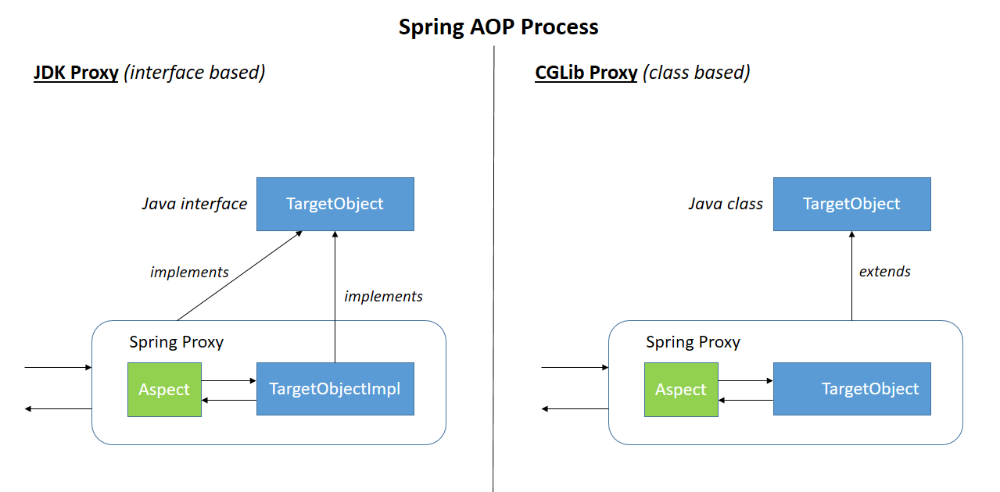<br>출처: https://www.baeldung.com/wp-content/uploads/2017/10/springaop-process.png </p>
  
  * 공통점
    * 다이내믹 프록시를 만들 수 있다.
  * JDK Dynamic Proxy
    * Proxy Factory를 이용하여 런타임시 다이내믹 프록시 객체를 만든다.
    * **반드시 인터페이스를 정의해야 하며, 인터페이스에 대한 명세를 기준으로 프록시를 만든다.**
      * 인터페이스 선언에 대한 강제성이 있는 단점이 있다.
    * 내부적으로 JDK Dynamic Proxy에서는 `InvationHandler`라는 인터페이스를 구현해 만들어지는데, invoke 함수를 오버라이딩하여 Proxy의 위임 기능을 수행한다.
    * **리플렉션을 이용하므로 성능상 저하가 발생할 수 있다.**
  * CGLib
    * CGLib은 순수 Java JDK 라이브러리가 아닌 CGLIB라는 외부 라이브러리를 사용하는 방식이다.
    * **CGLIB의 Enhancer 클래스를 바탕으로 Proxy를 생성하며, 인터페이스가 없어도 Proxy를 생성할 수 있다.**
      * CGBLIB Proxy는 **타겟 클래스를 상속받아 생성하기 때문에 Proxy를 생성하기 위해 인터페이스를 만들어야하는 수고를 덜 수 있다.**
    * 하지만 상속을 이용하기 때문에, `final`이나 `private`와 같이 상속을 막는 방식은 사용하면 안된다는 단점이 있다.
    * **바이트 코드 조작을 이용하므로 성능상 JDK Dynamic Proxy보다 빠르다.**
  * 결론 - 다른점
    * 인터페이스의 유무
    * 다이내믹 프록시 객체 생성 방식
  
  --- 
</details>

<br>

## 테스트

#### Q. TDD란?
<details>
  <summary>답변</summary>
  
  --- 
  
  * 테스트 주도 개발을 의미한다.
  * 먼저 실패하는 테스트를 작성 후 기능을 구현하고, 테스트가 통과하면 리팩토링하는 과정을 거치는 개발 방법론이다.
  * 이를 통해 객체의 책임과 역할을 초기 설계보다 더 세밀하게 분리시킬 수 있다.
  
  --- 
</details>

#### Q. 테스트 작성 이유 (인수, 통합, 목, 단위)
<details>
  <summary>답변</summary>
  
  --- 
  
  * 인수 테스트 (시나리오 테스트)
    * 실제 사용자의 시나리오를 가정하고 api를 호출하여 기대한 결과값이 도출되는지 확인하기 위한 테스트이다.
    * 인수테스트는 시나리오의 끝에서 끝을 검증하므로 웹 애플리케이션의 모든 레이어를 검증한다.
  * 통합 테스트 (서비스 통합 테스트)
    * **서비스는 웹 애플리케이션에서 흐름제어를 담당한다. 이는 비즈니스 로직(도메인)을 조합하여 사용자가 원하는 기능을 만들어낸다는 의미이다.**
    * 따라서 비즈니스 로직이 원하는 순서대로 동작하는지? 외부 모듈 (DB, 외부 API)와 잘 연동되는지?에 대한 테스트를 꼭 해줘야 한다.
    * **input에 맞는 output이 잘 나오는지 확인하는 테스트.**
  * 서비스 목 테스트 (행위 기반 테스트)
    * **input에 맞는 output이 잘 나오는지 테스트하기 위함이 아니라, 실제 외부 모듈을 몇 번 찌르는지등 행위를 테스트하기 위함이다.**
  * 단위 테스트 (도메인 단위 테스트)
    * **도메인은 웹 애플리케이션에서 "도메인"을 그대로 사상하는 가장 중요한 로직(객체)다. (비즈니스 로직)**
    * **개발자는 클라이언트의 요구사항 (글)을 로직(코드)로 옮기는 작업을 하는 직군이다. 그리고 이러한 요구사항을 로직으로 드러내는 곳이 바로 "도메인"이다. 그러므로 요구사항이 코드로 잘 옮겨졌는지 꼭 테스트해줘야 한다.**
    * 또한, 단위 테스트를 작성하면 자연스럽게 역할과 책임을 기반으로 객체를 분리시킨다. 이는 객체지향적 설계를 유도한다.
  
  --- 
</details>

<br>

## Spring

#### Q. 스프링이 무엇인가요?
<details>
  <summary>답변</summary>
  
  ---

  * 스프링은 **자바 엔터프라이즈 개발을 위한 오픈소스 애플리케이션 프레임워크**입니다.
  * 스프링은 **자바를 이용한 동적인 웹 사이트를 개발하기 위해 여러가지 추상화 서비스를 제공하는 애플리케이션 프레임워크.**
  * 스프링의 핵심 요소
    * 애플리케이션 개발시 오직 애플리케이션 레벨의 **비즈니스 로직에만 집중할 수 있도록 다양한 서비스 인프라**를 지원한다. (**애플리케이션 레벨에서의 인프라를 지원**)

  ---
</details>

#### Q. 프레임워크가 무엇인가요? 라이브러리와의 차이점은?
<details>
  <summary>답변</summary>
  
  ---

  * **제어**
    * 라이브러리 (능동)
      * 라이브러리를 사용하는 코드는 애플리케이션 흐름을 직접 제어한다.
      * **개발자가 라이브러리 코드를 호출하여 전체적인 코드의 흐름을 주도한다.**
    * 프레임워크 (수동) - **제어의 역전**
      * 프레임워크는 거꾸로 코드가 프레임워크에 의해 사용된다.
      * **개발자는 프레임워크 흐름중 핵심 부분만 작성하고 프레임워크가 전체적인 흐름을 주도한다.**
  * 목적
    * 둘 다 목적은 코드의 재사용성과 편의성.
    * 라이브러리는 재사용성에 더 집중하고, 프레임워크는 기본적인 틀을 제공해주는 것에 집중한다.

  ---
</details>

#### Q. 스프링을 왜 사용하나요?
<details>
  <summary>답변</summary>
  
  ---  

  * **방대한 문서**
    * 자바진영에서 가장 보편화된 프레임워크. **문서화**가 잘 되어 있다.
  * **개발 편의성, 생산성**
    * **비즈니스 로직**에만 집중할 수 있도록 다양한 **애플리케이션 레벨에서의 인프라**를 갖추고 있다. 개발자는 비즈니스 로직에만 집중하면 된다.
    * ex. IoC, AOP, PSA
  * **비침투성 - POJO** (관심사 분리) - 객체지향적 특징
    * 비침투성을 지향하기 때문에, **기존의 도메인 부분에 대한 자바 코드를 최대한 건드리지 않고 웹 서비스를 할 수 있다**.
    * ex. 우아한 테크코스 체스 미션 -> 처음엔 콘솔에서만 동작하도록 했음. -> 웹 서비스를 위해 스프링을 적용시키면서 기존의 도메인 코드는 변경이 별로 발생하지 않음.
  * **엔터프라이즈 프레임워크 - 대용량 트래픽을 처리 검증됨**
    * 또한, 스프링은 검증된 다양한 기능들과 오픈소스 생태계를 지원한다.
    * spring batch나 spring security등과 같이 다양한 하위 프로젝트들을 제공한다.
    * 이는 개발자 입장에서 비즈니스 로직에만 집중할 수 있게 해준다.
  * **성능 향상 - 싱글톤 레지스트리**
    * 일반적인 자바 싱글톤의 장점 - 서버 관점
      * 매 요청마다 새로운 객체를 생성해 로직을 수행하면 비용이 너무 높다. (객체를 싱글톤으로 관리하는 것이 성능상 유리)
    * 일반적인 자바 싱글톤의 문제
      * `private` 생성자를 갖고 있기에 상속할 수 없다.
      * 테스트하기 힘들다.
      * 전역 상태로 만들기 때문에 바람직하지 않다.
      * 객체지향적으로 사용하기 힘들다 (의존성)
    * 스프링은 기존 싱글톤의 장점을 모두 취하고, 단점을 모두 배제한 싱글톤 형식의 객체를 사용할 수 있도록 지원한다. (싱글톤 레지스트리)
      * 평범한 자바 클래스를 싱글톤으로 활용하게 해준다.
      * 가장 중요한 점은 기존 싱글톤 패턴과 달리 스프링이 제공하는 싱글톤은 객체지향적 설계 방식과 디자인 패턴등을 적용하는 데 아무런 제약이 없다는 것이다.
  * **테스트**
    * DI를 통한 테스트 객체를 쉽게 주입해줌으로써 테스트를 쉽게 진행할 수 있다.
    * 통합 테스트를 제공해준다.

  ---
</details>

#### Q. 스프링 핵심 원칙
<details>
  <summary>답변</summary>
  
  ---

  * 스프링의 핵심 원칙은 세 가지다. IoC/DI, AOP, PSA
  * IoC
    * **Inversion Of Control** (제어의 역전)을 의미하며, **객체의 생성과 생명주기 관리까지 모든 객체에 대한 제어권을 개발자가 아닌 프레임워크에게 위임**한 것을 의미한다.
    * **객체의 생성 책임을 개발자가 가지는 것이 아니라, 프레임워크에 위임했다.** (능동 -> 수동)
    * IoC vs DI
      * **IoC는 DI의 한 형태. -> 객체지향에선 DI를 통해 IoC를 구현한다.**
  * DI
    * DI는 **의존관계 주입**을 의미한다. 의존관계란 하나의 객체가 다른 객체의 상태에 따라 영향을 받는 것을 의미한다.
    * 스프링에서는 이러한 **의존관계를 개발자가 직접 관리하지 않고, 스프링 컨테이너에서 관리**한다. 의존관계가 필요할 때마다 **스프링 컨테이너에서 개발자 코드안으로 의존성을 주입해준다.**
    * DI는 스프링에서 IoC를 구현한 한가지 방법이며, **IoC는 DI를 포함하는 개념이다**.
    * 이를 통해 개발자는 **객체의 생성, 생명주기 관리, 의존관계 설정 책임**을 신경쓸 필요없이 **자신의 비즈니스 로직에만 집중**하여 생산성을 높일 수 있다.
  * AOP
    * Aspect-Oriented Programming (관점 지향 프로그래밍)을 의미한다.
    * 스프링 DI가 의존성에 대한 주입이라면 AOP는 로직(code)주입이라고 할 수 있다.
    * 관점 지향은 쉽게 말해 **어떤 로직을 핵심적인 관점과 부가적인 관점으로 나누어서 보고 그 관점을 기준으로 각각 모듈화**하겠다는 것이다.
      * 핵심적인 관점: 비즈니스 로직
      * 부가적인 관점: 핵심 로직을 실행하기 위해서 행해지는 로직 (로깅, 트랜잭션, 캐싱) - 재사용된다.
  * PSA
    * Portable Service Abstraction (일관성 있는 서비스 추상화) 을 의미한다.
    * 서비스 추상화란, **같은 일을 하는 다수의 기술을 공통의 인터페이스로 제어할 수 있게 하는 것**을 의미한다.
    * **외부 환경의 변화에 관계없이 일관된 방식으로 기술에 접근할 수 있게 해주는 것을 의미한다.**
    * 예시
      * `@Cacheable`: 캐시대상으로 redis를 사용하던 ehcache를 사용하던 @Cacheable을 처리하는 내부 코드는 변하지 않는다.
      * `@Transactional`: JPA의 구현체로 hibernate를 이용하던 다른 구현체를 이용하던 @Transactional을 처리하는 내부 코드를 변경할 필요가 없다.

  ---
</details>

#### Q. Spring vs Spring Boot
<details>
  <summary>답변</summary>
  
  ---

  * Spring Boot의 장점을 통해 두 가지를 비교해보고자 한다.
  * 자동 설정
    * Spring의 경우 Dispatcher Servlet을 직접 서블릿 컨테이너에 등록해줘야 하며, IoC 컨테이너도 직접 실행해주어야 한다. 이외에도 다양한 의존성(JDBC, JPA 등등)을 수동으로 설정해주어야 한다.
    * Spring Boot는 `@EnableAutoConfiguration`을 통해 `spring-boot-autoconfigure/META-INF/spring.factories`에 명시된 다양한 설정들을 의존성에 따라 빈을 등록해준다. (의존성이 존재할 때만 자동 등록)
    * 또한, Dispatcher Servlet와 IoC 컨테이너와 같은 설정도 자동으로 해준다.
  * 쉬운 의존성 관리
    * Spring Boot의 경우 의존성만 주입해주면 Spring Boot가 알아서 설정하여 사용할 수 있게 해준다.
  * 내장 톰캣
    * Spring의 경우 직접 톰캣을 시동해주어야한다.
    * SpringBoot의 경우 내장 톰캣을 이용하여 자바 코드를 실행하여 웹 서비스를 할 수 있다.
  * 내장 H2
    * SpringBoot는 내장 H2를 빈 형태로 제공한다.

  ---
</details>

#### Q. POJO
<details>
  <summary>답변</summary>
  
  ---

  * 진정한 **POJO란 객체지향적인 원리에 충실**하면서, **환경과 기술에 종속되지 않고 필요에 따라 재활용될 수 있는 방식**으로 설계된 오브젝트를 말한다.
    * 어떠한 프레임워크에도 의존하지 않는다.
    * 자바를 이용한 테스트에 용이하다.
  * POJO의 두 가지 의견
    1. 어떠한 프레임워크에도 완전히 의존하지 않는 자바 객체. (애노테이션이 붙은 것도 POJO가 아니란 의견)
    2. 자바 객체 안에 코드를 프레임워크를 바꿔도 그대로 재활용할 수 있으면 POJO. (특정 애노테이션이 존재해도 POJO라는 의견)
  * EJB부터 스프링까지의 역사를 보면 두 번째가 맞는 듯 하다.
    * EJB 시절에는 특정 기능(Service, Controller 등)을 만들기 위해서는 특정 인터페이스나 클래스는 extends 했어야 했다. 따라서 그 시절에는 특정 클래스는 EJB 프레임워크에 매우 의존적이었으며 기능을 활용하기 위해서 특정 Class를 extends해야한다는 관점에서 객체지향적 특징을 잃어버리게 되었다(이미 상속을 사용하였으므로 상속의 특징을 활용하지 못함). 이것에 반발하여 EJB에 종속적이지 않은 클래스들을 POJO라고 정의하게 되었다.
    * EJB 때는 걔네들이 정의해둔 클래스/인터페이스를 상속/구현 → **그래서 이거에 종속적이지 않는 것들은 POJO라고 부르자고 정한 것.**
    * 결론적으로 비즈니스 코드가 특정 프레임워크에만 종속적이지 않는다면 POJO라고 부른다. (애노테이션은 주석과 같이 마킹한다는 의미에서 코드에 직접적으로 영향을 주지 않으므로 제외시킨다.)
  * 예시를 들어 보자면
    * `@Service`와 같은 애노테이션들이 붙은 클래스들도 POJO가 맞다.
    * 그 이유는 애노테이션 기반 프레임워크를 사용할 때, 애노테이션만 변경하고 코드 레벨에서 변경은 발생하지 않기 때문이다.
  * 물론 예외도 존재한다.
    * `@Entity` 는 특정 제약사항이 필요하기 때문에(빈 생성자, id 등등...) POJO가 아니다.

  ---
</details>

#### Q. 생성자 주입을 추천하는 이유는?
<details>
  <summary>답변</summary>
  
  ---

  * **불변**
    * 대부분의 의존관계 주입은 한번 일어나면 애플리케이션 종료시점까지 의존관계를 변경하지 않는 것이 좋다.
    * 그 이유는 불변을 보장함으로써, 추후에 **발생할 수 있을 버그를 사전에 차단해 주는 효과**를 얻기 때문이다.
  * **생성자 주입은 Setter의 단점을 모두 커버한다.**
    * 객체를 만들 때 의존성을 주입해주지 않아도 생성이된다. -> NPE 발생 확률 존재.
    * Setter 주입의 경우 상태가 **불변하지 않기 때문에 실수할 확률이 높다.** 
  * **스프링에 의존적이지 않다.**
    * 스프링 application context가 없어도 단독으로 테스트 혹은 도메인으로써의 역할을 수행할 수 있다.

  ---
</details>

#### Q. 필드 주입을 추천하지 않는 이유
<details>
  <summary>답변</summary>
  
  ---

  * 우선 스프링 공식문서에서도 추천하지 않는다.
  * 스프링에 의존적인 코드가 된다. - 스프링은 기본적으로 비침투성(POJO)를 지향한다.
    * 우선 필드 주입은 수정자(Setter)주입과 유사한 방식으로 동작한다.
    * 또한, **필드 주입은 IoC 컨테이너에서 제공해주는 것이므로 컨테이너에 너무 의존적인 코드**가 된다.
    * 만약 **테스트시 application context가 없다면 해당 객체는 테스트가 불가능하다.** (순수 자바 코드 단위 테스트 불가)

  ---
</details>

#### Q. servlet과 serlvet container
<details>
  <summary>답변</summary>
  
  ---

  * servlet
    * **Java로 HTTP 요청 및 응답을 처리하기 위한 표준**
    * 서블릿은 클라이언트의 http 요청을 받아 **비즈니스 로직을 수행하고, 적절한 http 응답을 생성하는 자바 객체**이다.
    * 웹페이지를 동적으로 생성하는 역할.
    * 서블릿은 일반 자바 객체와 달리 **서블릿 컨테이너 내에서만 실행**된다.
  * servlet container
    * 클라이언트로부터 **http 요청 메시지를 적절하게 파싱 후, 스레드를 생성하여 적절한 서블릿을 실행시키고, 서블릿으로 부터 응답받은 요청 처리 결과를 이용해 http 응답 메시지를 만들어주는 컴포넌트.**
    * **웹 서비스에 필요한 다양한 기능을 제공하며, 개발자로 하여금 비즈니스 로직(serlvet 구현)만 집중할 수 있도록 도와주는 프레임워크**
    * **지원하는 기능**
      * tcp/ip 소켓 연결 및 종료. (통신 지원)
      * http 요청 메시지 파싱 및 응답 메시지 생성.
      * 서블릿 생명주기 관리 (서블릿의 탄생과 죽음을 관리)
      * 멀티스레딩 지원 (요청당 스레드로 처리)
      * 선언적인 보안 관리
    * 대표적인 servlet container: tomcat, netty

  ---
</details>

#### Q. servlet container의 동작 흐름
<details>
  <summary>답변</summary>
  
  ---

  1. 사용자 **요청 파싱**
  2. 새로운 **스레드를 생성**하고, **HttpServletRequest, HttpServletResponse 생성.**
  3. 사용자 요청을 분석하여 **대응되는 서블릿 검색**. (DD.xml을 통해 서블릿을 미리 정의해둔다.)
  4. 찾은 서블릿의 **`service()` 메서드 호출함으로써, 비즈니스 로직 처리 위임.**
  5. **서블릿은 클라이언트에게 넘길 응답을 작성**. 이때 Response 객체를 사용한다.
  6. servlet container가 서블릿으로부터 받은 **Response를 적절한 http response로 만들어 클라이언트에 반환**.
  7. 요청을 처리한 **스레드는 소멸하거나 스레드 풀로 반환**.

  ---
</details>

#### Q. Bean이란
<details>
  <summary>답변</summary>
  
  ---

  * 스프링 **IoC Container에 의해 생성 및 관리되는 자바 객체**를 의미한다.
    * 스프링 IoC Container에 의해 생명주기가 관리되는 자바 객체.
    * 스프링의 핵심 원칙은 IoC/DI의 근간이 되는 개념.
  * 스프링 IoC컨테이너에 의해서 관리되고 애플리케이션의 핵심을 이루는 객체들을 스프링에서는 빈즈(beans)라고 부른다.
    * 빈은 스프링 **IoC컨테이너에 의해서 인스턴스화되어 조립되거나 관리되는 객체**를 말한다.
    * **빈과 빈 사이의 의존성은 컨테이너가 사용하는 메타데이터 환경설정에 의존한다.**
  * Bean의 주요 속성
    * class: 정규화된 자바 클래스 이름
    * id: bean의 고유 식별자
    * scope: 빈 스코프
    * constructor-arg: 생성 시 생성자에 전달할 인수
    * property: 생성 시 bean setter에 전달할 인수
    * init method와 destory method

  ---
</details>

#### Q. Java Bean vs Spring Bean
<details>
  <summary>답변</summary>
  
  ---

  * Java Bean
    * 데이터 표현하는 것을 목적으로 하는 자바 클래스.
    * 특별한 것 없고, 그저 아래 규약에 맞춰서 만든 클래스를 의미한다.
      1. 기본생성자가 존재한다.
      2. 모든 멤버변수의 접근제어자가 private이다.
      3. 멤버변수마다 getter/setter가 존재한다.
      4. 외부에서 멤버변수에 접근하기 위해서는 메서드로만 접근할 수 있다.
      5. 직렬화가 가능해야한다.
  * Spring Bean
    * Spring Framework의 IoC Container에 의해 등록, 생성, 조회, 관계설정이 되는 객체를 의미한다.

  ---
</details>

#### Q. Bean Scope
<details>
  <summary>답변</summary>

  ---

  * 빈의 생명주기와 관련이 있다.
  * singleton: 하나의 Bean 정의에 대해서 **스프링 IoC 컨테이너마다 단 하나의 객체만 존재**
  * prototype: 하나의 Bean 정의에 대해서 **매 Bean을 찾는 요청마다 새로운 Bean을 생성.** (Ioc 컨테이너가 생명주기 관리를 아예 하지 않는다. 그저 팩토리 메서드)
  * request: 하나의 Bean 정의에 대해서 하나의 HTTP Request의 생명주기 안에 단 하나의 객체만 존재. (각각의 요청마다 자신만의 객체를 가진다.)
  * session: 하나의 Bean 정의에 대해서 하나의 HTTP Session의 생명주기 안에 단 하나의 객체만 존재.
  * global session: 하나의 Bean 정의에 대해서 하나의 global HTTP Session의 생명주기 안에 단 하나의 객체만 존재.

  ---
</details>

#### Q. @Bean vs @Component
<details>
  <summary>답변</summary>
  
  ---

  * 공통점
    * 둘 다 IoC 컨테이너에 빈으로 등록하기 위한 방법.
  * 차이점
    * **@Bean은 개발자가 컨트롤 불가능한 외부 라이브러리**를 등록할 경우 사용한다. (그저 생성만 지원한다.) - Method Level
    * **@Component를 개발자가 직접 컨트롤 가능한 클래스**를 등록할 경우 사용한다. - Class Level

  ---
</details>

#### Q. Bean 등록 방법
<details>
  <summary>답변</summary>
  
  ---

  * XML을 이용한 빈 설정
  * Component Scan을 이용한 빈 설정
  * 자바 설정파일(`@Configuration`)을 이용한 빈 설정

  ---
</details>

#### Q. Bean 생명주기 - 예정
<details>
  <summary>토글</summary>
  
  --- 
  
  * 
  
  --- 
</details>

#### Q. @ComponentScan
<details>
  <summary>답변</summary>
  
  ---

  * **리플렉션 기술**을 활용하여 @Component 혹은 streotype 애노테이션이 붙은 **Class들을 자동으로 scan하여 Bean으로 등록해주는 역할**을 해주는 애노테이션.
  * 스프링부트는 `@ComponentScan`이 붙은 패키지부터 Scan을 한다.

  ---
</details>

#### Q. ComponentScan 과정
<details>
  <summary>답변</summary>
  
  ---

  * 스프링 애플리케이션을 동작시키면, 스프링 IoC 컨테이너가 생성된다.
  * 만약 `@ComponentScan`이 붙은 클래스가 있다면, 해당 클래스를 기준으로 하위 패키지에 등록된 모든 `@Component`가 붙은 클래스를 스캔한다.
  * 이때, reflection api를 사용한다. (필자는 reflections 라이브러리를 이용하여 Class 파일을 스캔했다.)
  * 스캔된 클래스를 IoC 컨테이너에 빈으로 등록한다.

  ---
</details>

#### Q. Spring 서버 부팅시 동작 과정 - 예정
<details>
  <summary>답변</summary>
  
  ---

  * 스프링의 경우
    1. 톰캣이 실행된다. (톰캣을 통해 실행해야 함)
    2. `ServletContextListener`의 스프링에서 제공하는 구현체인`ContextLoaderListener`에 의해 `Application Context`이 생성된다.
    3. `Application Context`가 생성되는 과정에서, 빈 정의 (xml, 자바 설정 파일, component scan)에 의해 빈이 생성된다.
    4. `Application Context`에 저장된 빈들의 의존 관계가 주입된다.
    5. 빈들의 생명주기에 맞는 메서드가 실행된다. (빈의 초기화 메서드, 소멸 메서드 등등)
  * 스프링 부트의 경우
    1. 

  ---
</details>

#### Q. Thread Local
<details>
  <summary>답변</summary>
  
  ---

  * Thread Local이란
    * 각 Thread마다 갖는 독립적인 지역 변수를 의미한다.
    * Java.lang 패키지에서 제공하는 쓰레드 범위 변수. 한 스레드에서 공유할 변수.
  * 특징
    * 같은 쓰레드 내에서만 공유
    * 따라서 같은 쓰레드라면 해당 데이터를 메서드 매개변수로 넘겨줄 필요 없다.
  * 스프링에서의 사용처
    * 트랜잭션 매니저에서 transaction Context를 전파하는데 사용된다.
    * SpringSecurity에서는 ThreadLocal을 기본 전략으로 SecurityContextHolder를 사용한다.

  ---
</details>

#### Q. Spring MVC 동작 과정 - 예정
<details>
  <summary>토글</summary>
  
  --- 
  
  * 
  
  --- 
</details>

#### Q. DispatcherServlet이란?
<details>
  <summary>답변</summary>
  
  ---
  
  * Front Controller 패턴을 이용하여 Servlet Container(Tomcat)에 들어오는 모든 요청을 받는 Servlet.
  * 공통 작업 (인터셉터, 예외 처리, Multipart 처리)를 처리하고 요청에 맞는 핸들러에 작업을 위임하는 Servlet.

  ---
</details>

#### Q. Filter vs Interceptor
<details>
  <summary>답변</summary>
  
  ---

  * 공통점
    * 둘 다 웹과 관련된 공통 관심 사항을 처리한다.
  * 차이점
    * 적용되는 순서와 범위, 사용방법이 다르다.
    * Filter는 서블릿에서 제공하는 기술이며, 특정 Servlet이 실행하기 전에 발생한다. (ex. Dispatcher Server 이전)
      * 예외처리: 스프링에서 제공하는 ExceptionHandler를 사용할 수 없다. 예외처리가 번거러움.
      * Context: Filter는 Spring의 Context 밖에서 동작하기에, 스프링에서 제공하는 DI등을 사용할 수 없다. (물론 방법이 있음)
      * 정보: 단순히 request, response 객체만 제공한다.
      * 시점: `doFilter`만 제공.
    * Interceptor는 스프링MVC에서 제공하는 기술이며, DispatcherServlet안에서 특정 핸들러들을 실행하기 전에 발생한다.
      * 예외처리: 스프링에서 제공하는 ExceptionHandler등을 사용할 수 있다.
      * Context: Spring의 Context 범위 내에서 동작하기에, 스프링에서 제공하는 DI등을 사용할 수 있다.
      * 정보: request, response에 더해서 어떤 핸들러가 호출되는지에 대한 정보도 제공받는다.
      * 시점: 핸들러 호출 전(`preHandle`), 호출 후 (`postHandle`), 요청 완료 이후(`afterCompletion`)을 제공.
  * 실행 과정
    * HTTP 요청 -> Servler Container -> Filter -> Servlet (Dispatcher Servlet) -> Interceptor -> Controller

  ---
</details>

<br>

## JPA

#### Q. JPA란
<details>
  <summary>토글</summary>
  
  --- 
  
  * JPA
    * Java Persistence API (인터페이스의 모음)
      * 대표적인 구현체로 Hibernate가 존재
    * 자바 진영의 ORM 기술 표준
    * 영속 계층과 관련된 로직을 컬렉션 다루듯이 사용할 수 있도록 해준다.
  * ORM
    * Object - Relational Mapping
      * 객체는 객체대로 설계
      * 관계형 DB는 관계형 DB대로 설계
    * ORM 프레임워크가 중간에서 자동으로 맵핑
  
  --- 
</details>

#### Q. JPA를 사용하는 이유
<details>
  <summary>토글</summary>
  
  --- 
  
  * 객체와 DB 테이블간의 패러다임 불일치를 해결하는 방법으로 SQL 맵핑과 ORM기술이 존재한다.
  * JPA를 사용하는 이유
    * **패러다임 불일치를 대신 해결해줌** - SQL 맵핑의 중복과 반복 단점을 해결해준다. (상속, 연관관계, 객체 그래프 탐색, 비교)
    * **SQL 중심적인 개발에서 객체 중심으로 개발** - 영속 계층과 관련된 로직을 컬렉션 다루듯이 사용할 수 있도록 해준다.
    * **생산성**
    * 유지보수 -> 필드만 추가하면 SQL은 JPA가 대신 처리
    * 데이터 접근 추상화와 벤더 독립성
    * **성능 최적화** (1차 캐싱, SQL 배치 요청, 지연 로딩)
    * 표준화
  * 개인적으론 Dao와 Repository의 차이점도 좋은 예시일 듯 하다.
    * **Repository는 도메인 계층에 속하며, Collection처럼 사용된다. 이때 Collection에서의 모든 CRUD는 JPA에 의해 영속화된다.**
  
  --- 
</details>

#### Q. 패러다임 불일치란?
<details>
  <summary>답변</summary>
  
  --- 
  
  * 패러다임 불일치란?
    * 객체와 RDB는 지향하는 목적이 다르기에 **객체를 다루는 방식과 테이블을 다루는 방식간의 패러다임 불일치**가 존재한다.
  * **대표적인 패러다임 불일치**
    * 상속
      * 객체는 상속이 존재하지만, DB 테이블은 존재하지 않는다.
    * **연관관계 (방향성) - 중요**
      * 객체는 방향성이 존재한다. (member가 team에 의존하면, member -> team만 접근 가능. team -> member는 불가능) - 단방향
      * 테이블은 방향성이 존재하지 않는다. (member < - > team, join 혹은 서브 쿼리를 이용해 서로 접근이 가능하다.) - 양방향
    * 객체 그래프 탐색
      * 객체 그래프 탐색은 객체의 참조를 이용해서 객체를 탐색하는 것을 의미한다.
      * 문제는 SQL을 직접 다루면 처음 실행하는 SQL에 따라 객체 그래프를 어디까지 탐색할 수 있는지 정해져버린다.
      * 즉, **DAO 계층에서 받아온 객체가 어디까지 그래프 탐색이 가능한지 모른다.** (어디까지가 null일 것인가)
    * 비교
      * DB는 기본 키의 값으로 각 로우를 구분한다.
      * 객체는 동등성과 동일성을 통해 각 객체를 구분한다.
        * SQL 맵핑의 경우 DAO에서 매번 새로운 객체를 반환하기에 동일성을 보장하지 못한다.
        * JPA는 동일한 트랜잭션에서 조회한 엔티티는 동일성을 보장한다.
  * 테이블 주도 모델링 vs 객체 주도 모델링와 같은 더 자세한 내용은 [여기](https://github.com/binghe819/jpa-learning-sandbox/blob/master/docs/README.md#2-2-%EC%97%B0%EA%B4%80%EA%B4%80%EA%B3%84)참고.

  --- 
</details>

#### Q. 연관관계 주인이란?
<details>
  <summary>답변</summary>
  
  --- 
  
  * `DB 외래키 관리자`
    * **양방향 연관관계를 구성하는 두 객체 참조 중에서 DB와의 동기화를 책임지는 객체.**
  * 양방향 매핑에서의 규칙
    * **객체에서의 양방향은 객체 두 개가 서로 단방향, 테이블에서의 양방향은 외래 키 하나.**
    * 그러기에 객체에서는 하나로 주인을 정해줘야한다.
  * 연관관계 주인의 특징
    * 연관관계의 주인만이 외래 키를 관리(등록, 수정) 한다.
    * 주인이 아닌 쪽은 읽기만 가능하다.
      * `mappedBy`를 통해 주인이 아닌 객체를 설정해준다.
  
  --- 
</details>

#### Q. 양방향의 두 객체중 어느 것을 연관관계 주인으로 해야하는가?
<details>
  <summary>답변</summary>
  
  --- 
  
  * 외래 키가 있는 곳을 주인으로 정한다.
    * 테이블에서 `1 : N` 관계에서 외래 키는 항상 다(`N`)쪽에 있기 때문이다.
  
  --- 
</details>

#### Q. 일대다 관계를 추천하지 않는 이유는?
<details>
  <summary>답변</summary>
  
  --- 
  
  * 문제점
    * 연관관계 주인(`1`)이 반대편 테이블(`N`)의 외래 키를 관리한다.
      * **엔티티가 관리하는 외래 키가 다른 테이블에 있다.**
      * `Team` 객체 안에서 `Member`를 가지지만, 테이블상에서 외래 키는 `Member`가 가지고 있다. (방향성이 서로 다르다.)
    * **연관관계 관리를 위해 추가로 `UPDATE SQL`이 날라간다.**
      * ex. `team.getMembers().add(member)` -> `member.team`을 null로 하여 insert -> team insert -> `member.team` update 쿼리 날림 
      * 자세한 내용 코드는 여기 [](https://github.com/binghe819/jpa-learning-sandbox/blob/relation-mapping-1-N/src/test/java/com/binghe/one_way/OneWayTest.java)
  * 가능한 일대다 양방향을 사용하는 것이 좋다.
  
  --- 
</details>

<br>

## 네트워크

#### Q. CORS란?
<details>
  <summary>답변</summary>
  
  --- 
  
  * 웹에서 다른 출처로의 리소스 요청을 제한하는 것과 관련된 정책은 두 가지이다.
    * SOP (Same-Origin Policy)
    * CORS (Cross-Origin Resource Sharing)
  * SOP와 CORS
    * SOP는 "같은 출처에서만 리소스를 공유할 수 있다"라는 규칙을 가진 정책이다. 그러나 웹 환경에선 다른 출처에 있는 리소스를 가져와서 사용하는 일이 굉장히 흔하므로 무작정 막을 수만은 없다. 그래서 몇 가지 예외 조항을 두고 이 조항에 해당하는 리소스 요청은 출처가 다르더라도 허용하기로 하는 정책이 바로 "CORS"이다.
    * 쉽게 말해, **SOP 정책을 웹에서 준수하긴 현실적으로 힘드니, CORS란 정책을 도입해서 설정된 다른 출처들간의 자원 교환을 허용하는 것.**
  * CORS란
    * **한 출처에서 실행 중인 웹 애플리케이션이 특정한 다른 출처의 선택한 자원에 접근할 수 있는 권한을 부여하는 체제가 필요하다.**
  * CORS 동작방식
    * 웹 클라이언트에서 다른 출처의 리소스에 요청을 보낼 때 요청 헤더에 `Origin`이라는 필드를 함께 보낸다.
    * 이후 서버가 응답을 할 때 헤더에 `Access-Control-Access-Origin`이라는 값에 "이 리소스를 접근하는 것이 허용된 출처"를 내려주게된다.
    * 응답을 받은 클라이언트(브라우저)는 자신이 보냈던 요청의 Origin과 서버가 보내준 응답의 Access-Control-Allow-Origin을 비교해본 후 유효한 응답인지 확인한다.
  * Preflight Request (CORS에서 가장 흔히 사용되는 접근제어 시나리오중 하나)
    * 요청을 한번에 보내지 않고 예비 요청과 본 요청을 나누어서 전송하는 것을 의미한다.
    * `OPTION`메서드를 이용해서 본 요청을 보내기 전에 브라우저 스스로 이 요청을 보내는 것이 안전한지 확인한다.
    * 웹 클라이언트는 이제 해당 요청엔 어떤 Origin을 넣을 수 있는지 파악했으므로, 다음 요청시 만약 Origin이 다르면 예외를 발생시킨다.
  
  --- 
</details>

#### Q. CSRF란?
<details>
  <summary>답변</summary>
  
  --- 
  
  * CSRF란
    * CSRF (Cross Site Request Forgery)는 악의적인 웹사이트, 전자 메일, 블로그, 인스턴트 메시지 또는 프로그램으로 인해 사용자의 웹 브라우저가 사용자가 인증 된 다른 신뢰할 수 있는 사이트에서 원치 않는 작업을 수행 할 때 발생하는 공격 유형.
  * CSRF가 이뤄지려면 다음과 같은 조건이 만족되어야 한다.
    1. 위조 요청을 전송하는 서비스 (은행, 네이버등등)에 희생자가 로그인 한 상태
    2. 희생자가 해커가 만든 피싱 사이트에 접속 (주로 음란물 사이트..)
  
  --- 
</details>

#### Q. 쿠키와 세션이란?
<details>
  <summary>답변</summary>
  
  --- 
  
  * HTTP 프로토콜의 특성이자 약점을 보완하기 위해 쿠키와 세션을 사용한다.
    * 비연결성 (connectionless): 클라이언트가 요청을 한 후 응답을 받으면 그 연결을 끊어 버리는 특징
    * 무상태성 (stateless): 통신이 끝나면 상태를 유지하지 않는 특징
    * 대표적으로 쿠키와 세션등을 사용하지 않으면 지속적인 로그인 환경을 구축할 수 없다. (물론 토큰 기반으론 가능)
  * 쿠키란?
    * 쿠키는 클라이언트측 브라우저 로컬에 저장되는 키와 값이 들어있는 작은 데이터이다.
    * 브라우저가 종료되어도 쿠키 만료 기간이 있다면 클라이언트 (브라우저) 에서 보관하고 있는다.
    * Response Header에 `Set-Cookie` 속성을 사용하면 클라이언트에 쿠키를 만들 수 있다.
    * 쿠키는 사용자가 따로 요청하지 않아도 브라우저가 요청시 Request Header에 넣어서 자동으로 서버에 전송한다.
    * 예시: "아이디와 비밀번호 저장하시겠습니까?", 장바구니 기능, "오늘 더 이상 이 창 보지 않음"
  * 세션이란?
    * 세션은 쿠키를 기반으로 하며, 서버에서 관리하는 사용자 정보 파일 (데이터)이다.
    * 서버에서는 클라이언트를 구분하기 위해 세션 ID를 부여하며, 웹 브라우저가 서버에 접속해서 브라우저를 종료할 때까지 인증 상태를 유지한다.
      * 클라이언트가 Request를 보내면, 해당 서버의 엔진이 클라이언트에게 유일한 세션 ID를 부여한다.
    * 예시: 로그인후 정보 저장.
  * 쿠키와 세션 차이
    * 사용자 정보 저장 위치: 쿠키는 클라이언트, 세션은 서버
    * 보안성: 쿠키는 클라이언트측에 저장하므로 언제든 스니핑 당할 우려가 있으나, 세션은 쿠키를 이용해서 sessionid만 저장하고 그것으로 구분해서 서버를 처리하기 때문에 보안성이 비교적 우수하다.
    * 모든 정보를 세션에 저장하면 좋지만, 서버 자원의 낭비와 속도때문에 중요하지 않은 정보는 쿠키에 저장하는 것이 좋다.
  
  --- 
</details>

#### Q. 세션 방식과 토큰 방식의 차이점과 장단점은?
<details>
  <summary>답변</summary>
  
  --- 
  
  * 세션 방식의 장단점
    * 장점
      * 토큰(JWT)과 비교하면 sessionid는 굉장히 작다. (네트워크 비용이 훨씬 적게 든다.)
      * 중요한 정보를 서버측에 저장/관리하기 때문에 상대적으로 온전한 상태를 유지하기 유리하다.
    * 단점
      * sessionid가 클라이언트로 전달되기에 여전히 공격의 위험이 존재한다. (유효기간, HttpOnly, Secure등을 통해 보안성을 높여야한다.)
      * 서버 확장성면에서 좋지 않다. (로드밸런싱을 적용한다면 세션 서버를 따로 두거나 sticky session, session clustering등을 고려해야 한다)
      * 멀티 디바이스 환경에서 로그인 시 신경써줘야할 부분이 존재한다.
      * stateful (매 요청마다 세션에 요청을 날리는 비용가 발생한다.)
  * 토큰 방식의 장단점
    * 장점
      * 서버 확장성면에서 좋다. (로드밸런싱해도 따로 해줄 작업이 없다.)
      * 멀티 디바이스 환경에 대한 부담이 없다.
      * stateless
    * 단점
      * 클라이언트측에 토큰이 저장되게 공격에 노출될 가능성이 크다. (실제로 body부분은 base64url을 통해 쉽게 디코딩할 수 있다.)
        * 민감한 정보를 담으면 안되며, 유효기간을 짧게 설정해 공격에 노출될 수 있는 시간을 최소화해야한다.
  
  --- 
</details>

#### Q. REST API란?
<details>
  <summary>답변</summary>
  
  --- 

  > 진정한 REST API는 로이 필딩이 정의한 REST를 지켜서 만든 API를 의미한다.
  > 
  > 본 정리자료에선 간단히만 설명하므로, 더 자세한 내용은 여기[그런 REST API로 괜찮은가?](https://www.youtube.com/watch?v=RP_f5dMoHFc)

  * REST란
    * Representational State Transfer의 약자
    * **자원을 이름(자원의 표현)으로 구분하여 해당 자원의 상태(정보)를 주고 받는 모든 것을 의미한다**
      * 자원(Resource)의 표현(Representation)에 의한 상태 전달
  * REST 구성
    * 자원 (Resource) : URI
      * 모든 자원은 URI라는 고유한 ID가 존재하며, 자원은 서버에 존재한다.
    * 행위 (Verb) : HTTP Method
      * GET, POST, PUT, DELETE
    * 표현 (Representation)
      * 클라이언트가 자원의 상태(정보)에 대한 조작을 요청하면 서버는 이에 적절한 응답을 보낸다.
      * REST에서 하나의 자원은 JSON, XML등 여러 형태의 Representation (표현)으로 나타내어 질 수 있다.
  * REST 제약 조건 (이 모든 것을 지켜야 진정한 REST라고 할 수 있다.)
    1. client - server
    2. stateless (무상태성)
    3. cache (캐시)
    4. uniform interface (self-descriptive message, HATEOAS등)
    5. layered system (다중 계층 - 보안, 로드 밸런싱, 암호화 계층, 프록시 등등)
    6. code-on-demand (optional)
  * REST API란?
    * REST 기반의 규칙을 지켜서 설계된 API
  * **개인적으로 모든 것은 클라이언트가 서버의 자원을 더 쉽게 이용할 수 있도록 하기 위함인 듯 하다.**
  
  더 자세한 내용은 [여기](https://github.com/binghe819/TIL/blob/master/Network/REST%20API/REST%20API.md#2-rest-api)
  
  --- 
</details>

#### Q. 주요 HTTP 상태 코드
<details>
  <summary>답변</summary>
  
  --- 
  
  * 2xx
    * 200 OK
    * 201 Created (PUT 또는 POST의 결과)
    * 202 Accepted
    * 204 No Content (요청에 대해서 보내줄 수 있는 컨텐츠가 없지만, 헤더는 의미있을 수 있다.)
  * 3xx
    * 301 Moved Permanently (리다이렉션 - 요청한 리소스의 URI가 **영구적으로** 변경되었음을 의미한다.)
    * 302 Found (리다이렉션 - 요청한 리소스의 URI가 **일시적으로** 변경되었음을 의미한다.)
  * 4xx
    * 400 Bad Request (잘못된 문법이나 요청으로 인하여 서버가 요청을 이해할 수 없음을 의미한다.)
    * 401 Unauthorized (미인증)
    * 403 Forbidden (클라이언트가 콘텐츠에 접근할 권리가 가지고 있지 않음을 의미한다. 401과 다른 점은 서버가 클라이언트가 누구인지 알고 있습니다.)
    * 405 Method Not Allowed
    * 406 Not Accepted
  * 5xx
    * 500 Internal Server Error (서버가 처리 방법을 모르는 상황에서 발생한다.)
    * 502 Bad Gateway (서버가 요청을 처리하는 데 필요한 응답을 얻기 위해 게이트웨이로 작업하는 동안 잘못된 응답을 수신했음을 의미한다.)
  
  --- 
</details>

#### Q. HTTP 메시지 구성
<details>
  <summary>답변</summary>
  
  --- 
  
  * HTTP Request
    * 시작 줄
    * 헤더
    * 바디
  * HTTP Response
    * 상태 줄
    * 헤더
    * 바디
  
  --- 
</details>

<br>

## 운영체제

#### Q. 운영체제란?
<details>
  <summary>답변</summary>
  
  --- 
  
  * 운영체제란?
    * 컴퓨터 하드웨어와 사용자 소프트웨어 사이에서 중재자 역할.
    * 사용자가 직접 다루기 힘든 각종 하드웨어 자원들을 제어하고 관리해주는 소프트웨어 (인터페이스 역할)
  * 좁은 의미의 운영체제
    * 커널
  * 넓은 의미의 운영체제
    * 커널뿐만 아니라 시스템을 위한 유틸리티들을 광범위하게 포함
    * 운영 체제 = 커널 (핵심 부분) + 시스템 유틸리티
  
  --- 
</details>

#### Q. 프로그램 vs 프로세스 vs 스레드
<details>
  <summary>답변</summary>
  
  --- 
  
  * 프로그램: 소스 코드가 파일 단위로 저장 장치에 저장되어 있으며, 아직 실행되지 않은 상태를 의미한다.
    * 디스크에 저장되어 있는 실행 가능한 파일
  * 프로세스: 실행 중인 프로그램. 프로그램을 실행하기 위해서 주소 공간, 메모리 등을 운영체제로부터 할당받은 상태.
    * 프로그램이 실행되어 RAM에 적재되어 실행 중인 상태
    * 여러 개의 스레드를 포함할 수 있다.
  * 스레드: 프로세스의 실행 단위. 같은 프로세스 내에 있는 스레드끼리는 프로세스의 자원을 공유할 수 있다.
  
  --- 
</details>

#### Q. 프로세스 메모리 구조
<details>
  <summary>답변</summary>
  
  --- 

  * 프로세스 메모리와 PCB의 차이
    * PCB는 프로세스를 제어하기 위해 운영체제가 저장하는 자료구조이다. (프로세스의 위치 값, PC값 등등)
    * 프로세스 메모리는 그저 프로그램을 실행하는데 필요한 메모리를 저장시켜놓는 공간이다.
  * **프로세스 메모리 구조**
    * 코드 영역: 프로세스가 실행할 코드가 기계어의 형태로 저장된 공간.
      * 컴파일 타임에 결정되며 Read-Only이다.
    * 데이터 영역: 전역 변수, static 변수등이 저장된 공간.
      * 컴파일 타임에 결정되며 Read-Write(실행 도중 변경 가능)이다.
    * 힙 영역: 개발자가 관리하는 메모리 영역으로, 동적 할당할 때 사용된다. (ex. malloc)
      * 런타임에 결정되며 개발자에 의해 메모리 공간이 동적으로 할당되고 해제된다.
    * 스택 영역: 호출된 함수의 수행을 마치고 복귀할 주소 및 데이터(지역변수, 매개변수, 리턴값 등)를 임시로 저장하는 공간
      * 컴파일 타임에 결정되며, 정해진 크기가 있으므로 초과시 StackOverFlow가 발생한다.
  
  --- 
</details>

#### Q. 스레드를 사용하는 이유는?
<details>
  <summary>답변</summary>
  
  --- 
  
  * 스레드가 없을 때의 단점은 아래와 같다.
    * **프로세스간의 컨텍스트 스위칭 오버헤드**
      * 프로세스는 프로세스마다의 독립적인 메모리를 가지고 있다. 그러므로 멀티 프로세스로 동작한다면 빈번한 컨텍스트 스위칭으로 인한 성능 저하가 발생한다.
    * **프로세스 사이 통신의 어려움**
      * 프로세스들은 독립된 주소공간을 가지고 있기 때문에, 단순한 방법으로 서로의 메모리 공간을 접근 할 수 없다.
      * 공유메모리, 소켓등을 이용해서 접근 해야 한다.
  * **스레드를 사용한다면**
    * **빠른 컨텍스트 스위치**
      * 스케줄링 단위가 프로세스였던 시절, Context Switching가 일어날 때마다 캐시 flush, 캐시 복수 등을 해야했다.
      * 하지만, **스케줄링 단위가 Thread로 되면서 같은 프로세스 내의 Thread들을 Context Switch를 할 때는 TCB만 바꾸면 된다.**
      * **메모리 상에서의 주소 이동도 필요없다.** (프로세스는 주소 이동을 해야함)
    * 스레드간 통신으로 멀티스레드 구현
      * 스레드는 하나의 프로세스에 여러 개 존재하며, 프로세스의 Heap, Static, Code 영역을 공유한다. 즉, 같은 프로세스내에서 스레드끼리의 통신은 굉장히 빠르고 쉽게 가능하다.

  --- 
</details>

#### Q. 스택을 스레드마다 독립적으로 할당하는 이유
<details>
  <summary>답변</summary>
  
  --- 
  
  * 결론부터 말하면 **독립적인 실행 흐름**을 추가하기 위해선 최소 조건으로 독립된 스택이 필요하기 때문이다.
  * 스택은 함수 호출 시 전달되는 인자로 되돌아갈 주소값 및 함수 내에서 선언하는 변수 등을 저장하기 위해 사용되는 공간이다.
  * 스택 메모리 공간이 독립적이라는 것은 독립적인 함수 호출이 가능하며, 이는 독립적인 실행 흐름을 의미한다.
  
  --- 
</details>

#### Q. PCB vs TCB
<details>
  <summary>답변</summary>
  
  --- 
  
  <p align="center">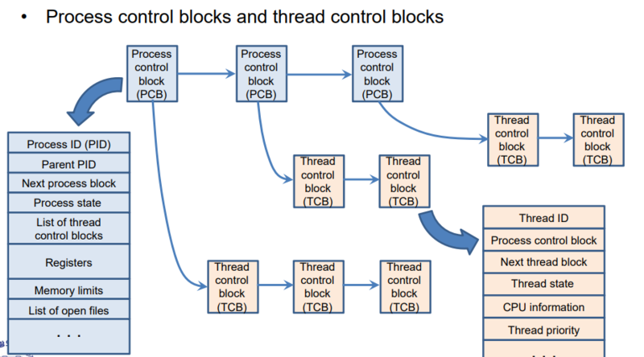<br>출처: http://www.kocw.net/home/search/kemView.do?kemId=1223639&ar=relateCourse </p>

  <p align="center"><br>출처: https://slideplayer.com/slide/12698810/<br>TCB는 PCB를 가리키는 포인터를 가진다 </p>

  * PCB (Process Control Block)
    * **운영체제가 프로세스를 제어하기 위한 정보를 저장하는 자료구조.**
    * **OS의 스케줄러에 의해 Context Switching되는 프로세스의 정보 단위**
  * TCB (Thread Control Block)
    * **스레드의 정보를 저장하는 자료구조.**
    * **프로세스에 존재하는 스레드 스케줄링 방식(라이브러리)에 의해 Context Switching되는 스레드의 정보 단위.**
  * 당연히 공유하는 자원이 훨씬 많은 TCB의 컨텍스트 스위칭이 성능상 훨씬 좋다. 그러기에 멀티 스레드를 사용하는 것.
  
  --- 
</details>

#### Q. 병행 (Concurrency) vs 병렬 (Parallemlism)
<details>
  <summary>답변</summary>
  
  --- 
  
  > 자꾸 헷갈려서 그림을 많이 첨부한다..

  <p align="center">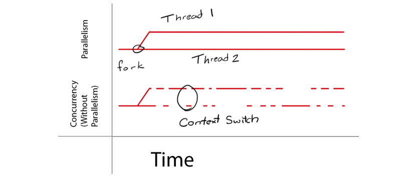<br>출처: https://medium.com/from-the-scratch/dont-be-confused-between-concurrency-and-parallelism-eac8e703943a </p>

  <p align="center">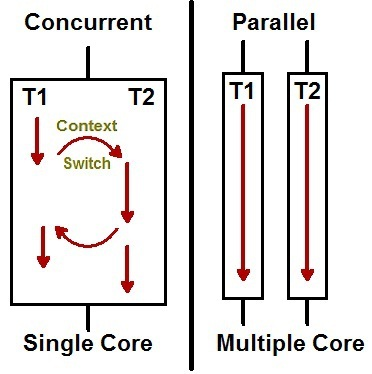<br>출처: https://www.codeproject.com/Articles/1267757/Concurrency-vs-Parallelism</p>

  * 공통점
    * 동시에 여러 가지 일을 하는 것.
  * 병행은 소프트웨어 성질이고, 병렬은 하드웨어의 성질이다.

  <p align="center">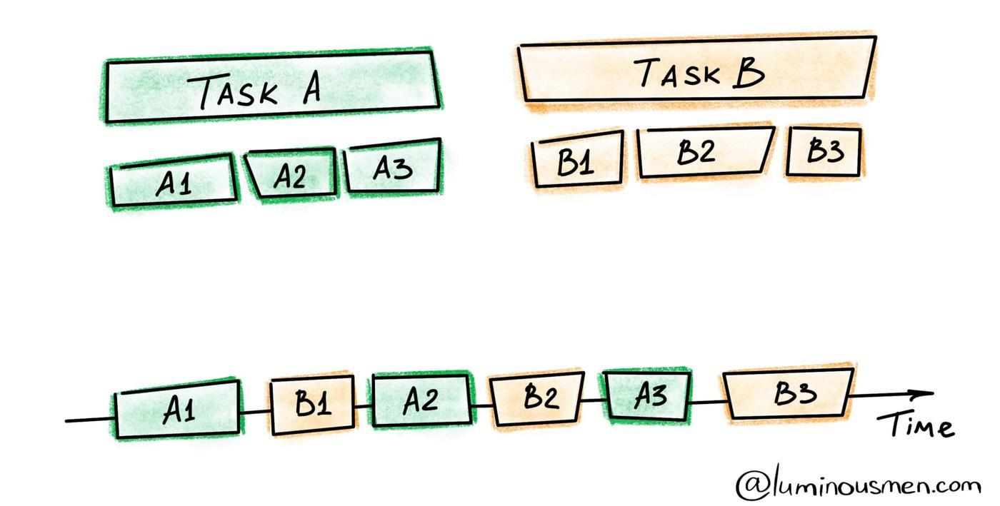<br>출처: https://luminousmen.com/post/concurrency-and-parallelism-are-different </p>
  * 병행
    * 싱글 코어
      * **시분할로 컨텍스트 스위칭을 하며 여러 작업을 수행하는 방식. 동시에 하는  것 처럼 느껴진다.**
      * 여러 가지의 일을 같은 시간에 번갈아가며 처리하는 방식.
      * ex. 싱글 코어에 멀티 스레딩 방식
    * 멀티 코어 => 병행 + 병렬
    * 예시 - 싱글 코어 CPU
    * Mutex, Deadlock이 발생할 수 있다.

  <p align="center">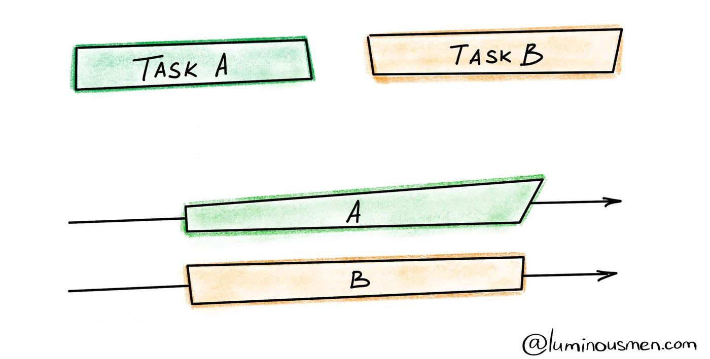<br>출처: https://luminousmen.com/post/concurrency-and-parallelism-are-different </p>
  * 병렬
    * 멀티 코어 (싱글 코어에선 불가능하다.)
      * **여러 가지의 일을 동시에 처리하는 방식.** (번갈아가면서 하는 것이 아닌 동시 처리)
      * 멀티 코어를 잘 활용할 수 있다.
    * 예시 - GPU
  
  --- 
</details>

#### Q. 멀티 프로세스 vs 멀티 스레드
<details>
  <summary>답변</summary>
  
  --- 
  
  * 멀티 프로세스
    * 개념
      * 같은 시간에 여러 개의 프로세스를 띄우고 실행하는 방식.
      * **여러 개의 프로세스를 동시에 수행하는 것. (부모 - 자식 관계를 통한 독립적인 구조)**
    * 예시 - 크롬
      * 크롬의 각 탭은 (Renderer) 프로세스 기반이다, 이들은 각자 독립적으로 실행된다.
      * 그리고 각 탭은 IPC (Inter-Process Communication) 메커니즘을 이용하여 통신한다. (공유 메모리, 메시지 전달 중 하나를 선택)
    * 장점
      * 독립된 구조를 가지기 때문에 안정성이 높다.
      * 하나의 프로세스가 비정상적으로 종료되어도 자식 프로세스 이외의 다른 포르세스엔 아무런 영향을 끼치지 않는다.
    * 단점
      * 독립된 메모리 영역을 가지므로 컨텍스트 스위칭을 위한 오버헤드 (캐시 초기화)가 발생한다.
      * 많은 메모리 공간 차지
  * 멀티 스레드
    * 개념
      * 같은 시간에 여러 개의 스레드를 띄우고 실행하는 방식.
      * **한 프로세스에서 여러 개의 스레드를 동시에 수행하는 것.**
    * 예시
      * 웹 서버 - 웹 서버는 각 요청을 스레드 기반으로 처리한다.
      * 웹 브라우저 - 하나의 스레드는 렌더링, 다른 스레드는 네트워크 통신을 수행한다.
      * 워드 프로세스 - 글을 작성하면 맞춤법 및 문법 검사등을 수행한다.
      * 운영체제 커널 - Linux 시스템 부팅시 여러 커널 스레드가 생성되고, 각 스레드는 장치 관리, 메모리 관리 또는 인터럽트 처리와 같은 특정 작업을 수행한다고 한다.
    * 장점
      * 적은 메모리 공간 차지
      * TCB를 컨텍스트 스위칭하므로 속도가 빠름
      * 싱글 스레드에 비해 응답성이 빨라진다. (하나의 작업이 완료될 때까지 기다리지 않기 때문)
      * 자원을 공유한다.
    * 단점
      * 동기화의 문제 존재
      * 하나의 스레드가 문제 발생시 전체 스레드에 영향을 끼칠 수 있음
  * 예시
    * 웹 서버가 매 요청마다 프로세스로 할당한다면 멀티 프로세스, 스레드로 할당한다면 멀티 스레드라고 볼 수 있다.
  
  --- 
</details>

#### Q. Light Weight Process vs Heavy Weight Process - 예정
<details>
  <summary>답변</summary>
  
  --- 
  
  * 
  
  --- 
</details>

#### Q. User Level Thread vs Kernel Level Thread - 예정
<details>
  <summary>답변</summary>
  
  --- 
  
  * 
  
  --- 
</details>

#### Q. Context Switching이란? 언제 발생하는지?
<details>
  <summary>답변</summary>
  
  --- 
  
  * 컨텍스트 스위칭 개념
    * 하나의 사용자 프로세스로부터 다른 사용자 프로세스로 **CPU의 제어권이 이양되는 과정.**
  * 컨텍스트 스위칭는 언제 발생하는가?
    * 인터럽트: 여러 장치들이 CPU의 작업이 필요할 때 발생시키는 이벤트. (시스템 -> 시스템)
      * 하드웨어 인터럽트: 컨트롤러등 하드웨어 장치가 보내는 인터럽트.
      * 소프트웨어 인터럽트: 소프트웨어가 보내는 인터럽트. (aka. 트랩)
      * ex. 시분할
    * 시스템 콜 (소프트웨어 인터럽트)
      * 사용자 프로그램이 운영체제 내부에 정의된 코드를 실행하고 싶을 때 운영체제에 서비스 요청하는 인터럽트. (사용자 -> 시스템)
      * 커널 영역의 함수 호출. (CPU의 제어권이 운영체제로 넘어간다.)
      * ex. 입출력, 예외 처리 등등
  
  --- 
</details>

#### Q. 다양한 스케줄러 - 예정
<details>
  <summary>답변</summary>
  
  --- 
  
  * 
  
  --- 
</details>

#### Q. CPU 스케줄링
<details>
  <summary>답변</summary>
  
  --- 
  
  > Ready Queue에 있는 프로세스를 스케줄링하는 것.

  * CPU 스케줄링이 필요한 이유
    * 여러 프로세스가 제한된 CPU를 사용해야하므로 프로세스간의 스케줄링이 필요하다.
    * 즉, 매 시점 어떤 프로세스에 CPU를 할당해 작업을 처리할 것인지 결정하는 일이 필요하다.
  * CPU 스케줄링의 목표
    * CPU를 효율적으로 사용하면서, 특정 프로세스가 불이익을 당하지 않도록 하는것.
  * CPU 스케줄링 방식
    * 선점형 방식 (시분할) - CPU가 제어권을 가짐
      * 프로세스가 CPU를 계속 사용하기 원하더라도 강제로 빼앗을 수 있는 방법.
    * 비선점형 방식 - CPU가 제어권을 가지지 않음
      * CPU를 획득한 프로세스가 스스로 CPU를 반납하기 전가지는 CPU를 빼앗기지 않는 방법.
  * CPU 스케줄링 기법
    * 선입 선출 (FCFS, First Come First Served)
      * CPU를 사용하기 위해 도착한 프로세스들 중 먼저 온 것을 먼저 처리.
      * 비선점형 방식 (프로세스가 CPU를 반납할 때까지 대기)
      * 단점
        * 오래 걸리는 프로세스가 있다면 대기 중인 프로세스가 너무 오래 기다려야 한다. - Convoy Effect
    * SJF (Shortest Job Firs)
      * 다른 프로세스가 먼저 도착했어도 CPU burst time이 짧은 프로세스에게 선할당하는 방식
      * 비선점형 방식
      * 단점
        * CPU 사용이 짧은 job을 너무 선호한다. (차별한다) 사용기간이 긴 프로세스는 거의 영원히 CPU를 할당받지 못할 수도 있다. - 기아 상태
    * 라운드 로빈
      * CPU를 한 번 할당받아 사용할 수 있는 시간을 일정하게 고정된 시간으로 제한하여 반복하는 방식.
      * 단점
        * 오랜 시간이 걸리는 프로세스 때문에 짧은 시간이 필요한 프로세스가 오래 기다려야한다.
    * 우선 순위
      * CPU 사용을 위해 대기 중인 프로세스들에 우선순위를 부여하고 우선순위에 따라 먼저 할당하는 방식.
      * 선점형 방식
        * 더 높은 우선순위의 프로세스가 도착하면 실행중인 프로세스를 멈추고 CPU를 선점한다.
      * 비선점형 방식
        * 더 높은 우선순위의 프로세스가 도착하면 Ready Queue의 Head에 넣는 방식.
      * 문제
        * 우선 순위가 낮은 프로세스는 계속해서 CPU를 점유하지 못한다. - 기아 상태
        * 실행 준비는 되어있으나 CPU를 사용못하는 프로세스를 CPU가 무기한 대기하는 상태 - 무기한 봉쇄
      * 해결책 - 기아 상태 문제는 우선순위가 낮은 프로세스가 오래 기다리면 우선순위를 높이는 방식으로 해결할 수 있다.
  
  --- 
</details>

#### Q. 동기와 비동기 차이
<details>
  <summary>답변</summary>
  
  --- 
  
  * 동기 / 비동기
    * 동기와 비동기는 호출 되는 함수의 완료를 호출한 쪽에서 신경을 쓰냐 호출받은 쪽에서 신경을 쓰냐의 차이다.
      * **`호출된 함수`의 수행 결과 및 종료를 `호출한 함수`가 신경쓰면 동기**
      * **`호출된 함수`의 수행 결과 및 종료를 `호출한 함수`가 신경쓰지 않으면 비동기**
    * 동기: 함수를 호출과 `동시에` 반환 값이 기대되는 경우를 동기
    * 비동기: 함수를 호출화 `동시에` 반환 값을 기대하지 않는 경우 비동기
  * 블록 / 논블록
    * 블록: 호출받은 쪽이 호출한 쪽에 제어권을 넘겨주지 않는 것.
    * 논-블록: 호출받은 쪽이 호출한 쪽에 제어권을 넘겨주는 것.
  
  --- 
</details>

#### Q. 프로세스 동기화 방법 (세마포어와 뮤텍스)
<details>
  <summary>답변</summary>
  
  --- 
  
  * 
  
  --- 
</details>

#### Q. 데드락이란? 해결방법은?
<details>
  <summary>답변</summary>
  
  --- 

  <p align="center">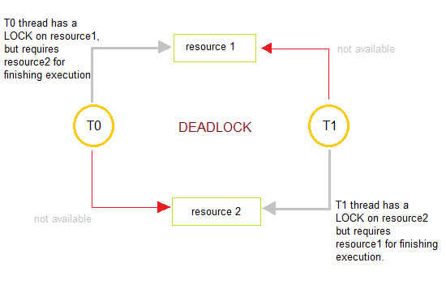<br>출처: https://velog.io/@jess29/DeadLock</p>
  
  * 데드락이란
    * 교착상태.
    * **두 개 이상의 작업이 서로 상대방의 작업을 끝나기만을 기다리고 있어서 다음단계로 진행하지 못하는 상태.**
  * 데드락 발생조건
    * 상호배제 (Mutual Exclusion)
      * 한 프로세스가 자원을 사용하고 있으면, 다른 프로세스는 사용할 수 없다.
    * 점유대기 (Hold and Wait)
      * 한 프로세스가 자원을 가지고 있는 상태에서 대기하는 것.
      * 프로세스가 할당된 자원을 가진 상태에서 다른 자원을 기다리는 것.
    * 비선점 (No preemption)
      * 한 프로세스가 자원을 수행하는 중에는 다른 프로세스가 중간에 끼어들 수 없다.
      * 프로세스가 어떤 자원의 사용을 끝낼 때까지 그 자원을 뺏을 수 없다.
    * 순환대기 (Circular wait)
      * 프로세스가 요구하는 자원의 방향이 원형을 이룬다.
      * 각 프로세스는 순환적으로 다음 프로세스가 요구하는 자원을 가지고 있는 것.
  * 데드락 해결 방법
    * 예방
      * 데드락 발생조건 3가지 중 최소 한가지를 미충족 시키도록 만드는 것.
    * 회피
      * 데드락이 발생하지 않는 수준으로 자원을 할당하는 방식. (자원을 많이 할당할수록 데드락이 발생할 확률이 커진다.)
      * 현재 할당된 자원의 수를 기준으로 시스템을 안정상태와 불안정상태로 나뉘어진다.
      * 할당된 자원이 많으면 불안정이고, 할당 자원이 적으면 안정상태이다.
    * 상태 검출 및 복구
      * 교착 상태 존재 여부 및 교착 상태에 연관된 프로세스와 자원을 알아낸다.
      * 데드락을 일으킨 프로세스를 종료하거나, 할당된 자원을 해제함으로써 복구한다.
    * 무시
      * 대부분 교착 상태는 드물게 발생하고 예방,회피,탐지 및 복구는 비용이 많이 들기때문에 그냥 무시하는 방식
  
  --- 
</details>

<br>

## DB

### RDB

#### Q. 정규화란? 왜 정규화를 하는가?
<details>
  <summary>답변</summary>
  
  --- 
  
  * 정규화란?
    * **중복을 최소화하게 데이터를 구조화하는 프로세스를 정규화(Normalization)**
      * 데이터베이스 정규화의 목표는 이상이 있는 관계를 재구성하여 작고 잘 조직된 관계를 생성하는 것에 있다
    * 제대로 조직되지 않은 테이블들과 관례들을 작고 잘 조직된 테이블과 관계들로 나누는 것.
  * 정규화를 하는 이유
    * **중복 데이터를 제거**하기 위함. 중복 데이터가 많으면 데이터끼리의 정합성(서로 일치한지)을 맞추기 어렵다.
      * 이를 통해 무결성을 유지할 수 있다.
    * **데이터 저장을 논리적**으로 하기 위함. 
  
  --- 
</details>

#### Q. 데이터 무결성과 정합성
<details>
  <summary>답변</summary>
  
  --- 
  
  * 개념
    * 데이터 정합성
      * 어떤 데이터들의 값이 서로 일치할 때 데이터 정합성이 맞다고 표현한다.
      * 중복된 데이터를 많이 사용하면 데이터끼리 정합성을 맞추기 어렵고 궁극적으로 서로 달라지는 경우 정합성이 깨진다. (정규화를 통해 해결할 수 있다.)
    * 데이터 무결성
      * 데이터가 정확하고 완전해야 한다는 의미.
      * 데이터 완정성이나 정확성이라는 표현이 더 정확하다고 한다.
      * 무결성의 종류
        * 엔티티 무결성 - 개체 무결성
          * 엔티티에 존재하는 모든 인스턴스는 고유해야 한다.
          * 모든 인스턴스(Row)를 대표하는 속성(PK)는 고유한 값이거나, Null 값을 가지면 안된다.
        * 참조 무결성 - 외래키
          * 엔티티의 외래 식별자 값은 참조되는 엔티티의 주 식별자 값과 일치하거나 Null 값이어야 한다.
          * 참조 무결성은 보통 FK (외래키)제약에 의해서 지켜진다.
        * 도메인 무결성 - 속성 값(컬럼)과 관련된 제약
          * 엔티티의 특정 속성 값은 동일한 데이터 타입, 길이, Null 허용 여부, 기본 값, 허용 값 등 동일한 범주의 값만이 존재해야한다.
          * ex. 이름 속성으로 "binghe"는 허용, 777는 불가
        * 업무 무결성
          * 기업에서 업무를 수행하는 방법이나 데이터를 처리하는 규칙 (비즈니스 로직과 비슷함)
          * ex. 주문 금액 4만원 이상이면 무료배송
  * 차이점
    * 정합성은 데이터가 서로 무순 없이 일관되게 일치해야 한다는 의미
    * 무결성은 데이터가 정확하고 완전해야 한다는 의미.
      * 데이터는 제대로된 (DBA나 개발자가 의도한) 상태로 존재해야한다는 의미.
    * 어떤 데이터는 정합성은 만족하나 무결성은 훼손된 상태일 수 있다.
      * ex. 이름 속성에 전부 전화 번호(숫자)가 들어간 경우.
  
  --- 
</details>

#### Q. 인덱스란?
<details>
  <summary>답변</summary>
  
  --- 
  
  * **인덱스는 테이블에 대한 동작의 속도를 높여주는 자료 구조이다.**
    * 비유: DB `인덱스 : 데이터`  = 책 `색인 : 페이지 번호(책 내용)`
  * 인덱스는 **데이터의 저장 성능을 희생하고 데이터의 읽기 속도를 높이는 기능**이다.
    * **인덱스는 데이터를 저장할 때 항상 정렬해야 하므로 저장하는 과정이 복잡하고 느리다. 반면에, 정렬되어 있는 값을 조회하는 것은 굉장히 빠르다.**
  
  --- 
</details>

#### Q. RDB는 인덱스를 보통 어떤 자료구조로 구현하는가?
<details>
  <summary>답변</summary>
  
  --- 
  
  * B-Tree 혹은 B+Tree
    * root, branch, leaf 노드로 나뉘고 스스로 균형을 맞추는 균형 트리이다.
    * 스스로 균형에 맞춰 데이터를 정렬하기 때문에 항상 O(logN)의 조회 성능을 유지한다.
  * [B-Tree 원리 및 사용 이유](https://github.com/binghe819/TIL/blob/master/DB/%EA%B8%B0%ED%83%80/B-Tree/B-Tree.md)
  
  --- 
</details>

#### Q. 인덱스 튜닝을 하는 이유는?
<details>
  <summary>답변</summary>
  
  --- 
  
  * 조회 성능을 높이기 위함.
  * 대량의 데이터에서 소량의 데이터를 탐색하기 위해 Index를 사용할 경우 랜덤 I/O 횟수를 줄이는 것이 인덱스 튜닝의 핵심이라고 볼 수 있다.
  
  --- 
</details>

#### Q. 인덱스 튜닝 종류
<details>
  <summary>답변</summary>
  
  --- 
  
  > B-Tree 기준

  * 수직적 탐색
    * 인덱스 스캔 시작지점을 찾는 과정 (leaf 노드에서 스캔의 시작 지점을 찾는 과정)
    * 조건에 만족하는 첫 번째 레코드를 찾는 것이 목표
  * 수평적 탐색
    * 데이터를 찾는 과정 (인덱스 leaf 노드를 수평적으로 스캔한다.)
    * 조건절에 맞는 데이터를 모두 찾는 것이 목표. (ROWID를 찾기 위함)
  * 인덱스 튜닝
    1. 인덱스 스캔 효율화 (수직적 탐색)
       * **인덱스 스캔 과정에서 발생하는 비효율을 줄이는 것.**
    2. 랜덤 액세스 최소화 (수평적 탐색)
       * **인덱스 스캔 후 테이블 레코드를 액세스할 때, 랜덤 I/O 횟수를 줄이는 것**을 의미한다.
  * 우선적으로 튜닝해야 하는 부분은 랜덤 액세스 최소화 (수평적 탐색)이다.
    * 학생 명부를 뒤지는 과정에서의 비효율보다, 학생 명부에 없는 정보를 위해 직접 교실에 가는 부담이 더 크듯, 랜덤액세스 최소화 튜닝이 더 중요하다. (다른 비유 찾아보자.)
  
  --- 
</details>

#### Q. 순차 I/O와 랜덤 I/O란?
<details>
  <summary>답변</summary>
  
  --- 
  
  * **순차 I/O는 물리적으로 인접한 페이지를 차례대로 읽는 순차 접근 방식이다.**
    * 인접한 페이지를 여러 개 읽는 **다중 페이지 읽기방식**으로 수행된다.
    * 원하는 데이터를 찾기 위해선 Full Scan을 해야한다.
  * **랜덤 I/O는 물리적으로 떨어진 페이지들에 임의로 접근하는 임의 접근 방식이다.**
    * 정해진 순서없이 이동하는 만큼 디스크의 물리적인 움직임이 필요하고, 다중 페이지 읽기가 불가능하다.
    * 대용량의 데이터를 하나하나 랜덤 I/O를 통한다면 전체 데이터에 접근 수행 시간이 비교적 오래 걸린다.
  
  --- 
</details>

#### Q. Index Range Scan과 Table Full Scan
<details>
  <summary>답변</summary>
  
  --- 
  
  <p align="center">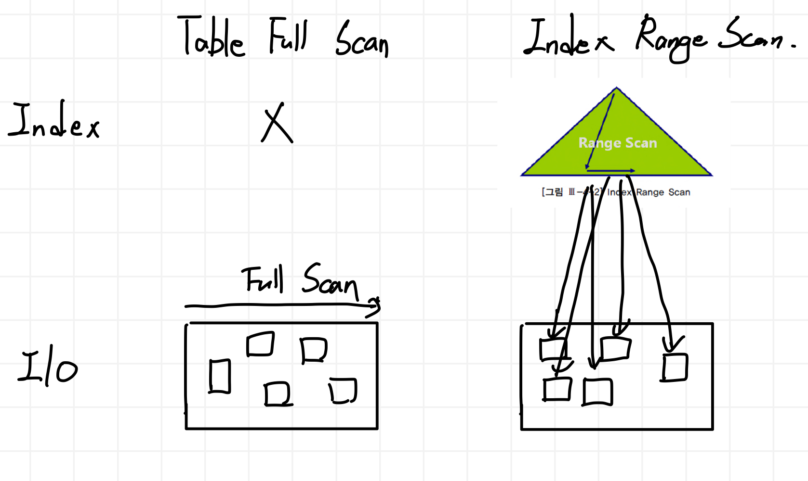 </p>

  * Table Full Scan
    * 순차 I/O 방식와 MultiBlock I/O방식으로 디스크를 읽어 한 블록에 속한 모든 레코드를 한번에 읽어들이는 방법.
  * Index Range Scan
    * 랜덤 I/O와 Single Block I/O로 레코드 하나를 읽기 위해 매번 I/O를 통해 필요한 레코드를 읽는 방법.
  * 무조건 Index Range Scan이 좋은 것은 아니다.
    * 조금만 생각해보면 위와 같이 읽을 **데이터가 일정량을 넘으면 Index Range Scan의 경우 매 인덱스마다 데이터를 가져와야 함으로 다량의 디스크 I/O가 발생**하게 된다.
    * 그러므로 더 비효율적일 수도 있다.
    * 다만, **큰 테이블에서 소량 데이터를 검색할 때는 당연히 Index Range Scan이 유용하다.**
  
  --- 
</details>

#### Q. 다중 인덱스 주의할 점
<details>
  <summary>답변</summary>
  
  --- 
  
  * 다중 인덱스의 정렬 방식
    * 다중 인덱스의 **두 번째 칼럼은 첫 번째 칼럼에 의존해서 정렬돼 있다.**
    * 즉, 다중 칼럼 인덱스에서는 인덱스 내에서 각 칼럼의 위치(순서)가 매우 중요하다.
  * 다중 인덱스 설정시 주의할 점
    * 다중 인덱스 테이블에서 조회를 하면, 첫 번째 인덱스 컬럼 값부터 찾고, 그 다음 인덱스 칼럼을 찾기 시작한다.
    * **인덱스 순서를 고려해야 한다.**
      * **비교 작업의 범위가 작은 인덱스부터 설정해주는 것이 다중 인덱스 설정에 좋다.**
      * 즉, **작은 범위를 앞에 두고, 비교적 큰 범위 검색 컬럼을 뒤에 두는 것이 좋다.**
  
  --- 
</details>

#### Q. 클러스터링 인덱스 vs 넌클러스터링 인덱스  
<details>
  <summary>답변</summary>
  
  --- 
  
  * 클러스터링 인덱스
    * 물리적으로 행을 재배열한다. (리프 노드가 데이터 페이지)
    * 실제 DB의 데이터 파일에 정렬이 되어 있는 상태로 디스크에 저장된다.
    * 테이블의 데이터가 물리적으로 정렬되어 저장되어 있기 때문에 부분 범위 처리에 활용하면 적은 I/O를 통해 원하는 데이터를 추출할 수 있다. (인덱스를 거치지 않는다)
    * 선택도의 범위가 30% 이내일 때 효율적이다.
    * 테이블당 최대 1개
  * 넌클러스터링 인덱스
    * 물리적으로 행을 재배열하진 않는다. (데이터 페이지를 건들지 않고, 별도의 장소에 인덱스 페이지 생성)
    * 실제 DB의 데이터 파일에 정렬이 되지 않은 상태로 디스크에 저장된다.
    * Leaf Level 인덱스 페이지에 테이블 데이터 위치가 저장되어 있기 때문에 테이블 데이터가 있는 Leaf Level까지 찾아간 뒤 해당 테이블에 랜덤 I/O를 통해 데이터를 추출할 수 있다. (인덱스갔다가 하나하나 랜덤I/O)
    * 선택도의 범위가 3% 이내일 때 효율적이다.
    * 테이블당 최대 249개
  * 클러스터 인덱스는 데이터의 위치를 바로 알기 때문에 그 데이터로 바로 접근할 수 있고 넌클러스터 인덱스는 페이지를 한 번 거쳐서 데이터에 접근하는 방식
  
  --- 
</details>


#### Q. MySQL은 쿼리를 어떻게 처리하는가?
<details>
  <summary>답변</summary>
  
  --- 
  
  <p align="center">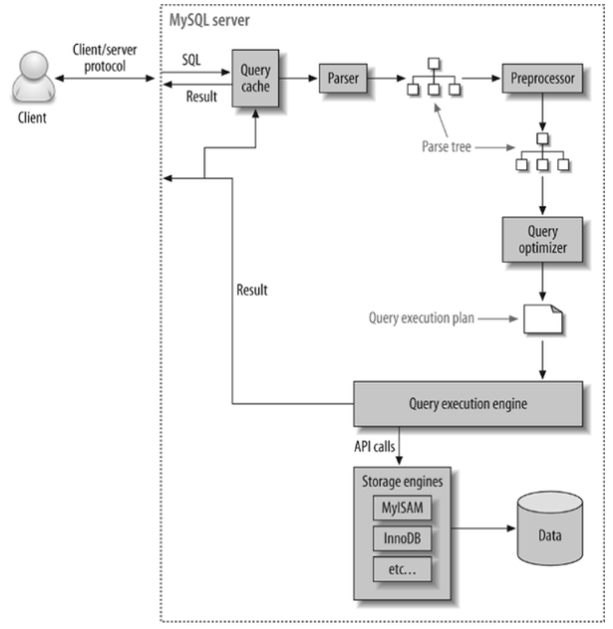 </p>

  * Connection Pool (Connection Handler)
    * 
  * SQL Parser
    * 쿼리 문장을 토큰(MySQL이 인식할 수 있는 최소 단위의 어휘나 기호)으로 분리해 트리 형태의 구조로 만들어 내는 작업을 의미한다.
  * Optimizer
    * 사용자 요청으로 들어온 쿼리 문장을 저렴한 비용으로 가장 빠르게 처리할 지 결정하는 역할을 담당한다. (DBMS의 두뇌)
    * **인덱스의 유무, 데이터 분산 또는 편향 정도 등의 통계정보를 참고하여 여러 실행계획을 작성한다.**
  * Execution Engine
    * **옵타마이저가 두뇌라면 실행 엔진과 핸들러는 손과 발에 비유**할 수 있다.
    * ex. 옵티마이저가 `GROUP BY`를 처리하기 위해 임시 테이블을 사용한다고 가정한다면
      1. 실행 엔진은 핸들러에게 임시 테이블을 만들라고 요청.
      2. 다시 실행 엔진은 WHERE 절에 일치하는 레코드를 읽어오라고 핸들러에게 요청.
      3. 읽어온 레코드들을 1번에서 준비한 임시 테이블로 저장하라고 다시 핸들러에게 요청.
      4. 데이터가 준비된 임시 테이블에서 필요한 방식으로 데이터를 읽어 오라고 핸들러에게 다시 요청.
      5. 최종적으로 실행 엔진은 결과를 사용자나 다른 모듈로 넘긴다.
    * 위와 같이 **실행 엔진은 만들어진 계획대로 각 핸들러에게 요청해서 받은 결과를 또 다른 핸들러 요청의 입력으로 연결하는 역할**을 수행한다.
  * Handler - Storage Engine
    * MySQL 서버의 가장 밑단.
    * **MySQL 실행 엔진의 요청에 따라 데이터를 디스크로 저장하고 디스크로부터 읽어 오는 역할을 담당한다.**
    * 스토리지 엔진에 접근하기 위한 API
  
  --- 
</details>

#### Q. Optimizer가 하는 일
<details>
  <summary>답변</summary>
  
  --- 
  
  * optimizer는 인덱스의 유무, 데이터 분산 또는 편향 정도 등의 통계정보를 참고하여 여러 실행계획을 작성하고 이들의 비용을 연산한 후, 최적화된 실행계획을 수립하는 DBMS의 핵심엔진 이다.
  
  --- 
</details>

#### Q. 트랜잭션 개념과 성질
<details>
  <summary>답변</summary>
  
  --- 
  
  * 트랜잭션이란?
    * **복수 쿼리를 한 단위로 묶는 것**. 더 이상 나눌 수 없는 단위 작업.
    * ex. 하나의 거래 완성 (단위) = 구매 계좌에서 n만원 출금(작은 단위) + 판매자 계좌에서 n만원 출금(작은 단위)
  * 트랜잭션 성질 (ACID)
    * **Atomicity (원자성) -> 단위**
      * 원자: 더 이상 쪼개질 수 없는 성질
      * 원자성이란 데이터의 변경을 수반하는 일련의 데이터 조작이 전부 성공할지 전부 실패할지를 보증하는 구조이다.
      * COMMIT OR ROLLBACK
    * **Consistency (일관성) -> 무결성 제약 조건**
      * 트랜잭션이 안전하게 수행된다는 것을 보장하기 위한 성질
      * 트랜잭션 수행 전/후에 데이터 모델의 모든 제약 조건(기본 키, 외래 키, 도메인, 도메인 제약조건 등)을 만족하는 것을 통해 보장한다는 의미.
      * 예시 
        * 통장의 잔고는 마이너스가 안된다는 제약 조건이 존재한다.
        * 만약 트랜잭션 과정에서 통장의 잔고가 마이너스가 된다면 롤백되어 트랜잭션이 종료된다.
    * **Isolation (독립성) -> 병행 제어**
      * 데이터 조작을 복수의 사용자가 동시에 실행해도 '각가의 처리가 모순없이 실행되는 것을 보증'하는 것.
      * 하나의 트랜잭션 수행시 다른 트랜잭션의 작업이 끼어들지 못하도록 보장하는 것. (Lock 처리)
    * **Durability (지속성) -> 영속화**
      * 트랜잭션을 완료(COMMIT)하고 완료 통지를 사용자가 받는 시점에 그 트랜잭션이 영구적이 되어 그 결과를 잃지 않는 것.
      * 컴퓨터가 종료되거나 시스템 장애가 발생해도 계속 저장되는 성질 (RAM이 아닌 SSD에 저장된 상태)
  
  --- 
</details>

#### Q. 트랜잭션 Isolation Level
<details>
  <summary>답변</summary>
  
  --- 

  <p align="center"> </p>

  <p align="center">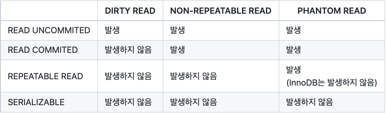 </p>
  
  * 트랜잭션 격리수준이란?
    * 하나의 트랜잭션 내에서 또는 여러 트랜잭션 간의 작업 내용을 어떻게 공유하고 차단할 것인지를 결정하는 레벨.
    * **격리성이 높아질 수록 성능이 악화된다.**
  * **READ UNCOMMITED**
    * 커밋 전의 트랜잭션의 데이터 변경 내용을 다른 트랜잭션이 읽는 것을 허용한다.
    * Dirty Read가 발생한다.
  * **READ COMMITED**
    * 커밋이 완료된 트랜잭션의 변경사항만 다른 트랜잭션에서 조회 가능하다. (UNDO를 통해 트랜잭션 이전의 데이터를 저장하고 있는다)
    * 한 트랜잭션이 다른 트랜잭션이 커밋한 값만 읽을 수 있다
    * Dirty Read가 발생하지 않는다.
    * 하지만, NON-REPEATABLE READ 현상이 발생한다.
      * 같은 트랜잭션 안에서 똑같은 SELECT 쿼리를 실행했을 때 서로 다른 값을 가져온다.
      * 트랜잭션 수행 중 다른 트랜잭션이 COMMIT하기 전 조회 데이터와 COMMIT한 후 조회 데이터가 달라질 수 있기 때문이다.
  * **REPEATABLE READ**
    * 트랜잭션 범위 내에서 조회한 내용이 항상 동일함을 보장한다.
    * 각각의 트랜잭션에 고유한 번호(순차적으로 증가하는 값)을 부여하는 방식으로 동작한다.
      * 만약 10번의 트랜잭션에서 실행되는 모든 SELECT 쿼리는 트랜잭션 번호 10보다 작은 트랜잭션 번호에서 변경한 것만 보게 된다.
    * **MySQL의 InnoDB에서 기본적으로 사용되는 격리 수준**
    * PHANTOM READ가 발생할 수 있다.
      * 다른 트랜잭션에서 수행한 변경 작업(INSERT문)에 의해 레코드가 보였다가 안 보였다가 하는 현상.
      * 하나의 트랜잭션 안에서 다른 트랜잭션 작업(INSERT, DELETE)등에 의해 레코드가 보였다가 안 보였다가 하는 현상.
    * SERIALIZABLE
      * 동기화 : 한 트랜잭션에서 사용하는 데이터를 다른 트랜잭션에서 접근이 불가하다.
      * 동시 처리 성능이 제일 떨어지므로 사용되지 않는다.
    * [자세한 내용](https://github.com/binghe819/TIL/blob/master/DB/RDB/%ED%8A%B8%EB%9E%9C%EC%9E%AD%EC%85%98/Transaction.md#3-%ED%8A%B8%EB%9E%9C%EC%9E%AD%EC%85%98-%EA%B2%A9%EB%A6%AC%EC%88%98%EC%A4%80)
  
  --- 
</details>

#### Q. 락의 종류
<details>
  <summary>답변</summary>
  
  --- 
  
  * 공유 락(Shared Lock) - READ Lock
    * 데이터를 읽을 때 사용되어지는 Lock.
    * 공유 Lock 끼리는 동시에 접근이 가능하다. 하나의 데이터를 읽는 것은 여러 사용자가 동시에 할 수 있다는 의미.
    * 공유 Lock이 설정된 데이터에 베타 Lock을 사용할 순 없다.
      * 특정 데이터에 공유 Lock을 걸게 되면, 해당 데이터를 write 하기 위해서는 베타 Lock을 얻어야 하므로, 공유 Lock을 가진 트랜잭션이 끝날 때 까지 write을 하지 못한다.
  * 베타 락(Exclusive Lock) - Write Lock
    * 데이터를 변경하고자 할 때 사용되며, 트랜잭션이 완료될 때까지 유지된다.
    * 베타 Lock이 해제될 때 까지 다른 트랜잭션 (읽기 포함)은 해당 리소스에 접근할 수 없다.
  
  --- 
</details>

#### Q. 낙관적인 락과 비관적인 락
<details>
  <summary>답변</summary>
  
  --- 
  
  * DB에 접근해서 데이터를 수정할 때 동시에 수정이 일어나 충돌이 발생할 수 있다. 이러한 상황을 해결하는 방법은 크게 두 가지다.
    1. 테이블 row에 Lock을 거는 방식.
    2. 수정할 때 특정 트랜잭션이 먼저 이 값을 수정했다고 명시하여 다른 트랙잭션이 동일한 조건으로 값을 수정할 수 없게 하는 방식.
  * 낙관적인 락 (Optimistic Lock)
    * 트랜잭션 내에서 데이터 갱신 시 충돌이 /발생하지 않을 것으로 가정하여 별도 락을 걸지 않는 방식.
      * 락을 해야하는 상황의 발생이 일어나면 그때 대응하고, 자원을 선점 시키지 않겠다는 의미
    * version과 같은 별도의 컬럼을 추가하여, 같은 row에 대해서 각기 다른 2개의 수정 요청이 있을 때 1개가 업데이트 됨에 따라 version을 변경하여 뒤의 수정 요청을 반영하지 않는 방식.
      * 트랜잭션을 필요로하지 않는다.
    * DB에서 제공해주는 특징을 이용하는 것이 아닌 Application Level에서 잡아주는 Lock 방식.
  * 비관적인 락 (Pessimistic Lock)
    * "자원에 동시 요청이 발생하여, 데이터 일관성에 문제가 생길 것"이라고 비관적으로 생각하고 이를 방지하기 위해 자원을 선점하는 방식.
      * 무조건 잠금하고 선점
    * 비관적 락이란 트랜잭션이 시작될 때 Shared Lock 또는 Exclusive Lock을 걸고 시작하는 방법이다.
    * Transaction과 Lock을 이용하여 충돌을 예방하는 것이 바로 비관적 락(Pessimistic Lock)
    * DB에서 제공해주는 특징을 이용한 Lock 방식.
    * 대표적으로 select for update문이 있다.
    * 비관적인 락은 낙관적인 락보다 데이터 일관성 문제를 해결할 수 있지만, 오버헤드가 크고 성능에 좋지 않다.
  * 장단점
    * 낙관적인 락
      * 장점: 성능이 좋다.
      * 단점: 롤백을 하기 까다롭다. (충돌이 났다면 이를 해결하기 위해 개발자가 수동으로 롤백처리를 해줘야 한다.)
    * 비관적인 락
      * 장점: 트랜잭션 처리(롤백)에 용이하다. 데이터 일관성이 확실히 지켜진다.
      * 단점: 성능이 비교적 느리다.
    * 낙관적 락은 충돌이 많이 예상되거나 충돌이 발생했을 때 비용이 많이 들것이라고 판단되는 곳에서는 사용하지 않는 것이 좋다.
  
  --- 
</details>

#### Q. Replication 데이터 일관성 문제
<details>
  <summary>답변</summary>
  
  --- 
  
  * 문제 정의
    * Replication은 보통 디폴트로 Binlog 기반의 비동기 방식으로 진행된다. 
    * 이때 마스터에 UPDATE한 쿼리가, SLAVE에 도착하기 전에 SLAVE에 조회 쿼리를 보내게 되면 NULL을 반환하게 되는 데이터 정합성 문제가 발생할 수 있다.
  * 문제 해결 방법 - 준동기
    * Replication에서 준동기 방식을 사용한다면 문제를 해결할 수 있다.
    * 하지만 이 방식은 Master가 Slave의 응답을 기다려야하므로 성능이 저하될 수 있다.
  * 트레이드 오프
    * 결국은 트레이드 오프가 발생한다.
    * 서비스 운영에서 조회의 안정성이 데이터 정합성보다 우선순위가 높다고 생각되기에 비동기 방식으로 그대로 사용할 듯 하다.
    * 만약 클라이언트가 해당 요청시 NULL이 발생한다고해도 새로고침을 한번 더 하는 등 다른 액션을 취할 것으로 예상되기도 하다.
  
  --- 
</details>

#### Q. 샤딩이란
<details>
  <summary>답변</summary>
  
  --- 
  
  * 샤딩이란
    * 대량의 데이터를 분산 처리하기 위해 DB 테이블을 분할하여 물리적으로 서로 다른 곳에 분산하여 저장하는 것을 말한다.
  * 샤딩의 핵심
    * 샤딩키를 기준으로 데이터가 분산되며, 샤딩키를 잘 지정하여 데이터가 한쪽 샤드로 몰리게 하는 것을 막는 것이 중요하다.
  
  --- 
</details>

#### Q. FK를 거는 것이 좋을까? 걸지 않는 것이 좋을까?
<details>
  <summary>답변</summary>
  
  --- 
  
  * FK를 설정하는 경우
    * 장점
      * DB에서의 데이터 무결성(외래키 무결성)을 보장할 수 있다.
    * 단점
      * 특정 DB에 의존적이다.
  * FK를 설정하지 않을 경우
    * 장점
      * WAS에서의 로직이 특정 DB에 의존적이지 않다.
    * 단점
      * WAS에서 데이터 무결성을 보장하기 위해서 쿼리를 더 날려야 할 수도 있다.
  
  --- 
</details>

#### Q. MVCC 개념과 사용하는 이유
<details>
  <summary>답변</summary>
  
  --- 
  
  > Multi Version Concurrency Control

  * MVCC란?
    * 레코드 레벨의 트랜잭션을 지원하는 DBMS가 제공하는 기능.
    * **하나의 레코드 (ID가 12인 로우)에 대해 2개의 버전이 유지되고, 필요에 따라 어느 데이터가 보여지는지 여러 가지 상황에 따라 달리지는 구조를 의미한다.**
  * MVCC 사용이유
    * **가장 큰 목적은 잠금을 사용하지 않는 일관된 읽기를 제공하는데 있다.**
      * InnoDB는 Undo 로그를 이용해 이 기능을 구현한다.
  * MySQL MVCC 예시

  ```sql
  mysql> INSERT INTO member (m_id, m_name, m_area) VALUES (12, 'binghe', '서울');
  ```
  위와 같이 쿼리를 날리면 MySQL은 다음과 같이 저장하게 된다.

  <p align="center"><br>출처: RealMySQL </p>

  <br>

  ```sql
  mysql> UPDATE member SET m_area='경기' WHERE m_id=12;
  ```
  그리고 UPDATE문을 날리면 아래와 같이 변경된다. 

  <p align="center"><br>출처: RealMySQL </p>

  * 버퍼 풀은 새로운 값인 '경기'로 업데이트 된다. 그리고 Undo 로그에 이전 데이터인 '서울'이 저장된다.
  * 이때 조회를 하면, 트랜잭션 격리 수준에 따라 다르게 조회된다.
    * `READ_UNCOMMITTED`: 버퍼 풀이나 데이터 파일로부터 변경된 상태의 데이터를 반환한다. ('경기')
    * `READ_COMMITTED` 혹은 그 이상: Undo 영역의 데이터를 반환한다. ('서울')
  * 상태 변환
    * `COMMIT` -> 지금의 상태를 영구적인 데이터로 만든다. (버퍼 풀에 있는 내용을 디스크 I/O를 통해 영속화)
      * COMMIT때는 Undo 영역이 바로 삭제되거나 혹은 트랜잭션이 더이상 사용되지 않을 때 삭제된다.
    * `ROLLBACK` -> Undo에 있는 백업 데이터를 버퍼 풀로 다시 복구한다.
      * ROLLBACK때는 Undo 영역의 내용을 삭제한다.
  
  --- 
</details>

#### Q. 복합 인덱스 주의할 점
<details>
  <summary>답변</summary>
  
  --- 
  
  * **인덱스 컬럼 순서**를 주의해야 한다.
    * 다중 인덱스의 **두 번째 칼럼은 첫 번째 칼럼에 의존해서 정렬돼 있다.**
    * **다중 인덱스 테이블에서 조회를 하면, 첫 번째 인덱스 컬럼 값부터 찾고, 그 다음 인덱스 칼럼을 찾기 시작한다.**
  * 일반적으로 더 넓은 범위 검색컬럼을 뒤에 둬야한다
  * **선행 컬럼 없이 사용하면 인덱스를 활용할 수 없다.**
    * 선행 컬럼 없이 뒤에 존재하는 인덱스를 사용하면 인덱스를 전혀 타지 않는다.
  
  --- 
</details>

#### Q. 실행 계획 관련 내용
<details>
  <summary>답변</summary>
  
  --- 
  
  * https://nomadlee.com/mysql-explain-sql/#type
  
  --- 
</details>

<br>

### Redis

#### Q. Redis를 사용한 이유는?
<details>
  <summary>토글</summary>
  
  --- 
  
  * 방대한 문서
  * 디스크보단 메모리 DB
    * 메모리 계층구조 관점
      * 디스크는 메모리보다 CPU와의 거리가 더 멀다. 디스크가 용량은 더 크지만 더 느리다.
    * 프로세스 관점
      * 디스크에 접근하기 위해선 Disk I/O가 발생하며, 이는 프로세스를 Blocked 상태로 둔다. 그리고 I/O 요청이 완료되면 처리 결과를 메모리로 옮기고 나서야 Ready 상태가 되어 다시 CPU의 점유를 기다린다. (느림)
      * 메모리는 다른 장치들의 I/O가 발생하지 않고, 인터럽트를 통해 사용자 모드를 커널 모드로 바꾸기만 하면된다. 프로세스 상태가 Blocked 되지 않고, Ready와 Running 상태를 반복한다. (빠름)
  * Key-Value 저장소 (NoSQL)
    * Key와 Value로 매핑된 단순한 맵 형태의 저장소로서 쉽게 읽고 쓸 수 있다. (직관적)
  * NoSQL (Not Only SQL)
    * 대용량의 데이터를 처리하기 용이하다.
  * Value 값으로 다양한 Collection을 제공한다.
    * 다양한 Collection (자료구조)를 제공한다.
  * 싱글 스레드
    * 레디스는 싱글 스레드로 동작하기 때문에, Race Condition을 피해 데이터의 정합성을 보장하기 쉽다.
  * 설정에 따라 쉽게 데이터를 영구적으로 보존할 수 있다. (보관, 백업)
  * 쉽게 Replication 적용이 가능하다.
  
  --- 
</details>

#### Q. Redis가 싱글 스레드인 이유
<details>
  <summary>토글</summary>
  
  --- 
  
  * Redis는 싱글 스레드이다.
    * 이를 다르게 말하면, **Client에서 요청하는 명령어는 싱글 스레드(메인 스레드)에서 동작한다.**
    * Redis 메인 스레드 이외에도 AOP 혹은 백업에 사용되는 I/O 스레드도 존재한다.
    * 하지만 **명령을 수행하는 것은 메인 스레드이므로, Redis는 싱글 스레드로 보는 것이 맞다.**
  * Redis의 싱글 스레드 특징 -> [참고 - 공식 문서](https://redis.io/topics/latency#single-threaded-nature-of-redis)
    * **사용자의 요청을 하나의(싱글) 프로세스가 모두 처리한다.** 이때 Multiplexing라고 불리는 기술을 사용한다.
    * 이는 **Redis가 모든 단일 요청을 순차적으로 처리한다는 것을 의미한다**. (Node.js에서의 이벤트 루프 방식과 유사하다)
    * 싱글 스레드가 느릴 것으로 판단되지만, 사실은 빠르다. **그 이유는 매 요청을 굉장히 짧은 시간안에 처리하며, 프로세스가 블록 상태가 되지 않도록 설계했기 때문이다. 또한, 문맥교환이 발생하지 않는다.**
  * **Redis가 싱글 스레드인 이유**
    1. CPU가 병목 현상의 원인이 아니다.
       * Redis의 병목현상의 대부분은 CPU가 아닌 시스템 메모리/네트워크 대역폭에서 발생한다.
    2. 동시성을 보장한다.
       * 이벤트루프 패턴을 통해 동시성을 구현하였고, **문맥교환이 없어 자원을 절약할 수 있다.**
    3. 쉬운 구현
    4. 쉬운 배포
       * 한 개의 코어만 있어도 사용할 수 있기에 배포/시용이 쉽다.
  * [참고](https://coderscat.com/why-redis-is-single-threaded/)

  --- 
</details>

#### Q. Redis 사용시 주의할 점
<details>
  <summary>토글</summary>
  
  --- 
  
  * **메모리 관리의 중요성 - 메모리 파편화**
    * 문제점
      * Physical Memory 이상을 사용하면 문제가 발생한다. (Swap을 쓰면 속도가 느려지므로 비추천)
      * Maxmemory를 통해 최대 사용량을 설정할 수 있지만, 이는 메모리 파편화로 인해 무용지물일 수 있다.
      * 메모리 파편화로 인해 실제론 12M를 사용중인데, Redis는 1MB만 사용중이라고 파악할 수 있다.
    * 해결법
      * 가능한 메모리가 60 ~ 70%차면 이전시켜야 한다.
      * 메모리를 효율적으로 사용하는 자료구조를 이용해야 한다.
  * Redis는 **copy-on-write** 형식을 이용한다. (백업 기능을 사용하지 않는 것이 좋다)
    * 문제점
      * 리눅스를 기준으로 이야기를 해보자면 부모 프로세스에서 자식 프로세스를 fork할 경우 같은 메모리 공간을 공유하게 된다.
      * 이 때 부모프로세스는 해당 페이지를 복사한 다음 변경을 수행한다. 그래서 cow라고 부른다.
      * Redis의 실 사용량은 `실 데이터 크기 + 관리 메모리 overhead + Copy-on-Write로 인한 추가메모리`라고 봐야한다.
    * cow가 발생하는 사례
      * save 명령어
      * Replication
    * 해결법
      * 캐시 저장소로 사용되고 백업할 필요가 없다면 **RDB (save) 설정을 OFF**하는 것이 좋다.
  * **Collection 주의 사항**
    * 문제점
      * Collection안에 모든 데이터를 넣으면, **전체 조회나 메모리 파편화 관점에서 좋지 않다.**
    * 대안
      * 하나의 컬렉션에 너무 많은 아이템을 담으면 좋지 않다. 10000개 이하로 유지하는게 좋다.
  * **싱글 스레드** - O(N) 관련 명령어
    * 문제점
      * **Redis는 싱글 스레드로 동작한다. 즉, 동시에 한 개의 명령어 밖에 사용할 수 없다. O(N)이 걸리는 명령어는 피하는 것이 좋다.**
      * 긴 시간이 걸리는 트랜잭션이 들어오면, 다른 요청에 영향을 줄 가능성이 크다.
    * 대표적인 O(N) 명령어
      * KEYS: 모든 key를 순회하는 명령.
        * 대안 => `scan` 명령을 사용하는 것으로 하나의 긴 명령을 짧은 여러 번의 명령으로 바꿀 수 있다.
      * FLUSHALL, FLUSHDB
        * 데이터 다 날리는 명령.
      * Delete Collections
        * 하나의 Collection안에 데이터 10만개가 있으면 삭제하는데 1-2초 걸리게 된다. 1-2초동안 다른 요청은 아무것도 못한다..
      * Get All Collections
        * 하나의 Collection안에 10만개정도를 넣고, 모두를 가져온다면 굉장히 느려질 수 있다.
        * 대안 => 큰 Collection을 작은 여러 개의 Collection으로 나눠서 저장.
  --- 
</details>

#### Q. Redis Expire은 어떻게 동작하나요?
<details>
  <summary>답변</summary>
  
  --- 
  
  * Expire란?
    * Key에 TTL(Time To Live)를 설정하고, 해당 TTL이 만료되면 자동으로 삭제해주는 기능.
  * Expire의 시간 복잡도
    * O(1)
  * Expire 동작 원리
    * Redis에서 제공하는 Expire 방법은 두 가지다: a passive way, and an active way. (수동, 자동)
      * 수동방식: 키를 접근할 때 시간 초과되었는지 확인하여 삭제하는 방식.
      * 자동방식: 주기적으로 Redis가 만료가 설정된 키 중에서 랜덤으로 몇 개의 키를 테스트하여 삭제하는 방식.
    * **Redis는 자동방식을 디폴트로 제공한다.**
      * **Redis는 초당 10번 아래 작업을 수행한다.**
        1. 만료가 설정된 키 세트에서 20개의 랜덤 키를 테스트한다.
        2. 만료된 모든 키를 삭제한다.
        3. 키의 25% 이상이 만료된 경우, 1단계부터 다시 시작한다.
  * [공식 문서 참고](https://redis.io/commands/expire)

  --- 
</details>

<br>

## 기타

#### Q. Refresh Token은 어디에 저장하는 것이 좋을까요? - 예정
<details>
  <summary>답변</summary>
  
  --- 
  
  * 결론적으론 편의성과 보안성 사이에서 트레이드 오프가 발생한다.
    * 필자는 AT를 stateless하게 가져가고, RT는 stateful하게 서버에 저장시키는게 좋다고 생각했다.
  * 만료기간이 짧은 Access Token의 경우는 클라이언트단에 저장할 수 있다. **만료기간이 긴 Refresh Token은 어디에 저장하는 것이 좋을까?**
    * Client에 저장할 경우 (Client에 RT를 저장시키고, AT가 만료되면 RT를 통해 AT를 재발급하는 방식)
      * 서버에 따로 RT를 저장할 필요가 없으므로 편하다. 하지만 클라이언트에 저장된 RT가 탈취되면 보안적으로 굉장히 위험하다. (서버측에서 revoke 할 방법이 없다)
    * Server에 저장할 경우 (Client에 RT를 접근할 수 있는 index 값만 저장시키고, 서버 DB에 RT를 저장하는 방식)
      * 서버에 RT를 저장함으로써 관리포인트가 늘어 편의성이 떨어진다. 하지만 클라이언트에 직접적인 RT를 저장하지 않으므로 보안적으로 우수하다.
        * RT가 탈취되어도 재 로그인을 통해 이전 RT(탈취된)를 무력화시킬 수 있으며, 클라이언트 요청에 따라 서버에 저장된 RT를 무력화시킬 수 있다.
        * 즉, 탈취되었다고 판단된다면 서버측에서 RT를 revoke 할 수 있다.
      * 물론 세션처럼 사용된다는 단점이 존재한다. 하지만 이는 RT를 통한 AT를 재발급할 때만 stateful하게 동작하므로 트레이드 오프 관계라고 생각한다.
  
  --- 
</details>

#### Q. Layered Architecture로 구현한 이유는?
<details>
  <summary>답변</summary>
  
  --- 
  
  * 레이어를 나눈 이유
    * 관심사의 분리. 각 계층간의 관심사를 분리하기 위함 (추상화)
  * 어떤 식으로 레이어를 나누었는가?
    * Presentation
      * **Presentation Layer == UI Layer** (Web UI, 앱, Console등등)
        * UI가 변경되면 같이 변경되는 계층. ([Martin Flower](https://martinfowler.com/eaaDev/SeparatedPresentation.html))
        * the presentation layer doesn’t need to know or worry about how to get customer data; **it only needs to display that information on a screen in particular format** - [Software Architecture Patterns by Mark Richards](https://www.oreilly.com/library/view/software-architecture-patterns/9781491971437/ch01.html)
      * **자원에 대한 표현**의 역할을 담당. (유일하게 사용자가 접근하는 계층)
        * presents the application’s features and data to the user.
      * 역할
        * 요청 및 응답 변환
        * 인증
        * 예외처리 (ExceptionHandler)
    * Application
      * **Service계층에서 비즈니스 로직을 처리하는 것이 아니다!**
      * **이 계층은 트랜잭션, 도메인 간 순서 보장의 역할만 한다.**
        * 그럼 **비즈니스 로직은 누가 처리하느냐!**
        * **바로 도메인(Domain) Layer다!** -> 도메인에 작업 위임
      * 역할
        * 트랜잭션 관리
        * **도메인 간 순서 보장 역할**
    * Domain
      * **핵심 비즈니스 로직을 처리하는 역할**. (클라이언트 요구사항을 코드화시키는 계층)
      * 이 계층에서는 비즈니스 로직 상황을 반영하는 상태를 제어하고 사용하며, 그와 같은 상태 저장과 관련된 기술적인 세부사항은 Infra에 위임한다.
        * 즉, 다른 시스템과의 통신, 지속성 세부 정보는 Infra 계층에게 위임한다.
    * Infrastructure
      * 상위 계층을 지원하는 일반화된 기술적 기능을 제공한다. (구현체)
  
  --- 
</details>

<br>
