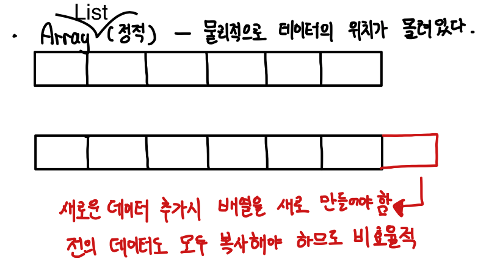
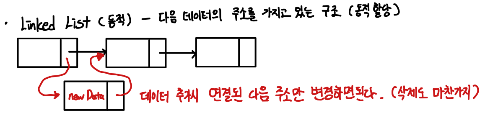

# ArrayList vs LinkedList

## 개념

### ArrayList

순차 리스트 - 배열을 기반으로 구현된 리스트

### LinkedList

연결 리스트 - 메모리의 동적 할당을 기반으로 구현된 리스트

## 정적 할당 vs 동적 할당

### ArrayList

* 배열 기반이므로 리스트를 생성시 길이를 정해야 한다. -> 정적 할당

### LinkedList

* 노드 연결기반이므로 리스트를 생성시 길이가 정해져 있지 않고, 동적으로 길이를 늘릴 수 있다. -> 동적 할당

## 트레이드 오프

 출처 : https://www.opentutorials.org/module/1335/8821

### ArrayList

* 추가 / 삭제
  * 배열을 기반으로 하는 ArrayList는 중간에 데이터를 추가하거나 삭제하게 된다면 해당 인덱스 뒤의 존재하는 모든 데이터를 복사하여 한 칸씩 밀어줘야 하므로 길이가 정해져 있지 않은 리스트가 필요하다면 비효율적이다.
* 인덱스 조회
  * 배열은 하나의 자료형을 그룹핑할 때 사용되는 자료형이다. 즉, 자료형의 길이가 같으므로 `*(기준 자료형 + 인덱스 )`를 통해 인덱스로 조회가 굉장히 빠르다. O(1)

### LinkedList

* 추가 / 삭제
  * 추가 - LinkedList는 노드를 연결하는 형태이므로, 새로운 데이터를 생성하여 포인터 값만 조정해주면 된다.
  * 삭제 - 삭제할 노드를 찾았다면 삭제는 노드 간의 포인터만 조절하면 되므로 굉장히 빠르다. 하지만, 삭제할 노드를 찾기 위해 탐색을 해야한다.
* 인덱스 조회
  * LinkedList는 노드를 연결하는 형태이므로, 메모리 상의 노드의 위치가 일정하지 않다. 즉, for문으로 하나하나 찾아봐야 한다. O(n)