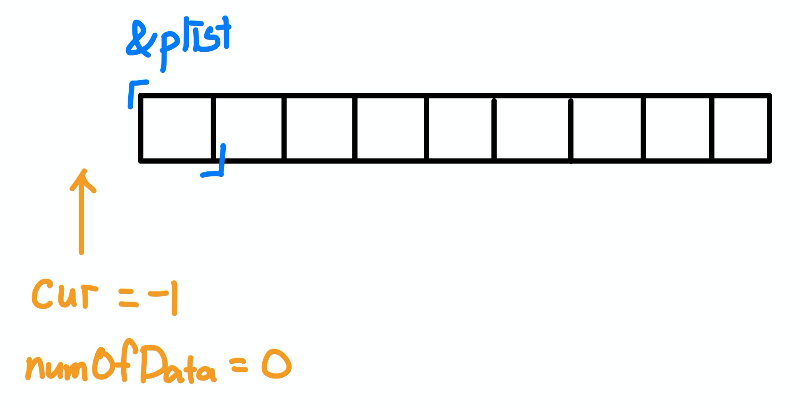
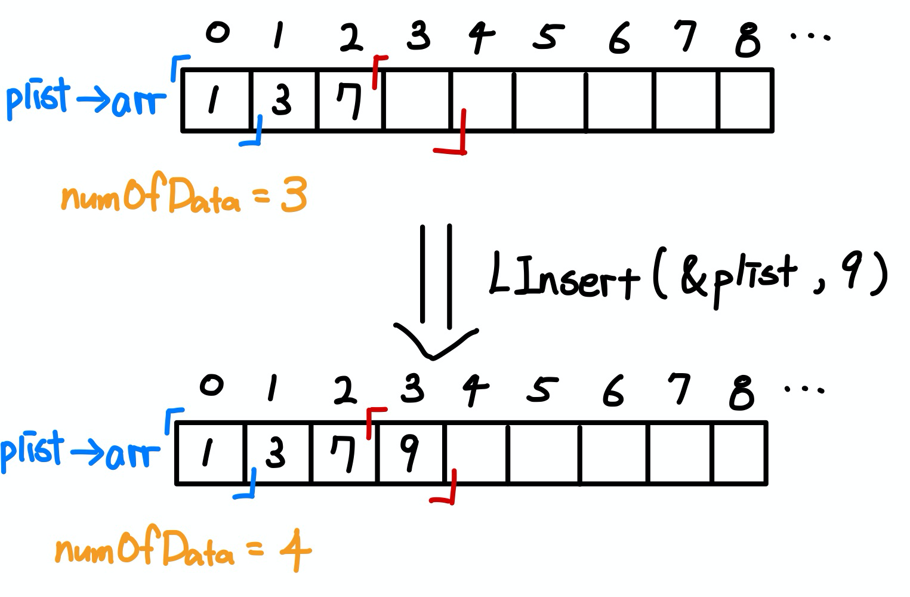
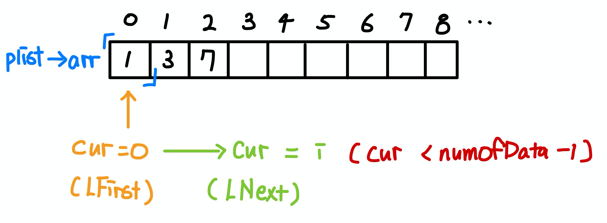
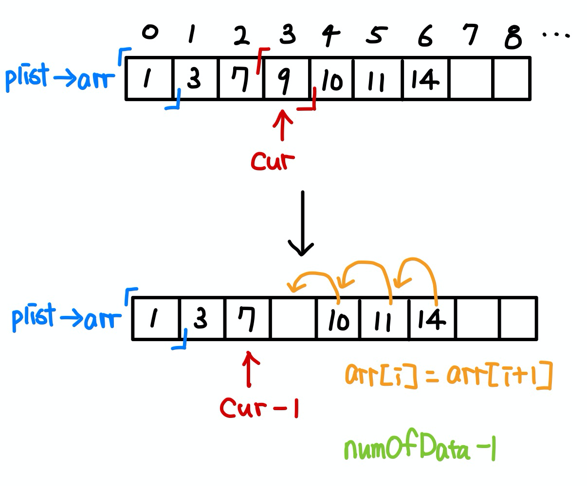

# 목차

- [ArrayList](#arraylist)
  * [정의](#정의)
  * [특징](#특징)
    + [저장 형태](#저장-형태)
    + [저장 특성](#저장-특성)
    + [장단점](#장단점)
  * [접근 시간](#접근-시간)
  * [사용 상황](#사용-상황)
  * [코드 - C](#코드---c)
    + [ArrayList의 ADT](#arraylist의-adt)
    + [초기화](#초기화)
    + [데이터 저장](#데이터-저장)
    + [데이터 참조](#데이터-참조)
    + [데이터 삭제](#데이터-삭제)
  * [코드 - JAVA](#코드---java)
- [참고](#참고)


# ArrayList


## 정의

* ArrayList의 목적
  * 같은 데이터 타입의 데이터를 그룹화하여 관리.
  * 복수의 데이터를 효율적으로 관리, 전달하기 위한 목적으로 고안된 자료구조.
* 정의
  * ArrayList는 말 그대로 배열을 기반으로 구현된 리스트이다.


## 특징


### 저장 형태

* 선형 자료구조
* 데이터를 나란치(하나의 열로)저장한다.


### 저장 특성

* 중복이 되는 데이터의 저장을 허용한다.


### 장단점

* 장점
  * 데이터 참조가 빠르다. 인덱스 값 기준으로 어디든 한 번에 참조 가능.
  * 배열과는 다르게 꼭 인덱스를 몰라도 동적으로 데이터를 추가할 수 있다.
* 단점
  * 배열의 길이가 초기에 결정되어야 한다. 변경이 불가능하다.
    * 자바의 ArrayList는 배열의 길이가 자동적으로 늘어난다. 하지만, 늘어날때마다 배열의 복사가 일어나므로 비효율적이다.
  * 삭제의 과정에서 데이터의 이동(복사)가 매우 빈번히 일어난다.
    * 중간 인덱스의 데이터를 삭제하면 뒤 인덱스의 데이터를 모두 앞으로 당겨야 하기 때문에 추가/삭제에 매우 비효율적이다.


## 접근 시간

* 추가/삭제
  * 맨 끝에 데이터 추가 : O(1)
  * 중간인덱스에 데이터 추가 : O(n)
  * 맨 끝 데이터 삭제 : O(1)
  * 중간인덱스에 데이터 삭제 : O(n)
* 조회
  * 인덱스를 이용한 조회 : O(1)
* 탐색
  * 데이터 탐색 : O(n)


## 활용

* 배열의 크기가 정해져있을 때 사용하면 좋다.
  * ArrayList는 처음에 인스턴스를 생성할 때, 저장할 데이터의 개수를 잘 고려하여 충분한 용량의 인스턴스를 생성하는 것이 좋다.
* 탐색과 정렬을 많이 사용해야 하는 경우 ArrayList를 사용하는 것이 효율적이다.


## 코드 - C

> 전체 코드
>
> * [ArrayList.h](https://github.com/binghe819/cs-datastructure/blob/master/LinkedList/ArrayList/ArrayList.h)
> * [ArrayList.c](https://github.com/binghe819/cs-datastructure/blob/master/LinkedList/ArrayList/ArrayList.c)
> * [main.c](https://github.com/binghe819/cs-datastructure/blob/master/LinkedList/ArrayList/main.c)


### ArrayList의 ADT

```c
#ifndef ArrayList_h
#define ArrayList_h

#include <stdio.h>

#define TRUE 1
#define FALSE 0

#define LIST_LEN 100 // 길이를 미리 정한다.
typedef int LData; // LData에 대한 typedef 선언

typedef struct ArrayList
{
    LData arr[LIST_LEN];
    int numOfData;
    int curPosition;
} ArrayList;

typedef ArrayList List;

void ListInit(List *plist); // 리스트 초기화
void LInsert(List *plist, LData data); // 데이터 저장

int LFirst(List *plist, LData *pdata); // 첫 데이터 참조, 저장된 데이터의 탐색 및 탐색 초기화 (참조한 데이터를 *pdata로 연결)
int LNext(List *plist, LData *pdata); // 다음 데이터 참조

LData LRemove(List *plist); // 참조된 데이터 삭제
int LCount(List *plist); // 데이터 개수 반환

#endif
```

* ArrayList는 그냥 배열로 봐도 무방하다.
  * 배열의 길이를 미리 정해놓는다. 즉 배열의 길이가 정적이다. (자바는 동적)


### 초기화



```c
typedef struct __ArrayList
{
  LData arr[List];
  int numOfData; // 리스트에 저장된 데이터의 수
  int curPosition; // 마지막 참조 위치에 대한 정보 저장
}
```

```c
void ListInit(List *plist)
{
  plist->numOfData = 0;
  plist->curPosition = -1; // 아무런 위치도 참조하지 않았다는 의미
}
```

```c
// main
List list;
ListInit(&list);
```

* 초기화 대상
  * 구조체 변수의 멤버


### 데이터 저장



```c
void LInsert(List *plist, LData data)
{
  if((plist -> numOfData) >= LIST_LEN) // 더 이상 저장할 공간이 없다면
    return;
  
  plist->arr[plist->numOfData] = data; // 데이터 저장
  (plist->numOfData)++; // 저장된 데이터의 수 증가
}
```

```c
// main
LData data = 9;
LInsert(&list, data);
```

* `numOfData`를 인덱스로 사용해서 배열에 데이터를 저장한다.


### 데이터 참조



```c
// 첫 데이터 참조 (참조한 데이터를 *pdata로 연결)
int LFirst(List *plist, LData *pdata) 
{
    if(plist->numOfData <= 0) // 저장된 데이터가 없다면
        return FALSE;

    plist->curPosition = 0; // 참조 위치 초기화 (첫번째 데이터 참조)
    *pdata = plist->arr[0]; // 데이터 포인터를 통해 데이터 저장
    return TRUE;
}

// 다음 데이터 참조
int LNext(List *plist, LData *pdata) 
{
    // 참조위치가 저장된 데이터의 수 -1 보다 작거나 같으면 더이상 참조할 것이 없다는 의미
    if(plist->curPosition >= (plist->numOfData) - 1)
        return FALSE;

    plist->curPosition += 1; // 참조 위치를 다음으로
    *pdata = plist->arr[plist->curPosition]; // 데이터 포인터를 통해 데이터 저장
    return TRUE;
}
```

```c
// main (// 전체 데이터 출력)
if(LFirst(&list, &data)) 
{
  printf("전체 데이터 출력 : %d", data);

  while(LNext(&list, &data))
  {
    printf(" %d", data);
  }


  printf("\n\n");
}
```


### 데이터 삭제



```c
// curPosition을 이용한 데이터 삭제
LData LRemove(List *plist) 
{
    LData removed_data = plist->arr[plist->curPosition]; // 삭제될 데이터

    // 삭제할 데이터를 기점으로 뒷 데이터 한칸씩 땡기기
    for(int i = plist->curPosition; i < (plist->numOfData)-1; i++)
        plist->arr[i] = plist->arr[i+1];

    plist->numOfData -= 1; // 데이터의 수 감소
    plist->curPosition -= 1; // 참조위치를 하나 되돌린다.
    return removed_data;
}
```

```c
 // 2와 3의 배수 데이터 삭제 (main)
if(LFirst(&list, &data))
{
  if(data % 2 == 0 || data % 3 == 0)
    LRemove(&list);

  while(LNext(&list, &data))
  {
    if(data % 2 == 0 || data % 3 == 0)
      LRemove(&list);
  }
}
```

* 삭제 방법
  1. `curPosition`을 사용한 삭제 (원하는 데이터를 삭제 할 수 있다.)
  2. `numOfData`를 사용해서 제일 뒤의 데이터 삭제하기


## 코드 - JAVA

[Collections - ArrayList](https://github.com/binghe819/TIL/blob/master/JAVA/%EC%9E%90%EB%B0%94%EC%9D%98%20%EC%A0%95%EC%84%9D/Collection%20Framework.md#2-1-arraylist)


# 참고

* [윤성우의 열혈 자료구조](http://www.yes24.com/Product/Goods/6214396?OzSrank=1)
* [자바의 정석]()