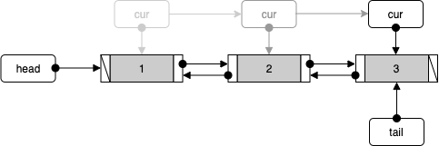
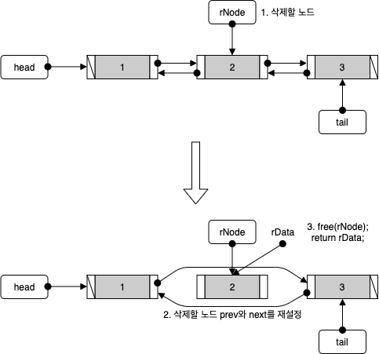

# 목차


# DoubleLinkedList


## 정의


### 양방향으로 노드를 연결하는 이유

* 양방향으로 이동이 가능하다.
  * 단순 연결리스트와 다르게 조회나 삭제시 before등의 변수가 따로 필요 없다.
* 


## 특징


## 시간 복잡도


## 활용


## 코드 - C


### DoubleLinkedList 종류


이번 글에서는 제일 기본적인 양방향 연결 리스트를 구현하였다.


### DoubleLinkedList ADT

```c
typedef int Data;

typedef struct __node
{
    Data data;
    struct __node *next;
    struct __node *prev;
} Node;

typedef struct _DBLinkedList
{
    Node *head;
    Node *cur;
    int numOfData;
} DBLinkedList;

typedef DBLinkedList List;


```

* 데이터 저장
  * 맨 앞에 저장 - insertFirst  (맨 앞)
  * 맨 뒤에 저장 - insertLast  (맨 뒤)
* 데이터 조회
  * 전체 조회 - first, next
  * 인덱스를 통한 조회 - getByIndex
* 데이터 삭제
  * 맨 앞 노드 삭제 - removeFirst  (맨 앞)
  * 맨 뒤 노드 삭제 - removeLast  (맨 뒤)
  * 인덱스를 통한 삭제 - removeByIndex  (중간)


### 초기화

```c
// 리스트 초기화
void ListInit(List *plist)
{
    plist->head = NULL;
    plist->tail = NULL;
    plist->cur = NULL;
    plist->numOfData = 0;
}
```


### 데이터 저장

리스트의 데이터 저장은 보통 맨 앞에 저장하거나 맨 뒤에 저장한다.


#### 맨 앞에 저장 insertFirst

<p align="center"><br>리스트가 비어 있을 때</p>

<p align="center"><br>리스트가 비어 있지 않을 때</p>

```c
void insertFirst(List *plist, LData data)
{
    Node *newNode = (Node*)malloc(sizeof(Node));
    newNode->data = data;
    newNode->prev = NULL;

    // (1) 만약 리스트가 비어 있다면.
    if(plist->head == NULL)
    {
        newNode->next = NULL;
        plist->tail = newNode;
    }
    else // 리스트가 비어있지 않다면 
    {
        newNode->next = plist->head;
        plist->head->prev = newNode;
    }
    
  	// (2)
    plist->numOfData++;
    plist->head = newNode;
}
```


#### 맨 뒤에 저장 insertLast

<p align="center"><br>리스트가 비어 있을 때</p>

<p align="center"><br>리스트가 비어 있지 않을 때</p>

```c
void insertLast(List *plist, LData data)
{
    Node *newNode = (Node*)malloc(sizeof(Node));
    newNode->data = data;
    newNode->next = NULL;

    // (1) 만약 리스트가 비어 있다면
    if(plist->tail == NULL)
    {
        newNode->prev = NULL;
        plist->head = newNode;
    }
    else // 리스트가 비어있지 않다면 
    {
        newNode->prev = plist->tail;
        plist->tail->next = newNode;
    }
	
  	// (2)
    plist->numOfData++;
    plist->tail = newNode;
}
```


### 데이터 조회



```c
// cur을 head로
int first(List *plist, LData *data)
{
    if(plist->head == NULL)
        return FALSE;
    else
    {
        plist->cur = plist->head;
        *data = plist->cur->data;
    }
    return TRUE;
}

// cur을 하나씩 오른쪽으로
int next(List *plist, LData *data)
{
    if(plist->cur->next == NULL)
        return FALSE;
    
    plist->cur = plist->cur->next;
    *data = plist->cur->data;
    return TRUE;
}

// 인덱스를 이용한 데이터 불러오기
int getByIndex(List *plist, int index, LData *data)
{
    if(plist->head == NULL)
        return FALSE;

    int cnt = 0;
    plist->cur = plist->head;
    while(plist->cur->next != NULL)
    {
        if(cnt == index)
        {
            *data = plist->cur->data;
            return TRUE;
        }
        cnt+=1;
        plist->cur = plist->cur->next;
    }
    return FALSE;
}
```

```c
// main
if(first(&list, &data))
{
  printf("전체 데이터 조회 : %d", data);

  while(next(&list, &data))
  {
    printf(" %d", data);
  }
  printf("\n");
}

// 인덱스를 통한 데이터 조회
if(getByIndex(&list, 2, &data)) // 2번째 인덱스의 데이터 불러오기.
  printf("%d \n", data);
else
  printf("존재하지 않는 인덱스입니다. ");
```


### 데이터 삭제


#### 맨 앞 노드 삭제 removeFirst


```c
LData removeFirst(List *plist)
{
    // 데이터가 없을 시 예외 처리 
    if(plist->head == NULL)
        return FALSE; // C언어는 예외처리를 어떻게 하는가?..

    // (1) 삭제 노드 및 데이터 설정
    Node *rNode = plist->head;
    LData rData = rNode->data;

    // (2) head 노드 재설정
    plist->head = rNode->next;
    rNode->next->prev = NULL;
    
    // (3) 노드 반환 및 데이터 반환
    plist->numOfData-=1;
    free(rNode);
    return rData;
}
```


#### 맨 뒤 노드 삭제 removeLast


```c
LData removeLast(List *plist)
{
    // 데이터가 없을 시 예외 처리 
    if(plist->tail == NULL)
        return FALSE;
    
    // (1) 삭제 노드 및 데이터 설정
    Node *rNode = plist->tail;
    LData rData = rNode->data;

    // (2) tail 노드 재설정
    plist->tail = rNode->prev;
    rNode->prev->next = NULL;

    // (3) 노드 반환 및 데이터 반환
    plist->numOfData-=1;
    free(rNode);
    return rData;
}
```


#### 인덱스를 통한 삭제 removeByIndex



```c
LData removeByIndex(List *plist, int index)
{
    // 예외 처리 (인덱스가 리스트 사이즈를 넘거나, 빈 리스트일 때)
    if(plist->numOfData <= index || plist->head == NULL)
        return FALSE;
    
    if(index == 0) // 첫번째 노드 삭제
        return removeFirst(plist);
    else if(index == plist->numOfData-1) // 마지막 노드 삭제
        return removeLast(plist);
    else  // 중간 노드 삭제
    {
        // head부터 index 노드 찾기
        int cnt = 0;
        plist->cur = plist->head;
        while(plist->cur->next != NULL)
        {
            if(cnt == index)
            {
                // (1) 삭제 노드 및 데이터 설정 
                Node *rNode = plist->cur;
                LData rData = rNode->data;

                // (2) rNode 노드 재설정
                rNode->prev->next = rNode->next;
                rNode->next->prev = rNode->prev;

                // (3) 노드 반환 및 데이터 반환
                plist->numOfData-=1;
                free(rNode);
                return plist->cur->data;
            }
                
            cnt+=1;
            plist->cur = plist->cur->next;
        }
    }
    return FALSE;
}

```


# 참고

* [윤성우의 열혈 자료구조](http://www.yes24.com/Product/Goods/6214396?OzSrank=1)
* https://www.geeksforgeeks.org/data-structures/linked-list/#doublyLinkedList

