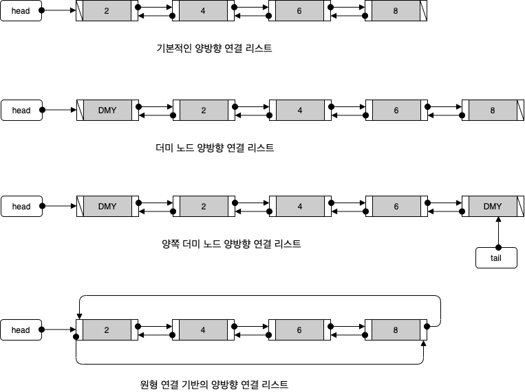

# 목차


# DoubleLinkedList


## 정의


### 양방향으로 노드를 연결하는 이유

* 양방향으로 이동이 가능하다.
  * 단순 연결리스트와 다르게 조회나 삭제시 before등의 변수가 따로 필요 없다.
* 


## 특징


## 시간 복잡도


## 활용


## 코드 - C


### DoubleLinkedList 종류



이번 글에서는 제일 기본적인 양방향 연결 리스트를 구현하였다.


### DoubleLinkedList ADT

```c
typedef int Data;

typedef struct __node
{
    Data data;
    struct __node *next;
    struct __node *prev;
} Node;

typedef struct _DBLinkedList
{
    Node *head;
    Node *cur;
    int numOfData;
} DBLinkedList;

typedef DBLinkedList List;


```

* 데이터 저장
  * 맨 앞에 저장 - insertFirst  (맨 앞)
  * 맨 뒤에 저장 - insertLast  (맨 뒤)
* 데이터 조회
  * 전체 조회 - first, next
  * 인덱스를 통한 조회 - getByIndex
* 데이터 삭제
  * 맨 앞 노드 삭제 - removeFirst  (맨 앞)
  * 맨 뒤 노드 삭제 - removeLast  (맨 뒤)
  * 인덱스를 통한 삭제 - removeByIndex  (중간)
  * 데이터를 통한 삭제 - removeByData  (중간)


### 초기화

```c
// 리스트 초기화
void ListInit(List *plist)
{
    plist->head = NULL;
    plist->tail = NULL;
    plist->cur = NULL;
    plist->numOfData = 0;
}
```


### 데이터 저장

리스트의 데이터 저장은 보통 맨 앞에 저장하거나 맨 뒤에 저장한다.


#### 맨 앞에 저장 insertFirst


* 리스트가 비어 있을 때


* 리스트가 비어 있지 않을 때

```c

```


#### 맨 뒤에 저장 insertLast


* 리스트가 비어 있을 때


* 리스트가 비어 있지 않을 대

```c

```


### 데이터 조회


### 데이터 삭제


# 참고

