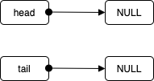
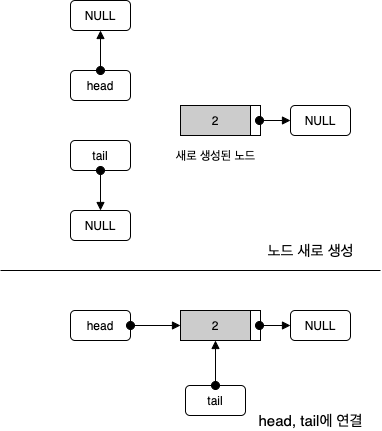
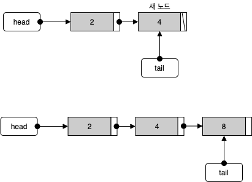
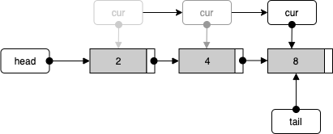
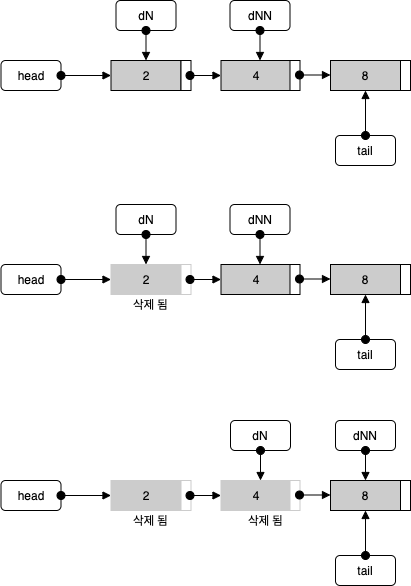
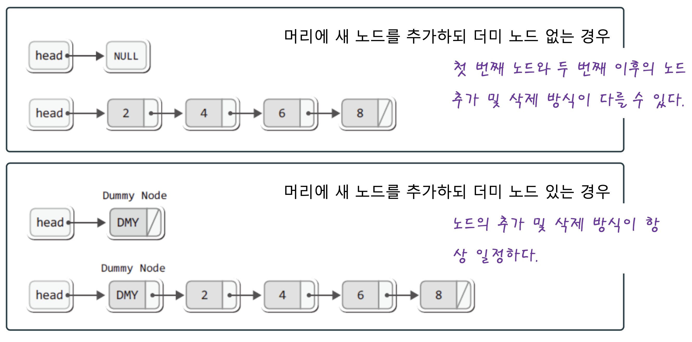
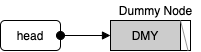
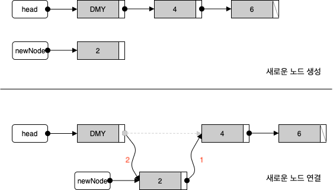
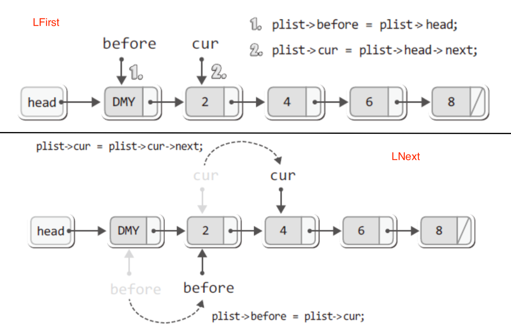
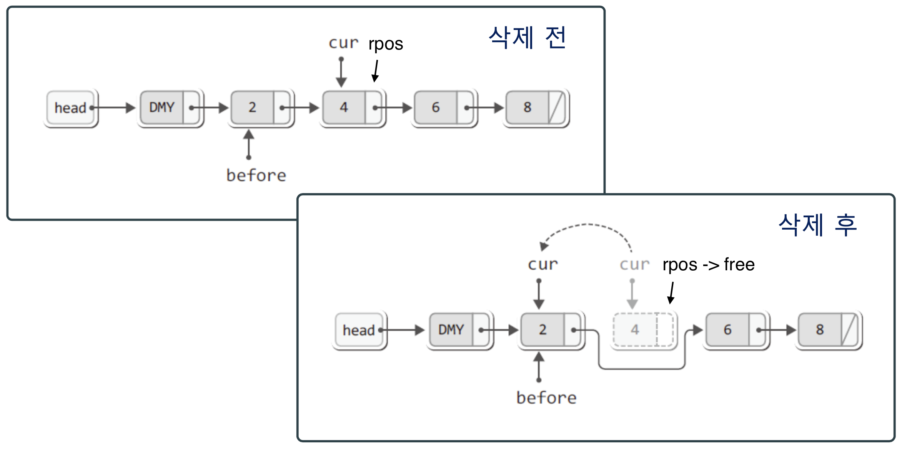

# 목차

- [LinkedList](#linkedlist)
  * [정의](#정의)
    + [Linked 무엇을 연결하겠다는 것인가?](#linked-무엇을-연결하는겠다는-것인가)
  * [특징](#특징)
    + [LinkedList의 특징](#linkedlist의-특징)
    + [장단점](#장단점)
  * [시간 복잡도](#시간-복잡도)
  * [활용](#활용)
  * [LinkedList - C](#linkedlist---c)
    + [LinkedList의 ADT](#linkedlist의-adt)
    + [초기화](#초기화)
    + [데이터 저장](#데이터-저장)
    + [데이터 조회](#데이터-조회)
    + [데이터 삭제](#데이터-삭제)
  * [DummyLinkedList - C](#dummylinkedlist---c)
    + [Dummy Node 란?](#dummy-node-란)
    + [새 노드의 추가 위치에 따른 장단점](#새-노드의-추가-위치에-따른-장단점)
    + [DummyLinkedList 구조체](#dummylinkedlist-구조체)
    + [초기화](#dummylinkedlist---c-초기화)
    + [데이터 저장](#dummylinkedlist---c-데이터-저장)
    + [데이터 조회](#dummylinkedlist---c-데이터-조회)
    + [데이터 삭제](#dummylinkedlist---c-데이터-삭제)
  * [코드 - JAVA](#코드---java)
    + [Node와 LinkedList](#node와-linkedlist)
    + [데이터 저장](#코드---java-데이터-저장)
    + [데이터 조회](#코드---java-데이터-조회)
    + [데이터 삭제](#코드---java-데이터-삭제)
- [참고](#참고)


# LinkedList


## 정의


### Linked 무엇을 연결하겠다는 것인가?

<p align="center"><br>출처 : https://www.interviewbit.com/courses/programming/topics/linked-lists/</p>

```c
typedef struct __node 
{
  int data; // 데이터를 담는 공간
  struct __node *next; // 연결의 도구.
} Node;
```

* Linked의 의미는 일종의 연결이 가능한 바구니라고 생각하면 된다.
* head, tail, cur이 연결 리스트의 핵심이다.
  * head, tail - 연결을 추가 및 유지하기 위한 것
  * cur - 참조 및 조회를 위한 것.


## 종류

* 단일 연결 리스트
  * 각 노드에 자료 공간과 한 개의 포인터 공간이 있고, 각 노드의 포인터는 다음 노드를 가리킨다.
* 이중 연결 리스트
  * 단일 연결 리스트와 비슷하지만, 포인터 공간이 두 개가 있고 각각의 포인터는 앞의 노드와 뒤의 노드를 가리킨다.
* 원형 연결 리스트
  * 일반적인 연결 리스트에 마지막 노드와 처음 노드를 연결시켜 원형으로 만든 구조이다.
* 이중 원형 연결 리스트
  * 이중 연결 리스트의 마지막 노드와 처음 노드를 연결시켜 원형으로 만든 구조이다.


## 특징

LinkedList의 일반적인 특징은 List가 가지고 있는 특징과 동일하다.


### LinkedList의 특징

* 프로그램이 수행되는 동안 크기가 동적으로 커지거나 작아진다
* 배열에 비해 데이터의 추가와 삽입에 용이하다
* 순차적으로 탐색하지 않으면 요소에 접근이 불가하기 때문에 탐색 속도가 떨어진다.
* **개발자가 원하는대로 구현하여 배열의 앞쪽, 뒤쪽, 중간 모두 노드를 추가할 수 있다.**


### 장단점

* 장점
  * 배열에 비해 데이터 추가/삭제 과정이 빠르다. O(1)
  * 배열보다 메모리 효율을 효과적으로 사용할 수 있다. 필요없는 메모리를 안쓰며, 필요할 때 생성하여 사용하기 때문이다.
* 단점
  * 특정 데이터를 탐색하기 위해서는 처음부터 끝까지 순회해야 하기 때문에 오래걸린다. O(n)
    * 인덱스 기반의 탐색, 데이터 기반의 탐색 모두 O(n)만큼 필요하다.


## 시간 복잡도

* 추가/삭제
  * 추가 : O(1)
  * 삭제 : O(1) or O(n)
* 조회
  * 인덱스를 통한 조회 : O(n)
* 탐색
  * 데이터 탐색 : O(n)


## 활용

* 추가 / 삭제를 많이 사용한다면 LinkedList를 사용하는 것이 효율적이다.


## LinkedList - C

> 전체 코드
>
> * [LinkedList_Basic](https://github.com/binghe819/cs-datastructure/blob/master/LinkedList/LinkedList/LinkedList_basic.c)


### LinkedList의 ADT

```c
#ifndef LinkedList_h
#define LinkedList_h

#include <stdio.h>

#define TRUE 1
#define FALSE 0

typedef int LData;

// LinkedList의 각 노드
typedef struct __node
{
    LData data;
    struct __node *next;
} Node;

// LinkedList의 head, tail, cur
typedef struct __linkedList
{
    Node *head;
    Node *tail;
    Node *cur;
} LinkedList;

typedef LinkedList List;

void ListInit(List *plist);
void LInsert(List *plist, LData data);

int LFirst(List *plist, LData *pdata);
int LNext(List *plist, LData *pdata);

LData LRemoveALL(List *plist);

#endif
```

* 인덱스를 통한 데이터 삭제등은 DummyLinkedList에서 더 자세히 다룬다.


### 초기화



```c
void ListInit(List *plist)
{
    plist->head = NULL;
    plist->tail = NULL;
    plist->cur = NULL;
}
```

```c
// main
List list;
ListInit(&list);
```

* LinkedList는 정해진 길이도 없다. 그러므로 head, tail을 사용하여 노드를 컨트롤한다.


### 데이터 저장

기본적인 LinkedList의 데이터 저장은 첫 번째 노드와 두 번째 이후의 노드 추가 및 삭제 방식이 다르다.

* 데이터 저장 1회전 (빈 리스트에 처음 데이터를 저장할 때)



* 데이터 저장 2회전 (head가 다른 노드를 가리키고 있을 때)



```c
void LInsert(List *plist, LData data)
{
  	// 새로운 노드 생성
    Node *newNode = (Node*)malloc(sizeof(Node));
    newNode->data = data;
    newNode->next = NULL;

  	// 첫 번째 노드에 추가할 때
    if(plist->head == NULL)
        plist->head = newNode;
    else // 두 번째 이후의 노드에 추가할 때
        plist->tail->next = newNode;

    plist->tail = newNode;
}
```

> 기본적인 LinkedList의 첫 번째와 두번째 노드의 추가/삭제 과정이 다른 것을 보완한 것이 바로 DummyLinkedList이다.


### 데이터 조회



```c
int LFirst(List *plist, LData *pdata)
{
  	// 저장된 데이터가 없을 때 
    if(plist->head == NULL)
        return FALSE;
    else
    {
        plist->cur = plist->head;
        *pdata = plist->cur->data;
    }
        
    return TRUE;
}

int LNext(List *plist, LData *pdata)
{
  	// 다음 노드가 더 이상 없다면 
    if(plist->cur->next == NULL)
        return FALSE;

  	// 다음 노드로 cur을 연결
    plist->cur = plist->cur->next;
    *pdata = plist->cur->data;
    return TRUE;
}
```

```c
// main
if(LFirst(&list, &data))
{
  printf("전체 데이터 조회 : %d", data);

  while(LNext(&list, &data))
  {
    printf(" %d", data);
  }

  printf("\n\n");
}
```

* 일반적인 List와 동일하게 cur을 움직여서 데이터를 조회한다.


### 데이터 삭제

전체 데이터를 삭제한다고 가정한다면 아래와 같다. 

(인덱스와 데이터를 기반으로 삭제하는 것은 DummyLinkedList에서 다룬다.)



```c
LData LRemoveALL(List *plist)
{
    // head에 연결된 노드 delNode로 연결
    Node *delNode = plist->head;
    Node *delNextNode = plist->head->next;
    printf("%d을 삭제 \n", delNode->data);
    free(delNode); // delNode 반환

    while(delNextNode != NULL)
    {
        delNode = delNextNode; // delNode를 다시 delNexNode로 연결
        delNextNode = delNextNode->next; // delNextNode도 그 다음 노드로 연결
        printf("%d을 삭제 \n", delNode->data);
        free(delNode); // delNode 반환
    }
}
```


## DummyLinkedList - C

> 전체 코드
>
> * [DummyLinkedList.h](https://github.com/binghe819/cs-datastructure/blob/master/LinkedList/LinkedList/DLinkedList/DLinkedList.h)
> * [DummyLinkedList.c](https://github.com/binghe819/cs-datastructure/blob/master/LinkedList/LinkedList/DLinkedList/DLinkedList.c)
> * [main.c](https://github.com/binghe819/cs-datastructure/blob/master/LinkedList/LinkedList/DLinkedList/main.c)


### Dummy Node 란?

<p align="center"><br>출처 : 윤성우의 열혈 자료구조</p>

* 기존의 [LinkedList](#linkedlist---c)에서는 첫 번째 노드와 두 번째 이후의 노드 추가 및 삭제 방식이 달랐다.
* **Dummy Node를 사용한다면 모든 노드의 추가 및 삭제 방식이 항상 일정하게 유지시킬 수 있다.**


### 새 노드의 추가 위치에 따른 장단점

> 본 글에선 새 노드를 연결리슽의 머리에 추가하는 방식을 정리하였다.

* 새 노드를 연결리스트의 머리에 추가하는 경우
  * 장점 - 포인터 변수 tail이 불필요하다. (tail을 관리할 필요가 없다.)
  * 단점 - 저장된 순서를 유지하지 않는다.
* 새 노드를 연결리스트의 꼬리에 추가하는 경우
  * 장점 - 저장된 순서가 유지된다.
  * 단점 - 포인터 변수 tail이 필요하다.


### DummyLinkedList 구조체

```c
typedef struct __node // 노드
{
    LData data;
    struct __node *next;
} Node;

typedef struct __dummyLinkedList // 리스트
{
    Node *head; // 더미 노드를 가리키는 노드
    Node *cur; // 참조 및 삭제를 돕는 노드
    Node *before; // 삭제를 돕는 노드
    int numOfData; // 저장된 데이터릐 수를 기록하는 변수
} LinkedList;
```


### 초기화



```c
void ListInit(List *plist)
{
    // 더미 노드 생성
    Node *dummy = (Node*)malloc(sizeof(Node));
    dummy->next = NULL;

  	// List의 head를 더미노드에 연결
    plist->head = dummy;
    plist->numOfData = 0;
}
```


### 데이터 저장



```c
void FInsert(List *plist, LData data)
{
    Node *newNode = (Node*)malloc(sizeof(Node)); // 새 노드 생성
    newNode->data = data; // 새 노드에 데이터 저장

    newNode->next = plist->head->next; // (1) 새 노드가 다른 노드를 가리키게 한다.
    plist->head->next = newNode; // (2) 더미 노드가 새 노드를 가리키게 한다.

    (plist->numOfData)++;
}
```

* 모든 경우에 동일한 저장과정을 거친다는 것이 더미 노드 기반 연결리스트의 장점이다.


### 데이터 조회

<p align="center"><br>출처 : 윤성우의 열혈 자료구조</p>

```c
int LFirst(List *plist, LData *pdata)
{
    if(plist->head->next == NULL) // 더미 노드가 NULL을 가리킨다면
        return FALSE;
    
    plist->before = plist->head; // before가 더미 노드를 가리키게 한다.
    plist->cur = plist->head->next; // cur은 첫 번째 노드를 가리키게 한다.

    *pdata = plist->cur->data; // 첫 번째 노드의 데이터를 전달
    return TRUE;
}

int LNext(List *plist, LData *pdata)
{
    if(plist->cur->next == NULL) // cur의 다음이 없다면.
        return FALSE;
    
    plist->before = plist->cur; // cur이 가리키던 것을 before가 가리킴
    plist->cur = plist->cur->next; // cur은 그 다음 노드를 가리킴

    *pdata = plist->cur->data; // cur이 가리키는 노드의 데이터 전달
    return TRUE;
}
```

* before를 사용하는 이유는 삭제를 용이하게 하기 위함이다.


### 데이터 삭제

<p align="center"><br>출처 : 윤성우의 열혈 자료구조</p>

```c
LData LRemove(List *plist)
{
    // cur을 가리키는 삭제 노드를 생성
    Node *rpos = plist->cur;
    LData rdata = rpos->data;

    // before의 next를 cur의 next를 가리키게 한다.
    plist->before->next = plist->cur->next;
    plist->cur = plist->before; // cur도 before로 이동시킨다.

    // 삭제 노드 반환 
    free(rpos);
    (plist->numOfData)--;
    return rdata;
}
```

* cur은 삭제 후 제조정의 과정을 거쳐야 하지만 before은 LFirst or LNext 호출 시 재설정되므로 재조정의 과정이 불필요하다.


## 코드 - JAVA

>  [Collections - LinkedList](https://github.com/binghe819/TIL/blob/master/JAVA/%EC%9E%90%EB%B0%94%EC%9D%98%20%EC%A0%95%EC%84%9D/Collection%20Framework.md#2-2-linkedlist)에 자바의 정석에서 설명하는 내용을 정리해두었다.

자바는 Collections List의 하나로 LinkedList (Double-Linked)를 제공한다.

> **Doubly-linked** list implementation of the `List` and `Deque` interfaces. Implements all optional list operations, and permits all elements (including `null`).
>
> All of the operations perform as could be expected for a doubly-linked list. Operations that index into the list will traverse the list from the beginning or the end, whichever is closer to the specified index.
>
> [참고 - JAVA 8 API](https://docs.oracle.com/javase/8/docs/api/)

자바로 따로 LinkedList를 구현하는 것보다는 자바는 어떻게 구현해 놓았는지 살펴본다.


### Node와 LinkedList

```java
public class LinkedList<E> {
  transient int size = 0;
  
  transient Node<E> first;
  
  transient Node<E> last;
  
  ...
    
    
  private static class Node<E> {
    E item;
    Node<E> next;
    Node<E> prev;
    
    Node(E item, Node<E> next, Node<E> prev) {
      this.item = item;
      this.next = next;
      this.prev = prev;
    }
  }
  
  ...
}
```

* 클래스 기반의 객체지향 언어답게 클래스로 Node와 LinkedList를 구현하고 있다.


### 데이터 저장

```java
// 실제 자바 API에 나와있는 코드.
public class LinkedList<E> {
  ...
    
  public boolean add(E e) {
    linkLast(e);
    return true;
  }
  
  /**
   * Links e as last element.
   */
  public void linkLast(E e) {
    final Node<E> l = last; // 현재 LinkedList의 마지막 노드.
    final Node<E> newNode = new Node<>(l, e, null); // 새로운 노드를 생성.
    
    last = newNode;
    if (l == null) // 만약 데이터가 없다면
      first = newNode;
    else // 만약 데이터가 있다면 
      l.next = newNode;
    size++;
    modCount++;
  }
  
  ...
}
```

* 구현 코드가 보통 C언어에서 구현하는 Double LinkedList와 유사하다.


### 데이터 조회

```java
public class LinkedList<E> {
  ...
  
  public E get(int index) {
    checkElementIndex(index);
    return node(index).item;
  }
  
  /**
   * Returns the (non-null) Node at the specified element index.
   */
  Node<E> node(int index) {
    // assert isElementIndex(index);
    if (index < (size >> 1)) { // 앞에서 뒤로
      Node<E> x = first;
      for (int i = 0; i < index; i++)
        x = x.next;
      return x;
    } else { // 뒤에서 앞으로
      Node<E> x = last;
      for (int i = size - 1; i > index; i--)
        x = x.prev;
      return x;
    }
  }
}
```

* 동일하게 for문을 돌며 원하는 인덱스의 Node를 찾아 반환하는 구조이다.
  * 단, head와 tail과 원하는 인덱스의 차이를 통해 앞에서 뒤로, 혹은 뒤에서 앞으로 탐색한다.


### 데이터 삭제

데이터를 삭제하는 메서드가 세 가지 존재한다.

* remove() - 맨 앞의 노드를 삭제한다.
* remove(int index) - 입력 받은 인덱스의 노드를 삭제한다.
* remove(Object o) - 입력 받은 데이터의 노드를 삭제한다.

인덱스와 데이터를 통한 노드 삭제 모두 for문을 돌며 원하는 노드를 찾아 unlink하는 방식을 사용한다.


> 자바에서는 다음 메서드를 미리 구현하여 여러 리스트 ADT를 구현하고 있다.
>
> * link
>   * linkFirst
>   * linkLast
>   * linkBefore
> * unlink
>   * unlinkFirst
>   * unlinkLast


# 참고

* [윤성우의 열혈 자료구조](http://www.yes24.com/Product/Goods/6214396?OzSrank=1)
* https://docs.oracle.com/javase/8/docs/api/