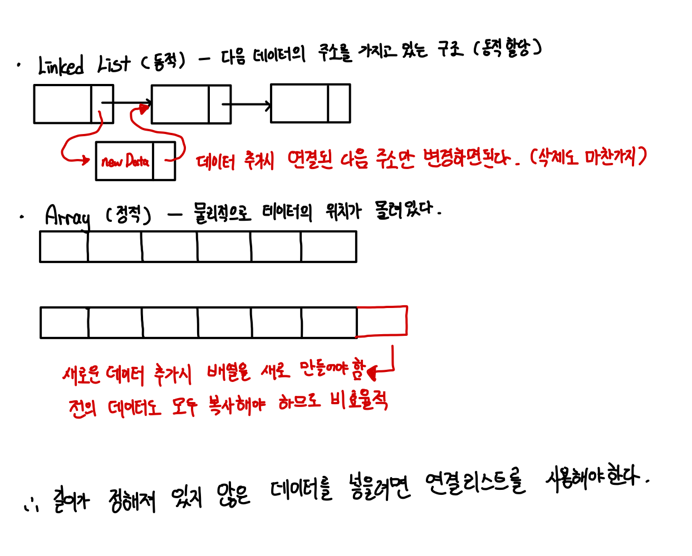

# 목차


# List


## 1 List란


### 1-1 리스트의 종류

* 순차 리스트 (ArrayList) : 배열을 기반으로 구현된 리스트
* 연결 리스트 (LinkedList) : 메모리의 동적 할당을 기반으로 구현된 리스트


### 1-2 리스트의 특징

* 리스트는 데이터를 나란히 저장한다. (선형자료구조)
* 중복된 데이터의 저장을 막지 않는다. (집합과 반대)
* 배열과 다르게 메모리 공간이 동적으로 할당된다.


### 1-3 ArrayList vs LinkedList


#### 정적 할당 vs 동적 할당




#### 트레이드 오프

<p align="center"><br>출처 : https://www.opentutorials.org/module/1335/8821</p>


* ArrayList

  * 추가/삭제 : 배열을 기반으로 하는 ArrayList는 중간에 데이터를 추가하거나 삭제하게 된다면 해당 인덱스 뒤의 존재하는 모든 데이터를 복사하여 한 칸씩 밀어줘야한다. O(n) -> 느림

  * 인덱스 조회 : 배열은 하나의 자료형을 그룹핑할 때 사용되는 자료형이다. 즉, 인덱스 조회를 할때 `*(기준 자료형 + 인덱스 )`해주면 되므로 O(1)의 시간복잡도가 나온다. -> 빠름

    

* LinkedList
  * 추가/삭제 : 노드를 연결하는 형태이므로, 새로운 데이터를 추가/삭제할 때 새로운 노드를 추가하고 원하는 인덱스 사이에 연결만 해주면 된다. O(1) -> 빠름
  * 인덱스 조회 : 노드를 연결하는 형태이므로, 메모리 상의 노드의 위치가 일정하지 않다. 즉, for문으로 하나하나 찾아봐야 한다. O(n) -> 느림


## 2 LinkedList 연결리스트


### 2-1 Linked : 무엇을 연결하겠다는 것인가?


```c
typedef struct _node {
  int data; // 해당 노드에 데이터를 담는 공간
  struct _node *next; // 다음 노드를 가리키는 포인터
} Node;
```

* **필요할 때마다 노드(바구니)를 하나씩 마련해서 그곳에 데이터를 저장하고 이들을 배열처럼 서로 연결한다.**
	* 필요할 때마다 바구니의 역할을 하는 **구조체 변수를 하나씩 동적 할당해서 이들을 연결한다.**
* 데이터 삽입과 조회를 위해서 head, tail, cur 포인터 변수를 생성하여 사용한다.
	* head는 첫 번째 노드를, tail은 마지막 노드를 가리킨다.
	* cur은 리스트 안을 돌아다닐 때 사용이 된다.


### 2-2 단순 연결 리스트


#### 정의


#### 특징


#### 접근 시간


#### 사용 상황 구분


### 2-3 원형 연결 리스트


