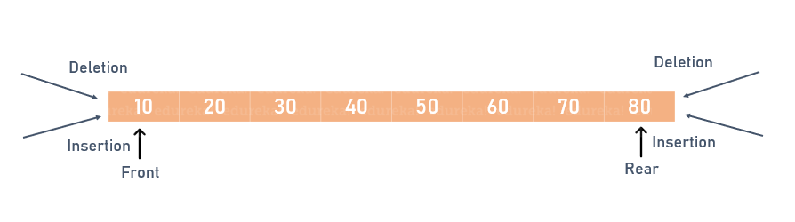
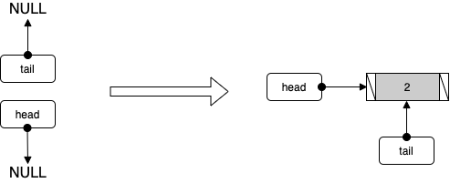
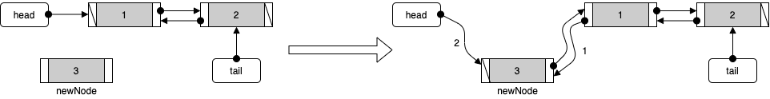
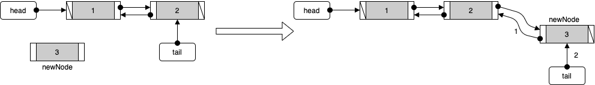
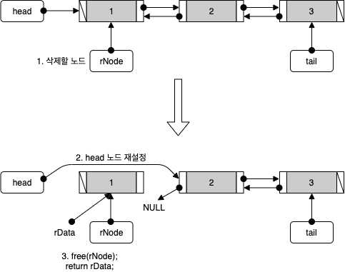
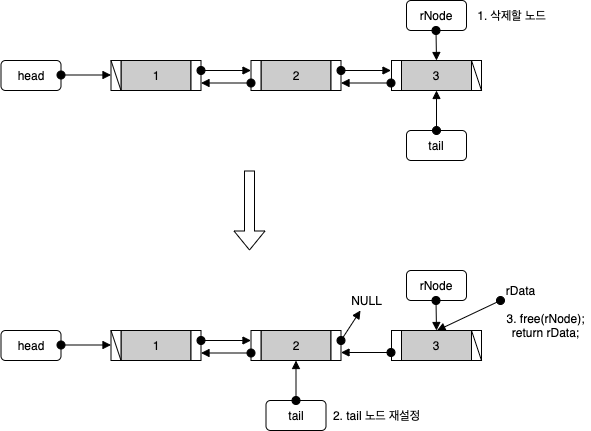

# 목차

- [Deque](#deque)
  * [정의](#정의)
    + [Deque란?](#deque란)
    + [덱의 ADT](#덱의-adt)
  * [활용](#활용)
  * [Deque - C](#deque---c)
  * [Deque - Java](#deque---java)
    + [ArrayDeque vs LinkedList](#arraydeque-vs-linkedlist)
- [참고](#참고)


# Deque


## 정의


### Deque란?

> Deque = double-ended queue

<p align="center"><br>출처 : https://www.edureka.co/blog/deque-in-java/</p>

* 덱 (deque)은 양쪽 끝에서 삽입과 삭제가 모두 가능한 자료 구조의 한 형태이다.
* 두 개의 포인터를 사용하여, 양쪽에서 삭제와 삽입을 발생 시킬 수 있다.
* 큐와 스택을 합친 형태로 생각할 수 있다.


### 덱의 ADT

* AddFirst - 앞으로 넣기
* AddLast - 뒤로 넣기
* RemoveFirst - 앞에서 빼기
* RemoveLast - 뒤에서 빼기
* GetFirst - 앞에서 peek
* GetLast - 뒤에서 peek


## 활용

* 스케줄링
* 우선순위


## Deque - C

덱은 LinkedList 형식과 ArrayList 형식으로 모두 구현이 가능하다. 본 글에서는 LinkedList를 사용하여 정리하였다.

**구현 코드를 보면 DoubleLinkedList와 거의 동일하다는 것을 알 수 있다.**


### ADT

```c
typedef int Data;

typedef struct __node
{
    Data data;
    struct __node *next;
    struct __node *prev;
} Node;

typedef struct _dlDeque
{
    Node *head;
    Node *tail;
} DLDeque;

typedef DLDeque Deque;

void DequeInit(Deque *pdeq);
int DQIsEmpty(Deque *pdeq);

void DQAddFirst(Deque *pdeq, Data data); // 덱의 머리에 데이터 추가
void DQAddLast(Deque *pdeq, Data data); // 덱의 꼬리에 데이터 추가

Data DQRemoveFirst(Deque *pdeq); // 덱의 머리에서 데이터 삭제
Data DQRemoveLast(Deque *pdeq); // 덱의 꼬리에서 데이터 삭제

Data DQGetFirst(Deque *pdeq); // 덱의 머리에서 데이터 참조
Data DQGetFirst(Deque *pdeq); // 덱의 꼬리에서 데이터 참조
```


### 초기화

```c
void DequeInit(Deque *pdeq)
{
    pdeq->head = NULL;
    pdeq->tail = NULL;
}
```


### 데이터 저장


#### AddFirst

<p align="center"><br>리스트가 비어 있을 때</p>

<p align="center"><br>리스트가 비어 있지 않을 때</p>

```c
void DQAddFirst(Deque *pdeq, Data data)
{
    // 새로운 노드 생성
    Node *newNode = (Node*)malloc(sizeof(Node));
    newNode->data = data;
    newNode->prev = NULL;

    newNode->next = pdeq->head;

    if(DQIsEmpty(pdeq)) // 만약 빈 덱이라면
        pdeq->tail = newNode;
    else // 비어 있지 않은 덱이라면 
        pdeq->head->prev = newNode;

    pdeq->head = newNode;
}
```


#### AddLast

<p align="center"><br>리스트가 비어 있을 때</p>

<p align="center"><br>리스트가 비어 있지 않을 때</p>

```c
void DQAddLast(Deque *pdeq, Data data)
{
    // 새로운 노드 생성
    Node *newNode = (Node*)malloc(sizeof(Node));
    newNode->data = data;
    newNode->next = NULL;

    newNode->prev = pdeq->tail;

    if(DQIsEmpty(pdeq))
        pdeq->head = newNode;
    else
        pdeq->tail->next = newNode;

    pdeq->tail = newNode;
}
```


### 데이터 조회

리스트와 다르게 덱은 맨 앞과 맨 뒤의 데이터만을 꺼낼 수 있다. 그러므로 조회 코드가 매우 간단하다.


#### GetFirst

```c
Data DQGetFirst(Deque *pdeq)
{
    if(DQIsEmpty(pdeq)) // 덱이 비어있다면
        exit(-1);

    return pdeq->head->data;
}
```


#### GetLast

```c
Data DQGetFirst(Deque *pdeq)
{
    if(DQIsEmpty(pdeq))
        exit(-1);

    return pdeq->tail->data;
}
```


### 데이터 삭제


#### RemoveFirst



```c
Data DQRemoveFirst(Deque *pdeq)
{
    if(DQIsEmpty(pdeq)) // 덱이 비어있다면
        exit(-1);

    Node *rNode = pdeq->head;
    Data rData = rNode->data;

    pdeq->head = rNode->next;

    free(rNode);

    if(pdeq->head == NULL) // 만약 삭제하는 요소(rNode)가 마지막 요소라면
        pdeq->tail = NULL;
    else
        pdeq->head->prev = NULL;

    return rData;
}
```


#### RemoveLast



```c
Data DQRemoveLast(Deque *pdeq)
{
    if(DQIsEmpty(pdeq))
        exit(-1);

    Node *rNode = pdeq->head;
    Data rData = rNode->data;

    pdeq->tail = rNode->prev;

    free(rNode);

    if(pdeq->tail == NULL) // 만약 삭제하는 요소(rNode)가 마지막 요소라면
        pdeq->head = NULL;
    else
        pdeq->tail->next = NULL;

    return rData;
}
```


## Deque - Java

> A linear collection that supports element insertion and removal at both ends. The name *deque* is short for "double ended queue" and is usually pronounced "deck". Most `Deque` implementations place no fixed limits on the number of elements they may contain, but this interface supports capacity-restricted deques as well as those with no fixed size limit.
>
> This interface defines methods to access the elements at both ends of the deque. Methods are provided to insert, remove, and examine the element. Each of these methods exists in two forms: one throws an exception if the operation fails, the other returns a special value (either `null` or `false`, depending on the operation). The latter form of the insert operation is designed specifically for use with capacity-restricted `Deque` implementations; in most implementations, insert operations cannot fail.
>
> [참고 - Java 8 API](https://docs.oracle.com/javase/8/docs/api/)

Deque은 "double ended queue"의 줄임말이다. 양방향 연결리스트와 배열리스트로 모두 구현이 가능하다.

자바에서는 Deque이라는 interface를 두고, Deque이 필요한 행동을 메서드로 구현하도록 하였다.

자바에서 Deque를 구현한 클래스는 다음과 같다.

* ArrayDeque
* LinkedList
  * ConcurrentLinkedDeque
  * LinkedBlockingDeque

이 중 하나를 선택하여 인스턴스를 만들면 Deque와 동일하게 사용이 가능하다.

> 참고 - ArrayDeque의 기본 길이는 16이다.


### ArrayDeque vs LinkedList

자바에서 보통 많이 사용되는 Deque의 구현체는 위의 2가지이다.

그렇다면 이 둘 중 무엇을 사용해야 하는가?

**아래 글들을 보고나면 ArrayDeque이 더 효율적이라는 것을 알 수 있다.**

* https://stackoverflow.com/questions/6129805/what-is-the-fastest-java-collection-with-the-basic-functionality-of-a-queue
* https://stackoverflow.com/questions/6163166/why-is-arraydeque-better-than-linkedlist


# 참고

* [윤성우의 열혈 자료구조](http://www.yes24.com/Product/Goods/6214396?OzSrank=1)
* [JAVA 8 API](https://docs.oracle.com/javase/8/docs/api/)

