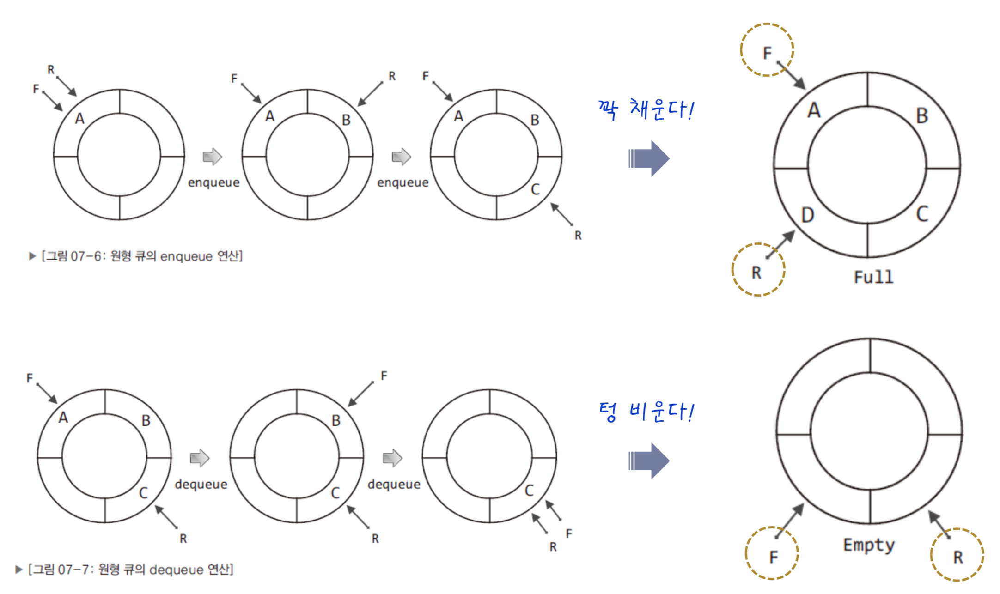
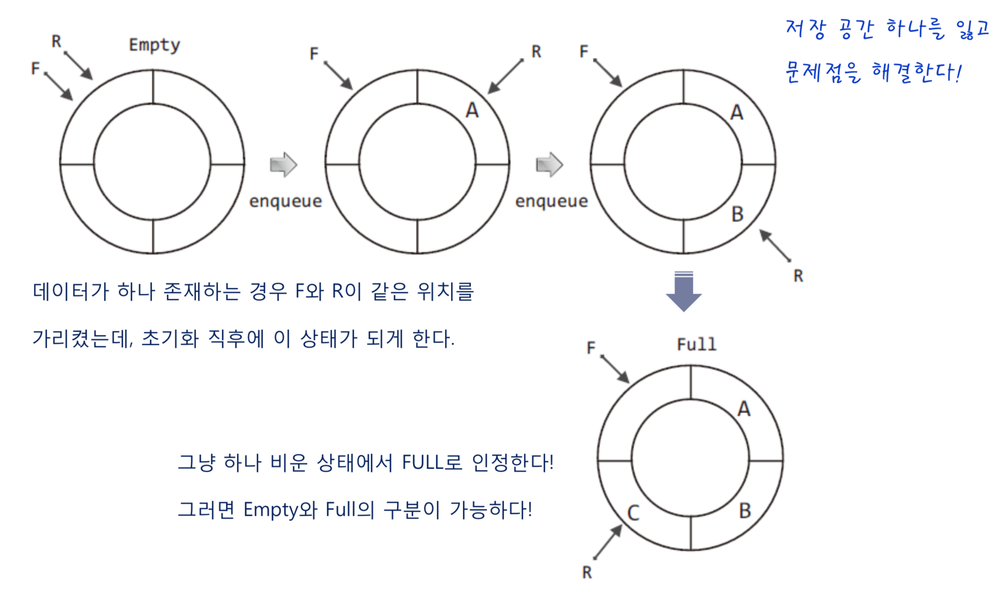
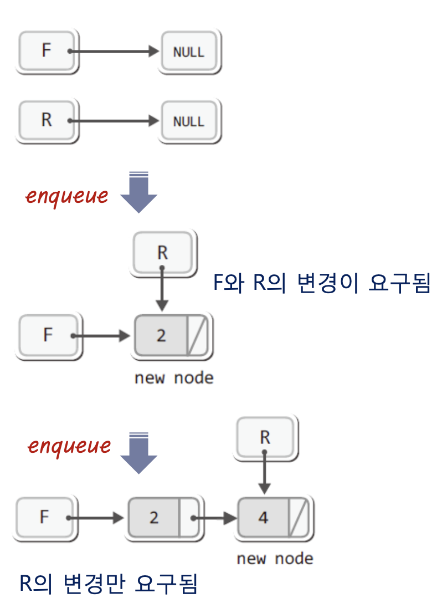
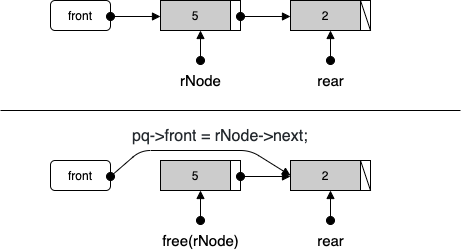

# 목차

- [Queue](#queue)
  * [정의](#정의)
    + [Queue란](#queue란)
    + [특징](#특징)
    + [큐의 ADT](#큐의-adt)
    + [ArrayList vs LinkedList](#arraylist-vs-linkedlist)
  * [활용](#활용)
  * [배열을 이용한 Queue (원형 큐) - C](#배열을-이용한-queue-원형-큐---c)
  * [연결리스트를 이용한 Queue - C](#연결리스트를-이용한-queue---c)
  * [Queue - Java](#queue---java)
- [참고](#참고)


#  Queue


## 정의


### Queue란

* 줄을 서는 것을 뜻하는 영어 단어.
* 선입선출의 대표적인 자료구조 형태


### 특징

* LIFO (Last In, First Out)
  * 먼저 집어 넣은 데이터가 가장 먼저 나오는 구조
  * 예시
    * 줄서기
    * 프린터의 출력 처리


### 큐의 ADT

* enqueue : 큐 맨 뒤에 요소 추가.
* dequeue :  큐 맨 앞의 요소 삭제 + 반환
* front : 큐의 맨 앞의 요소 반환
* rear : 큐의 맨 뒤의 요소 반환


### ArrayList vs LinkedList

* **큐에는 `ArrayList`보다 데이터의 추가/삭제가 쉬운 `LinkedList`로 구현하는 것이 적합하다.**
  - **큐는 데이터를 꺼낼 때 항상 첫 번째 저장된 데이터를 삭제하므로, `ArrayList`와 같은 배열 기반은 부적합하다.**


## 활용

* 운영체제 프로세스, 스레드 관리
* 메시지 큐
* 무엇인가를 줄 세울 때 많이 사용된다.


## 배열을 이용한 Queue (원형 큐) - C

> 전체 코드
>
> * [CircularQueue.h](https://github.com/binghe819/cs-datastructure/blob/master/Queue/CircularQueue/CircularQueue.h)
> * [CircularQueue.c](https://github.com/binghe819/cs-datastructure/blob/master/Queue/CircularQueue/CircularQueue.c)
> * [main.c](https://github.com/binghe819/cs-datastructure/blob/master/Queue/CircularQueue/main.c)


### 원형 큐의 문제점

원형 큐에서는 Front와 Rear라는 변수를 이용해 큐를 구현한다.

* Front - dequeue를 통해 데이터를 반환 및 삭제할 때 사용되는 인덱스
* Rear - enqueue를 통해 데이터를 삽입할 때 사용되는 인덱스

<p align="center"><br>출처 : 윤성우의 열혈 자료구조</p>

위와 같이 원형 큐를 구현한다면 큐가 꽉찬 경우나 텅 빈 경우에 F가 R보다 한 칸 앞선 위치를 가리킬 수 있게 된다.

즉, **큐가 꽉찬 경우와 텅빈 경우의 차이를 구별할 수 없다.**

이 문제를 해결하는 여러 방법이 있지만, 가장 쉬운 것은 하나의 공간을 비워두는 것이다.

<p align="center"><br>출처 : 윤성우의 열혈 자료구조</p>

* 큐가 꽉 찬 경우 : nextPosition(R) == F
* 큐가 텅 빈 경우 : F == R


### ADT

```c
#define QUE_LEN 100

typedef int Data;

typedef struct __queue
{
    int front;
    int rear;
    Data queueArr[QUE_LEN];
} CircularQueue;

typedef CircularQueue Queue;

void QueueInit(Queue *pq);
int QIsEmpty(Queue *pq);

void Enqueue(Queue *pq, Data data);
Data Dequeue(Queue *pq);
Data QPeek(Queue *pq);
```


### 초기화

```c
// 텅 빈 경우 front와 rear를 동일 위치 가리킴
void QueueInit(Queue *pq)
{
    pq->front = 0;
    pq->rear = 0;
}
```


### enqueue

```c
int NextPosIdx(int pos)
{
    // 배열의 마지막 요소의 인덱스 값이라면 0부터 (원형) 
    if(pos == QUE_LEN-1)
        return 0;
    else
        return pos+1;
}

void Enqueue(Queue *pq, Data data)
{
    // 큐가 꽉 찼다면 (예외처리)
    if(NextPosIdx(pq->rear) == pq->front)
        return FALSE;

    pq->rear = NextPosIdx(pq->rear); // rear 한칸 이동
    pq->queueArr[pq->rear] = data; // rear이 가리키고 있는 곳에 데이터 저장.
}
```

> 예외처리 부분에서 FALSE를 반환하면 0을 반환하는 것이므로 실사용 프로그램에서는 이렇게 구현하면 안된다.
>
> 학습용으로만 받아들이자~


### dequeue

```c
int QIsEmpty(Queue *pq)
{
    // 큐가 비어 있다면 
    if(pq->front == pq->rear)
        return TRUE;
    else 
        return FALSE;
}

Data Dequeue(Queue *pq)
{
    // 큐가 비어 있다면 (예외처리)
    if(QIsEmpty(pq))
        return FALSE;

    pq->front = NextPosIdx(pq->front); // front를 다음 인덱스로 이동
    return pq->queueArr[pq->front]; // front가 가리키는 데이터 반환 
    // 삭제를 안하는 이유는 어차피 덮어씌우는 형식으로 하기 때문이다.
}
```

> 예외처리는 학습용으로만 받아들이자!


## 연결리스트를 이용한 Queue - C


### ADT

```c
typedef int Data;

typedef struct __node
{
    Data data;
    struct __node *next;
} Node;

typedef struct __linkedQueue
{
    Node *front;
    Node *rear;
} LinkedQueue;

typedef LinkedQueue Queue;

void QueueInit(Queue *pq);
int QIsEmpty(Queue *pq);

void Enquque(Queue *pq, Data data);
Data Dequeue(Queue *pq);
Data QPeek(Queue *pq);

```


### 초기화

```c
void QueueInit(Queue *pq)
{
    pq->front = NULL;
    pq->rear = NULL;
}

```


### enqueue

enqueue의 과정은 두 가지로 나뉜다.

<p align="center"><br>출처 : 윤성우의 열혈 자료구조</p>

```c
int QIsEmpty(Queue *pq)
{
    // front를 통해서 데이터를 빼므로, front가 null이라면 큐는 텅 빈 것.
    if(pq->front == NULL)
        return TRUE;
    else
        return FALSE;
}

void Enquque(Queue *pq, Data data)
{
    // newNode
    Node *newNode = (Node*)malloc(sizeof(Node));
    newNode->data = data;
    newNode->next = NULL;

    // 첫 번째 노드의 추가라면 
    if(QIsEmpty(pq))
    {
        pq->front = newNode;
        pq->rear = newNode;
    }
    else // 두 번째 부터 (front는 움직이지 않고 rear만 움직인다.)
    {
        pq->rear->next = newNode;
        pq->rear = newNode;
    }
}
```

> 실사용하려면 예외처리 부분은 따로 리팩토링이 필요하다.


### dequeue



```c
Data Dequeue(Queue *pq)
{
    // 예외처리
    if(QIsEmpty(pq))
        return FALSE;

    Node *rNode = pq->front;
    Data rData = rNode->data;

    pq->front = rNode->next; // 삭제할 노드의 다음 노드를 front가 가리킴 
    free(rNode);
    return rData;
}
```

어차피 enqueue에서 따로 처리하기 때문에 rear은 그냥 내버려둬도 된다. dequeue의 흐름을 front만으로 설정할 수 있다.


## Queue - Java

> [Collections - Queue](https://github.com/binghe819/TIL/blob/master/JAVA/%EC%9E%90%EB%B0%94%EC%9D%98%20%EC%A0%95%EC%84%9D/Collection%20Framework.md#3-stack%EA%B3%BC-queue)에 자바의 정석에서 설명하는 내용을 정리해두었다.

자바에서 **큐는 `Queue`인터페이스로만 정의해 놓았을 뿐 별도의 클래스를 제공하고 있지 않다.**

**대신 `Queue`인터페이스를 구현한 클래스들이 있어서 이들 중의 하나를 선택해서 사용하면 된다.**

```java
Queue<Integer> queue = new LinkedList<>();
```

보통은 위와 같이 `LinkedList`와 같이 사용된다.


# 참고

* [윤성우의 열혈 자료구조](http://www.yes24.com/Product/Goods/6214396?OzSrank=1)