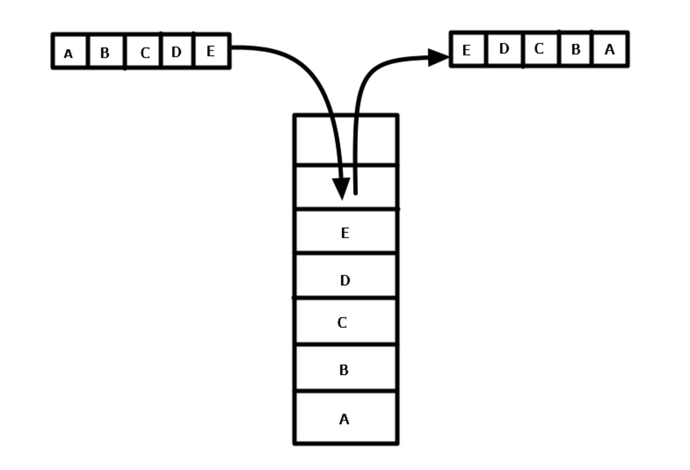
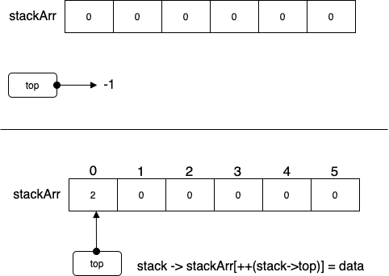
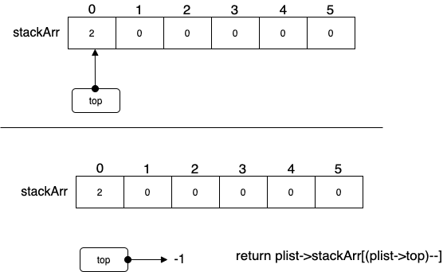
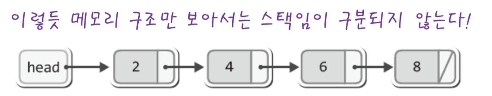
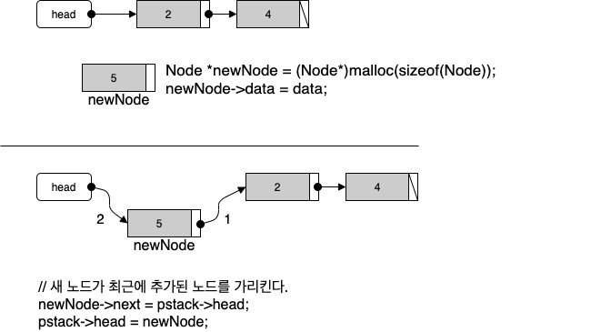
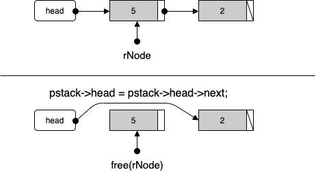

# 목차

- [Stack](#stack)
  * [정의](#정의)
    + [스택이란](#스택이란)
    + [특징](#특징)
    + [스택의 ADT](#스택의-adt)
    + [ArrayList vs LinkedList](#arraylist-vs-linkedlist)
    + [용어](#용어)
  * [활용](#활용)
  * [배열을 이용한 Stack - C](#배열을-이용한-stack---c)
  * [연결리스트를 이용한 Stack - C](#연결리스트를-이용한-stack---c)
  * [Stack - Java](#stack---java)
- [참고](#참고)


# Stack


## 정의


### 스택이란



* 제한적으로 접근할 수 있는 나열 자료구조
* 접근 방법은 언제나 목록의 끝에서만 일어난다. 끝 먼저내기 목록(pushdown list)이라고도 한다.


### 특징

* LIFO (Last In First Out)
  * **스택은 한 쪽 끝에서만 자료를 넣거나 뺄 수 있는 선형 구조이다.**
  * 예시
    * 프링글스통
    * 동전통


### 스택의 ADT

* peek() : 스택의 가장 윗 데이터를 반환한다. (**데이터를 삭제하진 않는다.**)
* push() : 자료를 밀어 넣는다해서 push이다. **스택의 가장 위 데이터 추가.**
* pop() : 넣어둔 자료를 꺼낸다 해서 pop이라 한다. **스택의 가장 위 데이터 삭제 및 반환**
* empty() : 스택이 비어있는지 확인


### ArrayList vs LinkedList

* 순차적으로 데이터를 추가하고 삭제하는 스택에는 ArrayList와 같은 배열기반의 자료구조가 적합하다.
* **어차피 top을 통해 데이터를 컨트롤하므로, 실제 삭제하지 않고 덮어씌우기 때문에 ArrayList가 더 적합하다.**


### 용어

* StackOverFlow : Stack이 가득 차있을 때 데이터를 넣기 위해 push를 호출하면 발생하는 예외
* StackUnderFlow : Stack이 비어있을 때 pop을 호출하면 발생하는 예외


## 활용

* 함수의 콜스택 (재귀)
* 문자열 역순 출력
* 연산자 후위표기법
* DFS
* 웹브라우저의 방문 기록


## 배열을 이용한 Stack - C

> 전체 코드
>
> * [ArrayBaseStack.h](https://github.com/binghe819/cs-datastructure/blob/master/Stack/ArrayBaseStack/ArrayBaseStack.h)
> * [ArrayBaseStack.c](https://github.com/binghe819/cs-datastructure/blob/master/Stack/ArrayBaseStack/ArrayBaseStack.c)
> * [main.c](https://github.com/binghe819/cs-datastructure/blob/master/Stack/ArrayBaseStack/main.c)


### ADT

```c
typedef int Data;

typedef struct _arrayStack
{
    Data stackArr[STACK_LEN];
    int top;
} ArrayStack;

typedef ArrayStack Stack;

void StackInit(Stack *pstack); // 스택 초기화
int SIsEmpty(Stack *pstack); // 스택 비어 있는지 확인

void SPush(Stack *pstack, Data data); // push
Data SPop(Stack *pstack); // pop
Data SPeek(Stack *pstack); // peek

#endif
```


### 초기화

```c
void StackInit(Stack *pstack)
{
    pstack->top = -1; // 빈 상태를 의미
}
```


### Push



```c
void SPush(Stack *pstack, Data data)
{
    // 데이터 추가를 위한 top 인덱스 값 증가 후 데이터 저장.
    pstack->stackArr[++pstack ->top] = data;
}
```


### Pop



```c
// pop = 반환 + 삭제
Data SPop(Stack *pstack)
{
    // 비어있는지 예외처리
    if(SIsEmpty(pstack))
    {
        printf("Stack Memory Error");
        return FALSE; // 예외처리 필요
    }

    // 삭제할 데이터 반환과 동시에 삭제한 데이터(top)의 인덱스 값 하나 감소.
    return pstack->stackArr[(pstack->top)--];
}
```


### Peek

```c
// peek = 반환
Data SPeek(Stack *pstack)
{
    // 비어 있는지 확인
    if(SIsEmpty(pstack))
    {
        printf("Stack Memory Error");
        return FALSE; // 예외처리 필요.
    }

    return pstack->stackArr[pstack->top];
}
```


## 연결리스트를 이용한 Stack - C

> 전체코드
>
> * [LinkedBaseStack.h](https://github.com/binghe819/cs-datastructure/blob/master/Stack/ListBaseStack/ListBaseStack.h)
> * [LinkedBaseStack.c](https://github.com/binghe819/cs-datastructure/blob/master/Stack/ListBaseStack/ListBaseStack.c)
> * [main.c](https://github.com/binghe819/cs-datastructure/blob/master/Stack/ListBaseStack/main.c)

<p align="center"><br>출처 : 윤성우의 열혈 자료구조</p>

* 리스트 기반의 스택은 일반적인 연결리스트와 비슷하다.
* 실제로 head만 가지고 있는 단방향 연결리스트는 메모리 구조상에서는 스택과 똑같이 볼 수도 있다.


### ADT

```c
typedef int Data;

typedef struct _node
{
    struct _node *next;
    Data data;
} Node;

typedef struct _linkedBaseStack
{
    Node *head;
} LinkedBaseStack;

typedef LinkedBaseStack Stack;

void StackInit(Stack *pstack); // 스택의 초기화
int SIsEmpty(Stack *pstack); // 스택이 비어있는지 확인

void SPush(Stack *pstack, Data data); // push
Data SPop(Stack *pstack); // pop
Data SPeek(Stack *pstack); // peek
```


### 초기화

```c
void StackInit(Stack *pstack)
{
    pstack->head = NULL;
}
```


### Push

<p align="center"></p>

```c
void SPush(Stack *pstack, Data data)
{
    // 새 노드 생성
    Node *newNode = (Node*)malloc(sizeof(Node)); 
    newNode->data = data;

    // 새 노드가 최근에 추가된 노드를 가리킨다.
    newNode->next = pstack->head;
    pstack->head = newNode;
}
```


### Pop



```c
Data SPop(Stack *pstack)
{
    // 예외처리
    if(SIsEmpty(pstack))
    {
        return FALSE;
    }

    Data rData;
    Node *rNode;

    rNode = pstack->head;
    rData = rNode->data;
    pstack->head = pstack->head->next;

    free(rNode);
    return rData;
}
```


### Peek

```c
Data SPeek(Stack *pstack)
{
    // 예외처리
    if(SIsEmpty(pstack))
        return FALSE;

    return pstack->head->data;
}
```


## Stack - Java

> [Collections - Stack](https://github.com/binghe819/TIL/blob/master/JAVA/%EC%9E%90%EB%B0%94%EC%9D%98%20%EC%A0%95%EC%84%9D/Collection%20Framework.md#3-stack%EA%B3%BC-queue)에 자바의 정석에서 설명하는 내용을 정리해두었다.

> **It extends class `Vector` with five operations that allow a vector to be treated as a stack.** The usual `push` and `pop` operations are provided, as well as a method to `peek` at the top item on the stack, a method to test for whether the stack is `empty`, and a method to `search` the stack for an item and discover how far it is from the top.
>
> [참고 - JAVA 8 API](https://docs.oracle.com/javase/8/docs/api/)

자바는 Vector를 상속받아 Stack을 구현하며, Vector는 ArrayList와 유사하다고 보면 된다.

Vector의 기본 길이는 10이라고 한다. [출처](https://www.quora.com/What-is-a-default-capacity-of-ArrayList-Vector-HashMap-Hashtable-and-Hashset)

즉, **자바에서 Stack의 요소가 10개가 넘어가면 ArrayList처럼 배열을 복사하므로 비효율적인 처리가 된다.**


# 참고

* [윤성우의 열혈 자료구조](http://www.yes24.com/Product/Goods/6214396?OzSrank=1)
* https://www.geeksforgeeks.org/stack-data-structure-introduction-program/