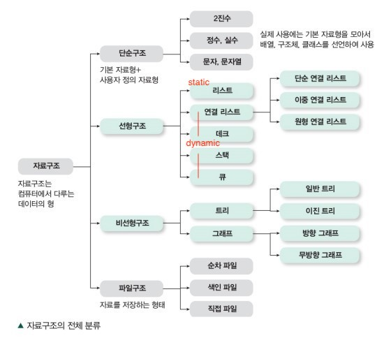

# 목차

- [자료구조란](#자료구조란)
  * [1 자료구조란](#1-자료구조란)
    + [1-1 컴퓨터가 데이터를 처리하는 방법](#1-1-컴퓨터가-데이터를-처리하는-방법)
    + [1-2 자료구조와 알고리즘](#1-2-자료구조와-알고리즘)
    + [1-3 자료구조의 종류](#1-3-자료구조의-종류)
  * [2 시간 복잡도와 공간 복잡도](#2-시간-복잡도와-공간-복잡도)
    + [2-1 시간 복잡도와 공간 복잡도란](#2-1-시간-복잡도와-공간-복잡도란)
    + [2-2 최악의 경우](#2-2-최악의-경우)
  * [3 빅오 표기법](#3-빅오-표기법)
    + [3-1 빅오 표기법이란](#3-1-빅오-표기법이란)

# 자료구조란

## 1 자료구조란

### 1-1 컴퓨터가 데이터를 처리하는 방법

컴퓨터는 전자식으로 작동하는 머신이다. off 와 on의 두가지 상태만으로 나타내는 전기로 만들다 보니 컴퓨터도 자연스럽게 2진법을 사용해서 처리를 하게 되었다. ( 전자적 신호를 사용. )

이로 인해 컴퓨터는 0과 1만을 다룰 수 있고, 0과 1로 다룰 수 있는 기본형의 종류는 세 가지의 불과하다.

* 숫자
  * 몇 바이트까지 한 개의 숫자로 계산할 것인가 -> int, float, long등 나눌 수 있다.
* 문자 (문자 인코딩)
  * 문자 인코딩 방식마다 몇 바이트를 하나의 문자로 인식한다. -> ASCII, 유니코드
* True/False

이러한 기본 자료형을 이용해 새로운 자료형을 선언 할 수 있다. 이것을 '사용자 정의 자료형'이라 한다.

* 문자열
  * 문자의 배열
* 배열
  * 하나의 특정 자료형을 나열하여 하나로 그룹핑.
* 구조체
  * 서로 다른 여러 개의 특정 자료형을 하나로 그룹핑.

### 1-2 자료구조와 알고리즘

프로그램이란 데이터를 표현하고, 그렇게 표현된 데이터를 처리하는 것이다.

* **데이터 표현 == 데이터 저장**
* **데이터의 저장을 담당하는 것이 바로 자료구조이다.**
* **데이터의 처리를 담당하는 것이 바로 알고리즘이다.**

### 1-3 자료구조의 종류

 출처 : 그림으로 정리한 알고리즘과 자료구조

* 선형 자료구조 : 자료를 구성하는 데이터를 순차적으로 나열시킨 형태
* 비선형 자료구조 : 하나의 자료 뒤에 여러 개의 자료가 존재할 수 있는 형태

## 2 시간 복잡도와 공간 복잡도

자료구조, 알고리즘의 성능을 측정할 때 시간 복잡도와 공간 복잡도로 표현한다.

### 2-1 시간 복잡도와 공간 복잡도란

* 시간 복잡도
  * 문제를 해결하는데 걸리는 시간과 입력의 함수 관계
  * 알고리즘에 사용되는 연산 횟수의 총량
* 공간 복잡도
  * 문제를 해결하는데 필요로 하는 메모리 공간의 양
  * 알고리즘에 사용되는 메모리 공간의 총량

### 2-2 최악의 경우

동일한 알고리즘도 입력 데이터의 양에 따라 다른 실행 시간을 보일 수 있다.

이럴 때 사용되는 것이 바로 최악의 경우이다.

#### 알고리즘 효율성 평가 방법

1. 최선의 경우 : 실행 시간이 가장 적은 경우.
2. 평균적인 경우 : 모든 입력을 고려한 평균 수행 시간
3. **최악의 경우 : 알고리즘 수행 시간이 가장 오래 걸리는 경우.**

**보통 시간 복잡도를 계산할 때 최악의 경우를 주로 사용한다.**

## 3 빅오 표기법

알고리즘의 시간 복잡도는 보통 빅오 표기법을 이용한다.

### 3-1 빅오 표기법이란

* 빅-오라는 것은 함수 T(n)에서 가장 영향력이 큰 부분이 어딘가를 따지는 것인데, 이때 사용되는 표기법에 대문자 O, 그러니까 큰 O가 사용되기 때문에 빅-오라고 한다.

   출처 : https://m.post.naver.com/viewer/postView.nhn?volumeNo=7185628&memberNo=25379965

